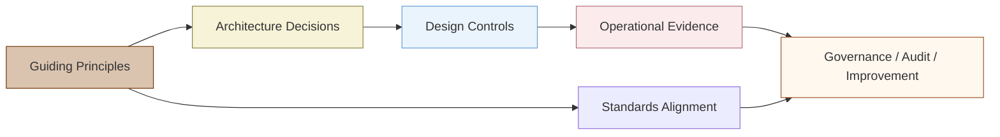
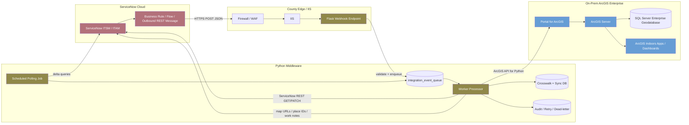
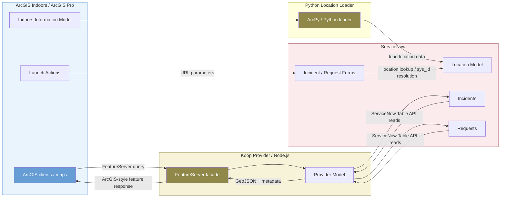
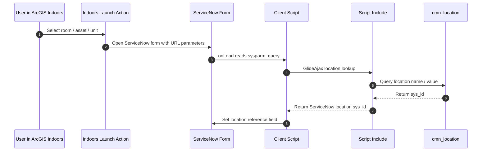
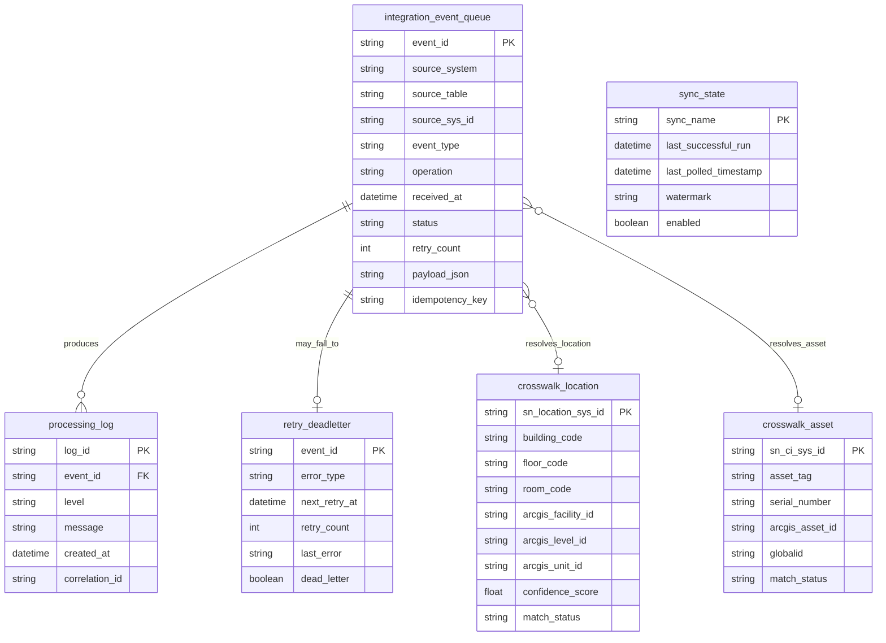
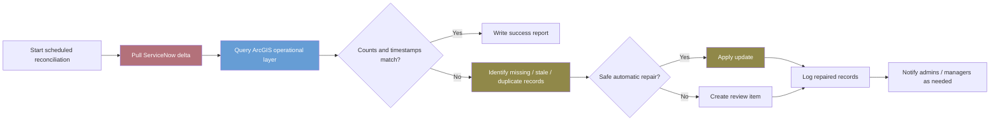

# Capybara Framework

**Spatial ITAM / ITSM Integration using ArcGIS Indoors and pluggable service-management connectors.**

Capybara is a strategy, architecture, governance, and reference-implementation framework for adding indoor spatial context to existing IT asset-management and service-management workflows without replacing the authoritative systems already in use.


# Quick Start

The fastest way to understand Capybara is to run the included **MockConnector** examples. No ServiceNow, TeamDynamix, Cherwell, ArcGIS Online, or Enterprise credentials are required for this demonstration path.

```text
copy docs\editions\alpha\4-scripts\files\config.example.toml config.toml
python docs/editions/alpha/4-scripts/files/06_reporting/report_on_hold_parts.py --config config.toml
python docs/editions/alpha/4-scripts/files/05_notifications_alerts/alert_missing_assets.py --config config.toml
python docs/editions/alpha/4-scripts/files/09_historical_analytics/capture_daily_snapshot.py --config config.toml
```

The sequence demonstrates the architecture end-to-end: normalized ITSM records -> operational logic -> management output -> historical analytics.


<div>

### Introduction

The Capybara Framework treats indoor spatial context as an operational IT capability. ServiceNow contains the authoritative record of work, request state, service ownership, asset lifecycle, assignment, work notes, approvals, and closure. ArcGIS Indoors contains authoritative indoor spatial context: sites, facilities, levels, units, spaces, routes, maps, floorplans, and indoor assets. Python middleware connects these two worlds without requiring either platform to surrender its core role.

In the most common Capybara pattern, ServiceNow emits event notifications when incidents, requests, tasks, assets, or work orders are created or updated. A Python/Flask application receives the event, validates it, stores a lightweight queue record, then uses ServiceNow REST APIs to retrieve full authoritative details. The worker then uses ArcGIS API for Python to query indoor spatial context, update operational feature layers, and write map links or place IDs back into ServiceNow.

<div class="callout tip">

<span class="callout-title">Implementation posture</span>Capybara is not a replacement for ServiceNow, ArcGIS Indoors, ArcGIS Enterprise, ArcGIS Pro, or a future Esri-supported connector. It is an architecture pattern and governance model for making those systems work together in a local-government IT environment.

</div>

</div>


<div>

### Problem Statement

Many service tickets include a weak location description: “printer near Finance,” “conference room display broken,” “new phones for the building across town,” or “replacement workstation at east-side cubicle.” These descriptions are meaningful to humans but difficult for service systems to use without a formal place model. The result is manual lookup, repeated clarification, inconsistent dispatch, fragmented asset visibility, and reporting that lacks a spatial dimension.

Capybara addresses this by turning ticket and asset records into location-enriched operational records. It does not require ServiceNow to become a GIS. It does not require ArcGIS Indoors to become a ticketing system. It uses integration to preserve strengths: ServiceNow controls service work; ArcGIS controls spatial context; Python translates between them.

</div>


<div>

### Executive Summary

<div class="grid3">

<div class="card">

#### Operational win

Tickets can carry floor-aware context, asset links, unit IDs, map links, route links, and confidence scores.

</div>

<div class="card">

#### Governance win

Authoritative ownership is explicit: ServiceNow owns work state; ArcGIS owns indoor spatial truth; Python owns integration state.

</div>

<div class="card">

#### Reporting win

Managers and leadership can see service demand by building, floor, department, asset type, hotspot, and SLA risk.

</div>

</div>

</div>


# Business Capability Map

Capability map

Python

Diagram




```mermaid
flowchart LR
    subgraph ITSM["ServiceNow ITSM / ITAM"]
        A["Incidents"]
        B["Requests"]
        C["Tasks / Work Orders"]
        D["CMDB / Assets"]
        E["Assignments / SLAs"]
    end

    subgraph Bridge["Python Middleware"]
        F["Webhook Receiver"]
        G["Polling Job"]
        H["Crosswalks"]
        I["Transform Rules"]
        J["Retry + Logs"]
    end

    subgraph Indoor["ArcGIS Indoors"]
        K["Facilities"]
        L["Levels"]
        M["Units / Spaces"]
        N["Indoor Assets"]
        O["Routes / Maps"]
        P["Operational Layers"]
    end

    ITSM --> Bridge
    Bridge --> Indoor
    Indoor --> Bridge
    Bridge --> ITSM
    Indoor --> Q["Spatial Dashboards"]
    ITSM --> R["Operational Reports"]
    Q --> S["Managers / Leadership"]
    R --> S

    style ITSM fill:#fbebed,stroke:#B3717A
    style Bridge fill:#f7f3d8,stroke:#908849
    style Indoor fill:#eaf4fd,stroke:#669DD5
```

# County Context and Business Value

This section places the technical architecture in its local-government business context. The source text below is incorporated from the attached *County Context - Business Value.docx* section document. It is presented as a source section so its original survey framing, user-story language, and business-value language remain intact.

How this section informs the architectureThe county-context material justifies why Capybara should focus on buildings, floors, office locations, asset visibility, technician deployment, audit readiness, and leadership reporting. It also provides survey evidence that local-government IT departments have a real floorplan-visibility gap.

Source section

### County Context

Capybara was born out of the CCISDA-CSAC Technology Executive Credential Program, which centers on information services in California county governments. For a project like this, focusing on California counties makes sense because they sit at the intersection of scale, complexity, and public accountability in government operations. Counties are responsible for maintaining vast and diverse portfolios of facilities, technology assets, and personnel—often spread across hundreds of buildings and multiple cities—while delivering critical services to millions of residents. This creates a strong need for better visibility into where assets and staff are located, how resources are being used, and how quickly issues can be resolved.

County governments also face unique operational pressures: aging infrastructure, constrained budgets, strict regulatory and audit requirements, and a growing expectation for data-driven decision-making. Many counties already operate mature ITSM/ITAM systems and use GIS extensively, but these systems are rarely integrated in a way that supports day-to-day operations inside buildings. Capybara directly addresses this gap by connecting indoor location context with asset and service data, improving efficiency without requiring wholesale replacement of existing systems.

Finally, counties represent a high-impact opportunity because solutions developed at the county level are inherently reusable and scalable. California’s counties vary widely in size and sophistication, making them an ideal proving ground for a framework that can be adapted statewide and beyond. Improvements in county IT operations translate directly into better service delivery, faster issue resolution, and more effective stewardship of public resources—magnifying the impact well beyond any single organization.

County governments manage a large, diverse, and geographically distributed asset base. They depend on a wide range of IT assets to deliver essential public services, including:

End-user devices (desktops, laptops, tablets, mobile devices)

Network and data center equipment

Servers, storage, and cloud resources

Software applications and licenses

Public safety and field technology systems

These assets are:

Purchased and maintained using taxpayer and grant funds

Distributed across multiple department building and campus locations

Subject to audit, public records, cybersecurity, and licensing compliance requirements

Critical to public safety, health services, courts, elections, and daily operations

In a recent survey conducted by team Capybara it was determined...

...That a vast majority of counties that responded have over 15 buildings where IT assets are deployed, and that ¾ of these counties report that they would benefit from being able to manage IT assets’ physical locations and deploy support technicians accordingly.

### December 2025 Survey Results

Representatives from the IT departments of 16 California counties (of 58 total, 27.6%) responded to a survey poll distributed in December 2025. Response counts were:

Placer (2), San Luis Obispo (2), Tulare (2), Fresno (1), Kern (1), Kings (1), Lassen (1), Orange (1), San Joaquin (1), Stanislaus (1), Trinity (1), Tuolumne (1), Yolo (1), others (0)

To the question “Which of the following help-desk, ticketing/work-order, and asset-service products does your organization use?”, respondents said:

ServiceNow (6), TDX (2), BossDesk (2), OpenGOV (2), NinjaOne (1), Giva (1), AllSight (1),  
 I don’t know (2)

Responses to the rest of the questions were as follows:

Does your county’s ITSM & ITAM solution support the display of asset locations overlayed on building floorplans?

| Yes (0, 0%) No (10, 62.5%) I don't know (6, 37.5%) |  |
| --- | --- |

Do you think your IT department could benefit from this floorplan functionality to manage assets’ locations and deploy support technicians?

| Yes (12, 75%) No (2, 12.5%) I don’t know (2, 12.5%) |  |
| --- | --- |

Does your County IT already have a consistent, repeatable framework for planning and deploying modern, spatially enabled IT asset-tracking system?

| Yes (1, 6.25%) No (14, 87.5%) I don't know (1, 6.25%) |  |
| --- | --- |

How does your IT department track the physical locations of your IT assets?

| Street Address (3, 18.75%) Network topology location (by network connection) (3, 18.75%) Other (3, 18.75%) I don't know (1, 6.25%) others (0, 0%) |  |
| --- | --- |

How does your IT department display/visualize the physical locations of your IT assets?

| We don't have this ability (6, 37.5%) Organizational campus maps (2, 12.5%) Network topology maps with spatial clustering (1, 6.25%) Other (1, 6.25%) others (0, 0%) |  |
| --- | --- |

How many distinct office locations does your county occupy (not including employees’ work-from-home offices)?

| 15 or more (14, 87.5%) 10 to 14 (1, 6.25%) 5 to 9 (1, 6.25%) Less than 5 (0, 0%) |  |
| --- | --- |

Do you have any additional comments or details related to mapping/visualizing IT assets’ locations?

| “This is exciting. I was afraid of being saddled in a boring project. This is not boring. I could see this extending into the parking lot for LE Agencies, i.e. patrol vehicles. Also, Radio sites, rack elevation.” “Sounds like a really cool tool idea.” “No” “Kings County is pretty small, so we don't really need such specific location tracking for assets. We use the Dell Asset tag as part of the PC name so we can find a machine if it moves to another network segment if needed. But I could definitely see the need for a large County.” “I've worked for a few larger departments and each one typically created bar codes for the jack location of where the equipment would be assigned. For laptops and other mobile devices we assigned them to the employee's badge number.” “I'm familiar with the tools and features from ESRI. A consideration if that's where your leaning is that not all county IT agencies manage ESRI for their respective counties. When I was at Ventura, IT Services did, but here in Orange County, Public Works does and they don't share. It would be nice though for us with over 200 locations. Let me know how I can help. Thanks!” |
| --- |

In many counties, IT asset data is:

Fragmented across spreadsheets, ticketing systems, and procurement tools

Inconsistently tracked where the asset is currently located

Lacking full lifecycle visibility (purchase → deployment → support → retirement)

Without a centralized asset management approach, counties often face:

Incomplete or outdated inventories

Difficulty tracking asset ownership, lifecycle, and location

Redundant purchases across departments

A plan for replacements and upgrades

Audit findings related to asset control and depreciation

Increased risk of loss, theft, or unsupported equipment

Respond efficiently to audits, security incidents, or public records requests

### User Stories

- 1. County IT Director  
  As a County IT Director, I want to see a high-level, real-time view of IT assets and service activity across county facilities so that I can make informed decisions about staffing, investment, and risk.

- 2. IT Operations Manager  
  As an IT Operations Manager, I want to assign service requests based on technician proximity and workload so that incidents are resolved faster and resources are used efficiently.

- 3. GIS Program Manager  
  As a GIS Program Manager, I want indoor maps to reflect current asset and location data so that spatial information remains trusted and useful across departments.

- 4. IT Asset Manager  
  As an IT Asset Manager, I want to understand where assets are physically located and how often they require service so that I can improve lifecycle planning and reduce unplanned downtime.

- 5. IT Service Desk Supervisor  
  As a Service Desk Supervisor, I want incoming tickets to be automatically associated with specific assets and locations so that triage and escalation decisions are faster and more accurate.

- 6. County IT Service Technician  
  As an IT Service Technician, I want to navigate directly to the correct building, floor, and room and view an asset’s service history so that I can complete repairs efficiently on the first visit.

- 7. County Employee (End User)  
  As a County employee, I want to submit a service request tied to my location so that support staff can find and assist me without additional back-and-forth.

- 8. Facilities and IT Coordination Lead  
  As a Facilities and IT coordination lead, I want shared visibility into building layouts and technology assets so that facilities changes and IT work can be planned together.

- 9. County Executive or Department Head  
  As a County executive, I want summary dashboards that show service performance and asset health by facility so that I can understand operational impacts without reviewing technical details.

- 10. Auditor or Compliance Officer  
  As an auditor, I want clear records linking assets, locations, and service activities so that compliance, accountability, and reporting requirements can be met efficiently.

### Business Value

IT Asset Tracking and Location Management project delivers meaningful and measurable business value by transforming how an organization understands, secures, and manages its technology investments.

At its core, the initiative provides real-time visibility into the IT environment. Instead of relying on spreadsheets, fragmented systems, or outdated manual records, the organization gains a centralized, authoritative source of truth for every county-owned device. Each asset’s location, status, and assigned custodian are clearly documented and continuously updated. This clarity establishes accountability at every level—no device exists without ownership, and no transfer occurs without record. For leadership, this means accurate, dependable insight into the entire technology landscape, enabling informed decision-making based on verified data rather than estimates or assumptions.

Beyond visibility, the project significantly reduces loss, theft, and unnecessary replacement costs. When assets are tracked consistently and monitored throughout their lifecycle, missing or misplaced equipment can be quickly identified and investigated. Stronger check-in, check-out, and transfer controls prevent gaps in custody that often lead to shrinkage. Over time, the organization avoids avoidable repurchases, minimizes insurance claims, and preserves the value of taxpayer-funded investments. For executive leadership, this translates directly into financial stewardship and responsible management of public resources.

The benefits extend into cybersecurity and enterprise risk management. A comprehensive asset inventory is foundational to modern security frameworks such as National Institute of Standards and Technology (NIST) and the Center for Internet Security (CIS). By identifying all connected and unmanaged devices, the organization closes blind spots that attackers frequently exploit. Improved endpoint tracking strengthens patch management, enhances incident response, and supports zero-trust security principles. Leadership gains confidence that cyber risk is being systematically reduced, and that the security posture of the organization is aligned with nationally recognized standards.

An asset tracking system also strengthens audit, grant, and compliance readiness. Accurate records of asset ownership, physical location, funding source, and custodial responsibility are readily available when auditors request documentation. Whether responding to capital asset reviews, grant compliance checks [equipment has to be specifically allocated], or IT control assessments, the organization can produce defensible, time-stamped records quickly and efficiently. This reduces staff time spent gathering documentation and lowers the likelihood of audit findings. For leadership, the value is clear: fewer compliance issues, smoother audits, and reduced administrative burden.

Finally, the project enhances operational efficiency and service reliability. When IT teams know exactly where devices are located and who is responsible for them, they spend less time searching for equipment and more time resolving issues. Incident response becomes faster, service disruptions are minimized, and equipment can be rapidly redeployed during emergencies, disasters, or staffing transitions. This agility ensures continuity of operations and sustained uptime for critical services. For leadership, the result is a more responsive organization capable of maintaining reliable technology services even under pressure.

In summary, an IT Asset Tracking and Location Management project is not simply a technical upgrade—it is an investment in visibility, accountability, financial stewardship, cybersecurity resilience, compliance readiness, and operational excellence.

## Architecture Implications of the County Context

The county context supports three core design requirements. First, the integration must handle geographically distributed facilities rather than one building or one campus. Second, it must treat asset location as an operational and compliance issue, not merely a map-display convenience. Third, it must generate value for multiple roles: technicians, service desk supervisors, asset managers, GIS program managers, IT directors, executives, and auditors.

| Source theme | Integration implication | Architecture response |
| --- | --- | --- |
| Distributed buildings and campuses | Tickets and assets need facility, level, unit, and route context. | Maintain an ArcGIS Indoors crosswalk to ServiceNow locations and assets. |
| Audit, public records, cybersecurity, and licensing pressure | Asset state must be traceable and defensible. | Keep ServiceNow authoritative for lifecycle and write integration activity to logs. |
| Need for technician deployment support | Work must be dispatchable by place, not only by queue. | Generate map links, floor-aware context, and operational dispatch layers. |
| Leadership decision-making | Reporting must connect work, assets, and places. | Build dashboards and summary views by building, floor, department, asset type, and incident pattern. |


# Guiding Principles, Tenets, and Standards

This section establishes the governance spine of the Capybara Framework. The source text is incorporated source-authored from the attached document, then expanded into architecture-specific implications for ServiceNow, ArcGIS Indoors, and Python middleware implementation.

Source section

### Guiding Principles, Tenets, and Alignment with Standards

### Guiding Principles

The Capybara Framework is guided by a set of principles intended to ensure that spatially enabled IT operations deliver measurable value while remaining practical, scalable, and sustainable. At its core, the framework emphasizes integration over replacement, leveraging existing ITSM, ITAM, and GIS investments rather than introducing new systems of record. Capybara also prioritizes clarity, repeatability, and adaptability, recognizing that counties vary widely in size, maturity, and organizational structure.

A second guiding principle is the use of spatial context as a decision-support enhancement, not a novelty. Location intelligence is applied where it improves understanding, coordination, and outcomes—such as incident response, asset lifecycle planning, and workload balancing—without adding unnecessary complexity. The framework encourages incremental adoption, data quality discipline, and role-based access, ensuring that spatial insights remain trusted and actionable over time.

### Tenets

- Integration Over Replacement  
  Capybara enhances existing ITSM, ITAM, and GIS platforms rather than introducing new systems of record or duplicating functionality.

- Standards-Aligned by Design  
  The framework is grounded in ITIL 4 and ISO-based service and asset management standards to ensure governance, consistency, and auditability.

- Spatial Context Adds Operational Value  
  Location intelligence is applied where it meaningfully improves analytics, reporting, and decision-making—not as a standalone visualization exercise.

- Incremental and Phased Adoption  
  Capybara supports gradual implementation, allowing organizations to deliver value early while managing risk and complexity.

- Data Quality as a Foundation  
  Accurate, complete, and well-governed data is treated as a prerequisite for effective spatial enablement and downstream analytics.

- Role-Based Visibility and Access  
  Information is presented according to user roles, ensuring relevance, security, and usability for executives, managers, and technicians.

- Operational Practicality  
  The framework prioritizes workflows that reflect real-world constraints and day-to-day operational needs.

- Scalability Across Organizations  
  Capybara is designed to work for counties of varying size, maturity, and technical capacity.

- Transparency and Traceability  
  Asset locations, service activities, and decisions are traceable and defensible, supporting reporting, compliance, and oversight.

- Continuous Improvement Orientation  
  Performance metrics, feedback loops, and maturity assessments are used to guide ongoing refinement and evolution.

### Standards

### ITIL® 4

Capybara aligns with ITIL 4 by reinforcing a service value–oriented approach to IT operations, emphasizing visibility, collaboration, and continual improvement. By adding spatial context to assets, incidents, and personnel, Capybara enhances several ITIL practices, including Incident Management, Service Request Management, Asset Management, and Monitoring and Event Management. The framework supports ITIL 4’s guiding principles—such as focus on value, optimize and automate, and collaborate and promote visibility—by enabling data-driven decisions grounded in real-world location awareness rather than siloed system views.

### ISO/IEC 20000-1:2018 (IT Service Management Systems)

Capybara supports ISO/IEC 20000-1:2018 by strengthening the consistency, traceability, and measurability of IT service delivery processes. Spatially enabling ITSM data improves the organization’s ability to define, operate, monitor, and improve service management practices across facilities and departments. The framework enhances evidence-based management by linking service activities to physical locations and assets, supporting audit readiness, service reporting, and continual service improvement without altering the core ITSM system of record.

### ISO/IEC 19770 (IT Asset Management)

Capybara directly reinforces ISO/IEC 19770 principles by improving the accuracy, completeness, and usability of IT asset information throughout the asset lifecycle. By associating assets with precise indoor locations and service histories, the framework supports better asset identification, control, and lifecycle decision-making. This spatial enrichment helps organizations reduce asset loss, improve utilization, and better understand total cost of ownership, while remaining fully compatible with existing ITAM tools and processes.

### ISO 55000 (Asset Management)

Capybara aligns with ISO 55000 by treating IT assets as part of a broader, organization-wide asset management system focused on value, risk, and performance. The framework supports ISO 55000’s emphasis on governance, lifecycle thinking, and alignment between assets and organizational objectives. By providing location-aware insights into asset condition, service demand, and operational impact, Capybara helps organizations balance cost, risk, and performance across their IT asset portfolios in a transparent and defensible manner.

### Value of Standards Alignment

Aligning the Capybara Framework with established IT governance and service management standards ensures that innovation is grounded in proven operational practices. By adhering to methodologies such as ITIL 4 and ISO-based management systems, Capybara helps organizations introduce spatial capabilities in a way that supports accountability, auditability, and continual improvement. This alignment reduces risk, eases stakeholder acceptance, and strengthens confidence among leadership and oversight bodies.

Standards-based alignment also enhances the long-term sustainability of Capybara implementations. It ensures that spatially enabled workflows remain compatible with evolving organizational policies, regulatory requirements, and technology platforms. By embedding indoor GIS into recognized governance and service management frameworks, Capybara enables counties to modernize IT operations while maintaining consistency, control, and strategic coherence.

## Architecture Expansion: Turning Principles into Design Controls

| Principle / Tenet | Design Control | Example in Capybara |
| --- | --- | --- |
| Integration Over Replacement | Keep ServiceNow and ArcGIS Indoors authoritative in their own domains. | Use Python crosswalks and map URLs rather than recreating tickets or GIS geometry in the wrong platform. |
| Standards-Aligned by Design | Map each workflow to recognizable ITSM, ITAM, asset-management, and audit practices. | Associate mapped incident trends with Incident Management, Asset Management, Monitoring and Event Management, and continual improvement practices. |
| Spatial Context Adds Operational Value | Only spatially enable data where location materially improves decisions or work execution. | Map assets, rooms, floors, hotspots, technician routing, shared printers, network closets, and deployment waves. |
| Incremental and Phased Adoption | Implement one building, asset class, and ticket category before scaling. | Start with shared printers or workstation refresh before mapping every IT asset. |
| Data Quality as a Foundation | Require authoritative keys, readiness checks, and reconciliation before operational reliance. | Use location and asset match-status fields: Matched, Needs Review, Ambiguous, Not Found, Retired, or Suppressed. |
| Role-Based Visibility and Access | Separate technician, manager, leadership, and auditor views. | Technicians see work details; leadership sees summaries; auditors see traceability and controls. |
| Transparency and Traceability | Log event receipt, API calls, record changes, layer edits, and write-back outcomes. | Every integration update carries an event ID, source sys\_id, correlation ID, timestamp, and status. |

## Standards Alignment Matrix

| Standard / Framework | Capybara Contribution | Evidence Produced by the Architecture |
| --- | --- | --- |
| ITIL 4 | Improves visibility, collaboration, optimization, and automation across Incident, Service Request, Asset, and Monitoring practices. | Spatial incident dashboards, service-request location context, automation logs, and improvement metrics. |
| ISO/IEC 20000-1:2018 | Strengthens measurable, repeatable, and auditable service-management processes. | Cross-system service reports by facility, ticket-to-location traceability, reconciliation outputs, and SLA geography. |
| ISO/IEC 19770 | Improves asset identification, lifecycle context, completeness, and control. | Asset-to-unit mapping, asset service history by space, lifecycle-state overlays, and exception reports. |
| ISO 55000 | Connects IT assets to value, risk, cost, performance, lifecycle, and organizational objectives. | Facility-level asset health dashboards, risk-weighted refresh planning, and service-demand heat maps. |

Principles-to-architecture traceability

Code / configuration

Diagram




# Assumptions, Exclusions, and Framework Boundaries

The following source section defines the planning assumptions and explicit exclusions that should travel with any Capybara implementation. Because these statements clarify scope, responsibility, and local accountability, they are incorporated as a source section.

Source section

### Assumptions & Exclusions

This section outlines the key assumptions under which the Capybara Framework is intended to be applied, as well as its inherent limitations and exclusions. These statements help set realistic expectations, clarify responsibilities, and ensure the framework is used appropriately as a strategic and planning guide rather than a prescriptive or turnkey solution.

### Assumptions

The Capybara Framework assumes the following conditions are in place, or will be addressed, by organizations choosing to adopt its guidance:

- ArcGIS Licensing Availability  
  Participating departments or municipalities maintain the required ArcGIS Online or ArcGIS Enterprise, ArcGIS Indoors, and ArcGIS Field Maps licenses necessary to support spatially enabled asset and service workflows.

- Up-to-Date GIS and Asset Data  
  Building floorplans, indoor location layers, asset inventories, and user-related spatial data are accurate, complete, and actively maintained within the organization’s GIS and ITAM systems.

- Endpoint Security Compliance  
  All mobile and desktop devices accessing Capybara-supported workflows adhere to organization-defined security baselines, identity management requirements, and acceptable-use policies.

- Interdepartmental Coordination  
  IT, GIS, Facilities, and other partner departments coordinate on data governance, location permissions, access controls, and privacy considerations to support shared use of spatial and service data.

- Reliable Network Connectivity  
  Users generally have access to stable Wi-Fi or cellular connectivity for synchronization and updates, except where offline workflows are explicitly supported (e.g., ArcGIS Field Maps offline use).

- User Device Compatibility  
  Field technicians and IT staff use mobile devices capable of running ArcGIS Field Maps and supporting required location services such as GPS, Wi-Fi positioning, or indoor positioning systems.

- Organizational Adoption and Training  
  Staff receive appropriate training and onboarding to support new workflows, including asset check-in/check-out practices, location-aware tasking, and use of mobile applications.

### Limitations and Exclusions

The Capybara Framework also acknowledges the following limitations and explicitly defines what is outside its scope:

- Indoor Positioning Accuracy  
  Location precision is constrained by the quality and availability of indoor positioning technologies (e.g., IPS, Wi-Fi triangulation, BLE beacons) and by environmental conditions within facilities.

- Data Refresh and Synchronization Rates  
  “Real-time” visibility depends on device synchronization intervals, network availability, and platform behavior; update latency may vary.

- User Compliance Dependencies  
  Accurate personnel and asset tracking relies on consistent user behavior, including carrying authorized devices, maintaining sign-in status, and following defined operational procedures.

- Privacy and Policy Constraints  
  Personnel location visibility and historical tracking may be restricted by labor agreements, privacy regulations, or organizational policy, limiting granularity for certain users or roles.

- Third-Party System Integration Constraints  
  Integration with ITSM/ITAM platforms (e.g., ServiceNow, Cityworks) is subject to vendor APIs, licensing terms, data models, and organizational configuration choices.

- Device Battery and Performance Considerations  
  Continuous location tracking and background application use may impact mobile device battery life and performance, affecting update frequency or offline behavior.

- Platform Dependency  
  Capybara is designed exclusively for the Esri ArcGIS ecosystem and does not support non-Esri mapping or indoor GIS platforms.

- Not a Turnkey Implementation or Managed Service  
  Capybara is a framework and implementation guide, not a software product, managed service, or fully configured deployment. Organizations remain responsible for system configuration, integration, and ongoing operations.

### Assumptions & Exclusions Summary

| Category | Item | Summary Description |
| --- | --- | --- |
| Assumption | ArcGIS Licensing Availability | Required ArcGIS Online or ArcGIS Enterprise, ArcGIS Indoors, and Field Maps licenses are in place to support Capybara workflows. |
| Assumption | GIS & Asset Data Readiness | Building floorplans, indoor layers, and asset inventories are accurate, current, and actively maintained. |
| Assumption | Endpoint Security Compliance | Devices accessing Capybara adhere to organizational security, identity, and access-control standards. |
| Assumption | Interdepartmental Coordination | IT, GIS, Facilities, and partner departments collaborate on data governance, permissions, and privacy controls. |
| Assumption | Network Connectivity | Reliable Wi-Fi or cellular connectivity is generally available, with offline support used where applicable. |
| Assumption | Device Compatibility | Field and IT staff use mobile devices capable of running ArcGIS Field Maps and supporting location services. |
| Assumption | Training & Adoption | Users receive appropriate training and follow defined workflows and operational procedures. |
| Limitation | Indoor Positioning Accuracy | Location precision depends on IPS, Wi-Fi triangulation, BLE beacons, and building conditions. |
| Limitation | Data Refresh Rates | Near real-time visibility varies based on sync frequency, device behavior, and connectivity. |
| Limitation | User Compliance | Accurate tracking relies on consistent user behavior (check-ins, device usage, app sign-in). |
| Limitation | Privacy Restrictions | Personnel location visibility may be limited by policy, labor agreements, or regulation. |
| Limitation | Third-Party Integration | ITSM/ITAM integration depends on vendor APIs, licensing, and system constraints. |
| Limitation | Device Battery & Performance | Continuous tracking may impact battery life and update reliability on mobile devices. |
| Exclusion | Non-Esri Platforms | Capybara applies only to the Esri ArcGIS ecosystem and does not support non-Esri GIS platforms. |
| Exclusion | Turnkey Implementation | Capybara is a framework and guide—not a preconfigured solution or managed service. |
| Exclusion | Operational Ownership | Organizations remain responsible for configuration, integration, operations, and maintenance. |

### Framework Boundaries

Taken together, these assumptions and exclusions reinforce that Capybara is intended to guide strategy, planning, and design decisions, not to replace existing systems, override governance structures, or eliminate the need for local judgment. Organizations are encouraged to adapt the framework to their technical environment, policies, and maturity level while remaining aligned with its guiding principles.

## Implementation Expansion: Making the Boundaries Operational

For an architecture implementation, these assumptions should become acceptance gates. A pilot should not proceed to production until licensing, indoor data readiness, endpoint security, stakeholder coordination, network connectivity, device compatibility, training, privacy policy, and operational ownership have each been assigned to a responsible owner.

| Boundary area | Recommended implementation control | Owner to identify |
| --- | --- | --- |
| Licensing | Confirm ArcGIS Indoors, ArcGIS Enterprise or ArcGIS Online, Field Maps, ServiceNow, and connector/API licensing before design freeze. | GIS administrator + ITSM product owner |
| Data readiness | Run a pre-pilot audit of building, floor, unit, asset, and location crosswalk completeness. | GIS data steward + IT asset manager |
| Endpoint security | Approve supported mobile and desktop baselines and define what happens when a device is out of compliance. | Security team + endpoint management team |
| Privacy | Document who can view personnel location context, whether history is retained, and what data is suppressed from dashboards. | Security/privacy/legal + HR/labor relations as applicable |
| Not turnkey | Create a support model for middleware, ServiceNow configuration, ArcGIS data maintenance, logs, credentials, and reconciliation. | Integration owner + platform owners |


<div>

#### Prerequisites

- Identified ServiceNow tables and fields for incidents, requests, tasks, work orders, assets, CIs, locations, users, groups, assignments, and closure.
- ArcGIS Indoors data model representing the relevant sites, facilities, levels, units, spaces, indoor assets, and routes.
- ArcGIS Enterprise Portal with appropriate feature services, groups, web maps, dashboards, and service accounts.
- Python runtime approved for server-side use, with dependencies for Flask, requests, ArcGIS API for Python, structured logging, and database connectivity.
- A security-reviewed path for ServiceNow outbound REST to reach the Flask endpoint or a brokered ingress tier.
- A maintenance owner for the integration, not merely a developer who writes the first script.

</div>


<div>

#### Budget and Procurement

Budget planning should cover platform licensing, server capacity, Azure subscription cost if applicable, ServiceNow Integration Hub or connector licensing where used, staff time, testing environments, monitoring tools, security review, backups, and operational support. The lowest-cost architecture is not always the cheapest over time if it lacks retry queues, reconciliation, logging, or supportability.

</div>


<div>

#### Deployment Steps

1.  Define pilot use cases and acceptance criteria.
2.  Inventory ServiceNow data fields, references, and event triggers.
3.  Inventory ArcGIS Indoors layers and identify stable location keys.
4.  Create the crosswalk schema and matching rules.
5.  Deploy Flask receiver in dev/test.
6.  Configure ServiceNow outbound REST event for a test table.
7.  Implement queue, worker, ServiceNow client, ArcGIS client, and logging.
8.  Test one-way ServiceNow-to-ArcGIS flow.
9.  Test ArcGIS context write-back to ServiceNow.
10. Add scheduled reconciliation and dead-letter review.
11. Run a security and operations review.
12. Move to controlled pilot production.

</div>


<div>

#### Infrastructure Configuration

For the on-prem pattern, IIS can front the Flask application, terminate or pass TLS depending on policy, restrict paths, forward requests to the Python application runtime, and provide familiar Windows operations support. ArcGIS Web Adaptor may also run under IIS for ArcGIS Enterprise components; however, the Flask application should remain separately governed and not be treated as part of the ArcGIS Web Adaptor itself.

<div class="diagram">

<div class="diagram-title">

Deployment lifecycle

</div>

</div>

</div>


# Release Governance and Production Readiness

## What Belongs in This Guide vs. Companion Materials

**Document scope**

Core governance and design guidance belongs in this guide. Editable implementation assets should be maintained as source-controlled companion files.

| Material | In This Guide | Companion Read the Docs Asset | Reason |
| --- | --- | --- | --- |
| Production readiness checklist | Yes | Printable PDF / spreadsheet version | The checklist belongs in the guide, but agencies need a fillable version. |
| Field mapping templates | Yes | CSV/XLSX/YAML templates | The concepts belong here; implementation teams need editable mappings. |
| SQL DDL | Yes, starter version | Versioned SQL scripts | Starter DDL clarifies architecture; executable scripts should be maintained separately. |
| Python middleware scripts | Architecture and examples | Full source files and notebooks | Production code needs version control, tests, and release packaging. |
| Budget calculator | Inputs and assumptions | Spreadsheet calculator | Calculators need formulas and editable local assumptions. |
| Presentation templates | Messaging guidance | PPTX / PDF templates | Reusable communication material is better as separate files. |
| Runbooks | Core procedure summaries | Detailed operational runbook files | Local teams will need environment-specific commands and contacts. |

## Release Governance

**Release governance**

Release governance keeps the public framework, local adaptations, and future contributions understandable, reviewable, and maintainable.

| Release Element | Production Rule | Why It Matters |
| --- | --- | --- |
| Edition numbering | Use named editions for major public releases and maintenance numbers for smaller corrections. | Readers can cite a stable edition while the framework remains a living document. |
| Change categories | Classify changes as editorial, technical, security, architectural, operational, or breaking. | Different changes require different levels of review. |
| Technical review | Require review by someone familiar with ArcGIS Enterprise, ArcGIS Indoors, Python, and ITSM/ITAM APIs. | Prevents diagrams and implementation steps from drifting away from workable practice. |
| Security review | Require review of authentication, authorization, credentials, exposure, logging, and data classification. | Integration services create new data flows and potential attack surfaces. |
| Operational review | Require review by the team that will monitor, restart, repair, and explain the integration. | A working pilot is not production-ready until it is supportable. |
| Accessibility and publication review | Check headings, tables, alt text, print output, icons, QR codes, and link labels. | The framework is intended for public reading, reuse, and PDF export. |
| Deprecation | Mark outdated connector patterns, vendor-specific references, and obsolete scripts before removal. | Maintains historical clarity without endorsing stale practices. |

### Release Review Matrix

| Change Type | Technical Review | Security Review | Operational Review | Editorial Review |
| --- | --- | --- | --- | --- |
| Editorial correction | Optional | No | No | Required |
| New diagram | Required | Conditional | Conditional | Required |
| New middleware procedure | Required | Required | Required | Required |
| Credential or security guidance | Required | Required | Required | Required |
| Connector or vendor pattern | Required | Conditional | Required | Required |
| Breaking change to templates or scripts | Required | Required | Required | Required |

## Production Readiness Review

**Go-live gate**

Before go-live, the implementation team should answer every readiness question or formally accept the risk.

| Area | Readiness Questions | Evidence to Collect |
| --- | --- | --- |
| Hosting | Where does the middleware run? Who patches it? Is the runtime supported? | Server record, application owner, patch schedule, recovery procedure. |
| Security | Are tokens, service accounts, webhook signatures, and credentials controlled? | Credential inventory, permissions matrix, secrets procedure, security signoff. |
| Monitoring | Can support staff see queue depth, failed events, API errors, retries, and reconciliation exceptions? | Dashboard, alert rules, log examples, escalation path. |
| Resilience | What happens when ServiceNow, ArcGIS, the database, or the network is unavailable? | Retry policy, outage test, backoff settings, recovery runbook. |
| Data quality | How are unresolved locations, duplicate matches, stale rooms, and retired assets handled? | Exception queue, alias review process, reconciliation report. |
| Support ownership | Who owns the endpoint, worker, queue, field maps, layers, write-back rules, and dashboards? | RACI, on-call expectations, support contacts. |
| Change control | How are schema, API, workflow, and map-layer changes reviewed before production? | Change ticket template, review checklist, rollback plan. |


# Environment Promotion, Runbooks, and RACI

## Environment Model and Promotion Path

**Environment separation**

Development, test, staging, and production should have separate configuration, credentials, layers, and promotion procedures.

| Environment | Purpose | ServiceNow Scope | ArcGIS Scope | Promotion Gate |
| --- | --- | --- | --- | --- |
| Development | Build and unit-test scripts, transforms, and matching rules. | Mock data or sandbox records. | Developer-owned layers or scratch feature services. | Unit tests pass; no production credentials used. |
| Test | Validate API behavior, field maps, and integration flow. | Non-production instance or test tables. | Non-production Portal content or test folder/group. | Integration tests pass; security review begins. |
| Staging | Mirror production schema and deployment settings before release. | Production-like record shape with controlled sample volume. | Production-like layers, maps, and dashboards. | User acceptance testing and operational signoff. |
| Production | Operate the approved integration service. | Approved tables, fields, and write-back rules only. | Approved operational layers and dashboards. | Change control, monitoring, backups, support handoff. |

Production-data warning
Testing directly against production tickets, production assets, or production Indoors reference layers should be avoided except under a documented emergency or controlled validation procedure.

## Operational Runbooks

**Supportable operation**

Production support requires repeatable procedures for normal maintenance, failure recovery, and emergency disablement.

| Runbook | Trigger | Required Steps | Exit Criteria |
| --- | --- | --- | --- |
| Restart Flask endpoint | Health check fails or endpoint becomes unavailable. | Check logs, stop app, start app, verify `/health`, send test event. | Health endpoint returns OK and event queue accepts a test event. |
| Restart worker | Queue depth grows while endpoint is healthy. | Check worker log, stop worker, confirm no stuck lock, restart worker, monitor throughput. | Oldest pending event age decreases. |
| Reprocess failed queue item | Record corrected or transient failure resolved. | Review error, reset status, increment manual retry marker, monitor reprocessing. | Event completes or returns a clearer exception. |
| Disable ServiceNow write-back | Write-back loop, bad field mapping, or security concern. | Set write-back disabled flag, restart worker if needed, confirm ArcGIS updates continue if approved. | No further write-back attempts occur. |
| Pause ArcGIS updates | Layer schema change, Portal outage, or data-quality incident. | Set ArcGIS publishing disabled flag, continue queueing, notify stakeholders. | No layer edits occur; backlog is preserved. |
| Rotate credentials | Scheduled rotation, suspected exposure, or expired secret. | Create new secret, update store, restart app/worker, validate both API clients. | Successful ServiceNow fetch and ArcGIS edit test. |
| Recover from ServiceNow outage | API failures or outage alert. | Pause worker or allow retry, monitor retry count, resume after API stability. | Delta pull catches missed updates. |
| Recover from ArcGIS outage | Portal, Server, token, or feature-layer failures. | Queue events, suppress destructive retries, validate layer once service returns. | Backlog drains without duplicates. |
| Rebuild crosswalk | Rooms renamed, facility restructured, or new Indoors data published. | Export current crosswalk, generate candidates, review exceptions, publish versioned crosswalk. | Reconciliation exception count returns to acceptable range. |
| Weekly reconciliation report | Scheduled governance review. | Compare source and target counts, missing keys, stale statuses, duplicate mappings. | Report delivered to owners and exceptions assigned. |

## Data Governance and RACI

**Ownership before automation**

Production integration succeeds when each data domain has an owner, steward, consulted parties, and informed audiences.

| Data / Function | Responsible | Accountable | Consulted | Informed |
| --- | --- | --- | --- | --- |
| ServiceNow tickets | Service desk lead | ITSM owner | GIS, cybersecurity, operations | Managers, technicians |
| Assets and CIs | Asset manager | ITAM owner | Finance, GIS, security | Department managers |
| Indoor spaces | GIS / Indoors data steward | GIS program owner | Facilities, IT, departments | Users, managers |
| Crosswalk tables | Middleware steward | Integration owner | GIS, ITSM, ITAM | Operations support |
| Write-back fields | Middleware owner | ITSM owner | GIS, security, service desk | Technicians, managers |
| Operational dashboards | GIS / reporting steward | Operations manager | Service desk, asset manager | Leadership |
| Security controls | Security reviewer | Security officer or designee | IT operations, GIS, ITSM | Project sponsor |
| Runbooks and support | Operations support lead | Application owner | Developers, GIS, service desk | Help desk and leadership |


# Security Controls, Field Mapping, and Exceptions

## Security Control Matrix

**Security posture tiers**

Minimum, recommended, and advanced controls help agencies choose an architecture that fits risk, staffing, and policy.

| Control Area | Minimum | Recommended | Advanced |
| --- | --- | --- | --- |
| Transport security | HTTPS for all endpoints. | TLS with current approved ciphers and certificate lifecycle management. | Private connectivity or mutual TLS where justified. |
| Webhook validation | Shared secret header. | HMAC signature over raw payload with timestamp validation. | HMAC, IP allowlist, replay protection, and gateway-level inspection. |
| Authentication | Dedicated integration accounts. | OAuth/app registration or platform-supported service principal model. | Short-lived credentials managed through enterprise vaulting. |
| Authorization | Least-privilege table/layer permissions. | Separate accounts for read, write, and administration. | Just-in-time access and conditional-access controls. |
| Secrets | Environment variables outside source code. | Approved secret store with access logging. | Enterprise vault, automated rotation, and break-glass procedure. |
| Logging | Application logs with event IDs. | Structured logs with step, duration, source ID, and target ID. | SIEM integration, alerting, and correlation with network/security telemetry. |
| Data minimization | Do not copy unnecessary fields. | Explicit allowlist of fields and approved write-back values. | Data classification review and automated field leakage checks. |
| Administrative controls | Manual stop/start procedure. | Feature flags for write-back, ArcGIS publishing, and worker pause. | Administrative console with audit trail and approval workflow. |

## Field Mapping Templates

**Implementation mapping templates**

Field maps should be reviewed like code because they define how records move between authoritative systems.

### ServiceNow Incident to ArcGIS Operational Incident Layer

| ServiceNow Field | ArcGIS Field | Required | Transform | Notes |
| --- | --- | --- | --- | --- |
| `sys_id` | `integration_key` | Yes | Direct | Primary idempotency key for upsert. |
| `number` | `ticket_number` | Yes | Direct | Human-readable ticket reference. |
| `short_description` | `summary` | Yes | Trim/truncate | Respect layer field length. |
| `priority` | `priority` | Yes | Normalize domain | Use stable coded values for map symbology. |
| `state` | `status` | Yes | Normalize domain | Do not assume labels are identical across systems. |
| `assignment_group` | `assignment_group` | No | Reference display lookup | Useful for operations dashboards. |
| `assigned_to` | `technician_name` | No | Reference display lookup | Minimize personal data if not required. |
| `cmdb_ci` | `ci_sys_id` | No | Reference lookup | Can support asset-derived location matching. |
| `location` | `unit_id`, `level_id`, `facility_id` | Yes | Crosswalk match | Primary spatial enrichment step. |
| `opened_at` | `opened_at_utc` | Yes | Timezone normalization | Use UTC or documented local convention. |
| `sys_updated_on` | `source_updated_at` | Yes | Timezone normalization | Supports reconciliation and stale-record detection. |

### ArcGIS to ServiceNow Write-Back Fields

| ArcGIS / Middleware Value | ServiceNow Field | Purpose | Write Policy |
| --- | --- | --- | --- |
| Map URL | `u_arcgis_map_url` | Open mapped ticket or asset context. | Allowed when map sharing is approved. |
| Facility ID | `u_arcgis_facility_id` | Building-level context. | Allowed as derived spatial context. |
| Level ID | `u_arcgis_level_id` | Floor-level context. | Allowed as derived spatial context. |
| Unit ID | `u_arcgis_unit_id` | Room, cubicle, or shared-space linkage. | Allowed after confidence threshold is met. |
| Match confidence | `u_arcgis_match_confidence` | Data-quality review support. | Allowed and recommended. |
| Integration note | `work_notes` | Human-readable summary of spatial match. | Allowed if it does not create noisy update loops. |

## Exception Handling Workflow

**Exception states**

Unmapped records, permission failures, duplicate features, and schema changes should move through explicit statuses rather than disappearing into logs.

| Status | Meaning | Typical Cause | Owner Action |
| --- | --- | --- | --- |
| `received` | Event accepted and persisted. | Webhook or scheduled pull created event. | No action unless stuck. |
| `queued` | Waiting for worker. | Normal backlog or paused worker. | Monitor queue age. |
| `in_progress` | Worker has claimed event. | Normal processing. | Investigate only if lock exceeds threshold. |
| `matched` | Indoor context resolved. | Valid crosswalk or deterministic match. | No action. |
| `published` | ArcGIS layer updated. | Successful add/update. | No action. |
| `writeback_complete` | Approved ServiceNow fields updated. | Successful write-back. | No action. |
| `needs_review` | Data-quality review required. | Missing/ambiguous location, duplicate room, retired asset. | GIS/ITSM steward corrects data or alias. |
| `retry_scheduled` | Transient failure will retry later. | Timeout, throttling, token refresh. | Monitor retry count. |
| `failed_permanently` | Automatic processing stopped. | Permission failure, schema mismatch, repeated error. | Support owner reviews and requeues manually. |
| `suppressed` | Event intentionally ignored. | Non-spatial ticket, excluded state, unsupported location. | Review suppression rules periodically. |


# Testing, Monitoring, and Failure Analysis

## Testing and Validation Strategy

**Test like an integration service**

Testing should cover code, schemas, permissions, location matching, event ordering, and failure behavior.

| Test Type | What to Test | Example Acceptance Criteria |
| --- | --- | --- |
| Unit tests | Normalization, transforms, status mapping, confidence scoring. | Known inputs produce expected output fields and reason codes. |
| Location-matching tests | Direct ID, crosswalk, alias, duplicate, and no-match scenarios. | High-confidence matches are deterministic; ambiguous matches route to review. |
| API-client tests | ServiceNow and ArcGIS clients with mocked responses. | Pagination, timeout, token, and error paths behave predictably. |
| Integration tests | Non-production end-to-end flow. | Ticket becomes ArcGIS feature and approved fields write back. |
| Security tests | Unsigned webhook, invalid signature, replayed timestamp, unauthorized source. | Request is rejected and logged without queueing. |
| Duplicate-event tests | Same event delivered multiple times. | No duplicate feature and no repeated noisy write-back. |
| Load tests | Expected peak ticket/event volume. | Queue drains within defined service objective. |
| User acceptance tests | Technician and service desk workflows. | Users can understand and use map links and floor context. |

## Monitoring and Metrics

**Operational observability**

Metrics should describe freshness, reliability, backlog, error rate, data quality, and user-facing usefulness.

| Metric | Why It Matters | Suggested Alert |
| --- | --- | --- |
| Queue depth | Shows backlog or stuck workers. | Depth exceeds normal peak threshold. |
| Oldest pending event age | Shows service degradation in user-facing terms. | Oldest event exceeds service objective. |
| Events processed per hour | Measures throughput and operational load. | Unexpected drop to zero during business hours. |
| Retry rate | Indicates API, network, token, or throttling instability. | Retry rate exceeds defined baseline. |
| Dead-letter count | Shows unrecoverable failure volume. | Any critical record enters permanent failure. |
| Location match confidence | Tracks data quality and location-model health. | Median confidence drops or low-confidence count rises. |
| ServiceNow write-back failures | Identifies permission, schema, or loop-prevention issues. | Write-back failures exceed threshold. |
| ArcGIS edit failures | Identifies token, layer, schema, or Portal problems. | Any sustained edit failure window. |
| Reconciliation exception count | Tracks drift between systems. | Exceptions trend upward week over week. |
| Median processing time | Measures integration health and latency. | Processing time exceeds baseline by defined factor. |

## Failure Mode and Effects Analysis

**FMEA for integration operations**

Failure analysis helps teams document what can go wrong, how it is detected, and how the system should respond.

| Failure Mode | Effect | Detection | Mitigation |
| --- | --- | --- | --- |
| Webhook disabled | Events stop arriving. | No new webhook events during active ticket periods. | Scheduled polling fallback and webhook health check. |
| ServiceNow API outage | Records cannot be fetched. | API error logs and retry spike. | Backoff retry; backlog preserved in queue. |
| ArcGIS layer schema changed | Updates fail or attributes are dropped. | Edit failure and schema validation job. | Pause publishing; update field maps; rerun tests. |
| Duplicate room codes | Wrong location match risk. | Multiple candidates from location query. | Exception queue and unique facility-level-unit matching. |
| Expired token | API calls fail. | Authentication errors. | Token refresh, credential rotation, alert. |
| Bad write-back logic | Noisy tickets or update loop. | Repeated update events on same record. | Source flags, idempotency keys, write-back disable switch. |
| Crosswalk corruption | Records map to wrong features. | Reconciliation anomalies and user reports. | Versioned crosswalk backup and review workflow. |
| Portal permission change | Users cannot see maps or layers. | Access-denied reports and sharing audit. | Portal group review and permission baseline. |


# Implementation Decision Trees and County Profiles

## Implementation Decision Trees

**Decision support**

Decision trees help teams choose a pattern without prematurely overbuilding or under-securing the solution.

### Do you need near-real-time updates?

1. No: begin with scheduled sync.
2. Yes: use webhook plus queue plus worker.
3. Yes, with high security restrictions: use API gateway, private connectivity, brokered queue, or outbound-only relay pattern.

### Do you need ServiceNow write-back?

1. No: publish one-way spatial operational layers.
2. Yes, for context only: write back map URLs, place IDs, and confidence values.
3. Yes, workflow-altering: require formal change control, testing, and service owner approval.

### Do you have reliable indoor identifiers?

1. Yes: use direct crosswalk matching.
2. Partially: use aliases, confidence scores, and exception review.
3. No: prioritize data cleanup before expanding automation.

### How complex should the architecture be?

1. One building / one use case: scheduled script may be enough.
2. Multiple facilities / operational dashboards: queue-backed middleware is preferred.
3. High availability / regulated data: gateway, vault, SIEM, HA database, and formal support model.

## County Implementation Profiles

**Adoption profiles**

Different counties can enter the framework at different levels of complexity while preserving the same governance principles.

| Profile | Description | Recommended Pattern | Primary Risk |
| --- | --- | --- | --- |
| Small County Pilot | One building, one ticket type, limited asset scope. | Scheduled sync with manual reconciliation. | Data cleanup postponed until after pilot. |
| Medium County Rollout | Multiple facilities, several ticket types, manager dashboards. | Webhook + queue + worker with limited write-back. | Unclear ownership of crosswalks and aliases. |
| Large County Enterprise | Many departments, facilities, dashboards, and support groups. | Brokered middleware, formal environments, monitoring, security review. | Architecture and governance complexity. |
| High-Security Pattern | Sensitive locations, constrained connectivity, strict audit requirements. | Private connectivity, API gateway, minimal write-back, SIEM logging. | Longer security and network coordination. |
| Connector-First Pattern | Agency wants vendor-supported integration where feature coverage is sufficient. | ArcGIS-ServiceNow connector approach with local governance overlays. | Feature gaps, licensing, and extensibility limits. |


# Sample Configuration and SQL DDL

## Sample Configuration Files

**Configuration as controlled source**

Field maps, layer references, write-back rules, and thresholds should live in reviewed configuration files rather than being scattered across code.

### Sample YAML Layer and Field Map

```
layers:
  incidents:
    portal_url: "https://gis.example.gov/portal"
    item_id: "abc123"
    layer_name: "Operational_Incidents"
    integration_key: "integration_key"

field_maps:
  incident:
    sys_id: integration_key
    number: ticket_number
    short_description: summary
    priority: priority
    state: status
    sys_updated_on: source_updated_at

writeback:
  incident:
    enabled: true
    fields:
      u_arcgis_map_url: map_url
      u_arcgis_facility_id: facility_id
      u_arcgis_level_id: level_id
      u_arcgis_unit_id: unit_id
      u_arcgis_match_confidence: confidence

matching:
  confidence_thresholds:
    auto_writeback: 0.90
    publish_without_writeback: 0.70
    needs_review: 0.69
  rules:
    - direct_unit_id
    - location_crosswalk
    - facility_level_room
    - asset_existing_location
    - governed_alias
    - fuzzy_candidate_review
```

### Sample Environment Configuration

```
environments:
  dev:
    servicenow_instance: "https://dev.example.service-now.com"
    arcgis_portal: "https://gis-dev.example.gov/portal"
    writeback_enabled: false
  test:
    servicenow_instance: "https://test.example.service-now.com"
    arcgis_portal: "https://gis-test.example.gov/portal"
    writeback_enabled: true
  prod:
    servicenow_instance: "https://example.service-now.com"
    arcgis_portal: "https://gis.example.gov/portal"
    writeback_enabled: true
    require_hmac_signature: true
    require_ip_allowlist: true
```

## Sample SQL DDL

**Starter operational schema**

The following DDL illustrates the kind of state tables a middleware service needs. Production scripts should be versioned separately.

```
CREATE TABLE dbo.integration_event_queue (
    event_id UNIQUEIDENTIFIER NOT NULL PRIMARY KEY,
    source_system NVARCHAR(50) NOT NULL,
    source_table NVARCHAR(128) NOT NULL,
    source_sys_id NVARCHAR(128) NOT NULL,
    event_type NVARCHAR(128) NOT NULL,
    payload_json NVARCHAR(MAX) NULL,
    status NVARCHAR(50) NOT NULL DEFAULT 'queued',
    retry_count INT NOT NULL DEFAULT 0,
    next_attempt_at DATETIME2 NULL,
    locked_by NVARCHAR(128) NULL,
    locked_at DATETIME2 NULL,
    last_error NVARCHAR(MAX) NULL,
    created_at DATETIME2 NOT NULL DEFAULT SYSUTCDATETIME(),
    updated_at DATETIME2 NOT NULL DEFAULT SYSUTCDATETIME()
);

CREATE INDEX IX_event_queue_status_next
ON dbo.integration_event_queue (status, next_attempt_at, created_at);

CREATE TABLE dbo.sync_log (
    log_id BIGINT IDENTITY(1,1) PRIMARY KEY,
    event_id UNIQUEIDENTIFIER NULL,
    step_name NVARCHAR(128) NOT NULL,
    status NVARCHAR(50) NOT NULL,
    message NVARCHAR(MAX) NULL,
    source_table NVARCHAR(128) NULL,
    source_sys_id NVARCHAR(128) NULL,
    arcgis_layer NVARCHAR(256) NULL,
    arcgis_globalid NVARCHAR(128) NULL,
    duration_ms INT NULL,
    created_at DATETIME2 NOT NULL DEFAULT SYSUTCDATETIME()
);

CREATE TABLE dbo.id_crosswalk (
    crosswalk_id BIGINT IDENTITY(1,1) PRIMARY KEY,
    sn_table NVARCHAR(128) NOT NULL,
    sn_sys_id NVARCHAR(128) NOT NULL,
    arcgis_layer NVARCHAR(256) NOT NULL,
    arcgis_globalid NVARCHAR(128) NULL,
    facility_id NVARCHAR(128) NULL,
    level_id NVARCHAR(128) NULL,
    unit_id NVARCHAR(128) NULL,
    is_active BIT NOT NULL DEFAULT 1,
    updated_at DATETIME2 NOT NULL DEFAULT SYSUTCDATETIME(),
    CONSTRAINT UQ_crosswalk UNIQUE (sn_table, sn_sys_id, arcgis_layer)
);

CREATE TABLE dbo.location_alias (
    alias_id BIGINT IDENTITY(1,1) PRIMARY KEY,
    source_value NVARCHAR(512) NOT NULL,
    normalized_value NVARCHAR(512) NOT NULL,
    facility_id NVARCHAR(128) NULL,
    level_id NVARCHAR(128) NULL,
    unit_id NVARCHAR(128) NULL,
    match_type NVARCHAR(64) NOT NULL,
    confidence DECIMAL(5,4) NOT NULL,
    is_active BIT NOT NULL DEFAULT 1
);

CREATE TABLE dbo.reconciliation_result (
    run_id UNIQUEIDENTIFIER NOT NULL,
    result_id BIGINT IDENTITY(1,1) PRIMARY KEY,
    entity_type NVARCHAR(128) NOT NULL,
    source_count INT NULL,
    target_count INT NULL,
    exception_count INT NULL,
    summary_json NVARCHAR(MAX) NULL,
    created_at DATETIME2 NOT NULL DEFAULT SYSUTCDATETIME()
);
```


# Accessibility and Publication QA

## Accessibility and Publication QA Checklist

**Publication quality**

Because the framework is intended for Read the Docs and flat PDF output, publication checks are part of production readiness.

### Structure

- Headings are hierarchical.
- TOC links work.
- Index links work.
- Appendices and reference sections are discoverable.

### Accessibility

- Images have alt text.
- Tables have headers.
- Links use meaningful labels.
- Icons provide context but do not replace words.

### Print Output

- Code blocks have sufficient contrast.
- Headings stay with content.
- Widows and orphans are minimized.
- Page numbers render in the chosen PDF engine.

### Release

- Security review completed.
- Technical review completed.
- Companion files versioned.
- Read the Docs build passes.


<div>

### ArcGIS Online Considerations

This guide focuses on ArcGIS Enterprise and on-prem or Azure VM deployments, but the same conceptual integration patterns can apply to ArcGIS Online when permitted by policy. Local governments should evaluate data sensitivity, public/private content, authentication, service accounts, egress controls, and licensing before moving operational ITSM data to any SaaS environment.

</div>


<div>

### ArcGIS Enterprise

The Enterprise pattern should treat Indoors data as an authoritative indoor GIS asset. That includes layer publishing, map configuration, group permissions, sharing, dashboard access, branch/versioning considerations where applicable, data-quality processes, and administrative ownership.

#### 4.1.1 Enterprise components

<div class="table-wrap">

| Component                         | Role in Capybara                                                                          | Implementation note                                                                        |
|-----------------------------------|-------------------------------------------------------------------------------------------|--------------------------------------------------------------------------------------------|
| Portal for ArcGIS                 | Identity, content, maps, apps, groups, dashboard items, and access control.               | Use a dedicated integration account and controlled groups for operational layers.          |
| ArcGIS Server                     | Hosts referenced or hosted feature services, map services, and associated endpoints.      | Integration writes should target carefully scoped editable layers.                         |
| ArcGIS Data Store                 | Supports hosted feature layers and other Enterprise data capabilities.                    | Use in accordance with Enterprise deployment type and hosting-server configuration.        |
| SQL Server enterprise geodatabase | May store authoritative or registered Indoors feature classes, depending on local design. | Validate database version and ArcGIS support matrix before production.                     |
| Web Adaptor / reverse proxy       | Provides standard web-server integration and route exposure for Portal/Server.            | Do not confuse ArcGIS Web Adaptor responsibilities with Flask middleware responsibilities. |

</div>

#### 4.1.2 Indoors layers

At minimum, Capybara requires a stable representation of buildings/facilities, levels/floors, units/spaces, and optionally indoor assets, occupants, pathways, and points of interest. The integration should avoid writing authoritative geometry unless the workflow explicitly governs geometry changes. Most ITSM integration updates should write operational attributes and derived layers, not alter base floorplans.

</div>


<div>

### Integration-General

Capybara integration is best understood as a hybrid <span class="index-term" term="event-driven integration">event-driven</span> and scheduled synchronization model. Webhooks support near-real-time reaction to changes. Polling supports recovery and reconciliation. Manual refresh supports operations teams when they need an immediate correction.

<div class="diagram">

<div class="diagram-title">

Hybrid operating model

</div>

</div>

</div>


<div>

### Integration-ServiceNow

#### 5.2.1 Outbound REST trigger strategy

ServiceNow can send an outbound REST message from script-capable areas when an event is triggered. For Capybara, the recommended outbound event includes only enough information to identify the changed record and event type. The middleware then queries ServiceNow for authoritative current state, avoiding over-large webhook payloads and reducing field-coupling.

#### 5.2.2 ServiceNow API calls

<div class="table-wrap">

| Action                  | Example endpoint class     | Purpose                                                                                       |
|-------------------------|----------------------------|-----------------------------------------------------------------------------------------------|
| Get full incident/task  | Table API                  | Retrieve authoritative details after webhook event.                                           |
| Get CI/asset context    | CMDB/Table API             | Resolve affected asset, serial number, asset tag, lifecycle status, assignment, and location. |
| Get user/caller context | Table API                  | Resolve caller, department, location, contact route, and assignment relationships.            |
| Patch enriched fields   | Table API                  | Write map URLs, place IDs, match status, confidence, and sync state.                          |
| Add work note           | Table API or record update | Provide traceable statement of GIS enrichment or error.                                       |

</div>

</div>


<div>

### Integration-Cherwell and Other ITSM Tools

The Capybara pattern generalizes beyond ServiceNow. Cherwell, TeamDynamix, Jira Service Management, BMC Helix, and similar systems can participate if they support API access, event triggers, scheduled exports, or reliable polling. The ServiceNow-specific pattern should therefore be implemented with an adapter boundary, so other ITSM systems can reuse the same Indoors and middleware layers later.

</div>


# ITSM/ITAM System of Record and Synchronization

## Source Section — ITSM / ITAM Solutions

The following source section is incorporated source-authored from *ITSM - ITAM Solutions.docx*. It clarifies why the framework begins with an ITAM/ITSM system of record and why ServiceNow is the primary reference platform while remaining adaptable to Cherwell, TeamDynamix, and other workflow engines.

Source section

An effective IT Asset Management (ITAM) and IT Service Management (ITSM) solution starts with a comprehensive approach and plan rather than just relying on tools. It is crucial to ensure visibility, control, and accountability throughout the lifecycle of every asset in the organization. In today’s rapidly changing environment—where hardware, software, cloud resources, and user devices are continually updated—having a single, unified platform is essential.

At the center of this framework sits ServiceNow, serving as the foundational system of record. It acts as both the operational backbone and the orchestration layer, connecting asset data, service workflows, and user interactions into a single, coherent ecosystem. However, this framework is intentionally designed to remain adaptable, allowing organizations to extend or substitute capabilities with platforms like Cherwell or TeamDynamix without requiring fundamental redesign.

From Chaos to Control: Imagine an organization where IT assets are scattered across spreadsheets, procurement systems, and siloed teams. A laptop is purchased, deployed, reassigned, and eventually retired—but no single system tells its full story. Software licenses are over-purchased in some areas and underutilized in others. Security risks grow quietly in unmanaged endpoints.

Establishing the System of Record

This approach begins by implementing a centralized Configuration Management Database (CMDB) within ServiceNow. Every asset—physical or virtual—is registered, classified, and tied to owners, locations, and services. This creates a living map of the organization’s IT landscape.

### The CMDB is not static; it is continuously updated through:

- Automated discovery tools

- Integration with procurement systems

- Endpoint management platforms

This ensures accuracy, which is the cornerstone of all downstream processes.

Lifecycle Management as a Core Principle

Each asset moves through a defined lifecycle:  
Request → Procurement → Deployment → Maintenance → Retirement

### ServiceNow orchestrates this lifecycle through workflows:

- Employees request assets via a service catalog

- Approvals trigger procurement workflows

- Assets are automatically recorded upon receipt

- Deployment links assets to users and services

- Retirement workflows ensure secure disposal and license reclamation

Because the framework is modular, similar lifecycle logic can be implemented in Cherwell or TeamDynamix using their respective workflow engines.

Integration with ITSM Processes

### Asset data becomes exponentially more valuable when integrated with ITSM functions:

- Incident Management: identification of affected assets reduces resolution time

- Change Management: understanding dependencies prevents outages

- Problem Management: recurring issues can be traced to specific asset types

### For example, when a server fails, ServiceNow can instantly identify:

- Related applications

- Impacted users

- Historical incidents tied to that asset

This transforms reactive IT into proactive service delivery.

Automation and Intelligence

### Automation is where the framework begins to scale:

- Auto-assignment of tickets based on asset ownership

- License compliance monitoring

- Predictive maintenance using historical data

- Automated alerts for warranty expiration

ServiceNow’s capabilities can be extended with AI-driven insights, but the framework ensures these automations are platform-agnostic. Cherwell and TeamDynamix can integrate similar intelligence through APIs and third-party tools.

Governance and Compliance

### A mature ITAM/ITSM solution enforces governance:

- Audit trails for every asset action

- License compliance tracking

- Policy enforcement (e.g., encryption, patching)

- Financial accountability (cost tracking, depreciation)

This is critical not only for operational efficiency but also for regulatory compliance

Extensibility by Design

### While ServiceNow is the initial focus, the architecture avoids vendor lock-in by:

- Using standardized data models

- Abstracting workflows where possible

- Leveraging APIs for integration

- Maintaining clear separation between data, logic, and presentation layers

### This allows organizations to:

- Introduce Cherwell in specific departments

- Use TeamDynamix in higher education environments

- Migrate platforms without losing process integrity

### A Living Ecosystem

In its mature state, the ITAM/ITSM solution is no longer just a tool—it becomes a living ecosystem. Every asset tells a story, every service is traceable, and every decision is backed by data.

- IT teams move from firefighting to forecasting.

- Finance gains clarity on spending and ROI.

- Security strengthens its posture through visibility.

- End users experience faster, more reliable service.

And most importantly, the framework remains future-proof—capable of evolving alongside technology, rather than being constrained by it.

### Platform Mapping Example

| Capability | ServiceNow | Cherwell | TeamDynamix |
| --- | --- | --- | --- |
| CMDB | Native | Native | Limited (extendable) |
| Workflow Engine | Flow Designer | mApp | iPaaS Integration |
| Asset Mgmt | Strong | Strong | Moderate |

## Applying the ITSM / ITAM System-of-Record Concept to Indoors Integration

The source section correctly places the CMDB and asset lifecycle at the center of the ITAM/ITSM operating model. Capybara extends that model by adding indoor spatial context without changing the system-of-record boundary. The CMDB remains the authoritative operational and asset register; ArcGIS Indoors supplies where assets exist in buildings; Python connects the two through durable references.

| ITAM / ITSM Capability | Spatial Extension | Middleware Role |
| --- | --- | --- |
| CMDB / asset register | Associate CI and asset records with facility, level, unit, and indoor asset geometry. | Maintain `sn_ci_sys_id``arcgis_asset_id` crosswalks. |
| Lifecycle management | Visualize deployment, maintenance, reassignment, retirement, and refresh status by location. | Update operational layers when lifecycle state changes. |
| Incident management | Map affected assets and service demand by space, floor, building, department, or zone. | Resolve location/asset context and publish derived ticket features. |
| Change management | Identify downstream spaces, users, and services impacted by changes to network closets, printers, phones, or shared spaces. | Query Indoors context and enrich change records. |
| Problem management | Detect recurring spatial patterns: same room, same floor, same model, same closet, or same building wing. | Aggregate event history and provide hotspot layers. |
| Governance and compliance | Demonstrate custody, location, assignment, maintenance, and retirement evidence. | Log integration changes and produce reconciliation reports. |


# Indoor Matching Rules

1. Persisted crosswalk key: ServiceNow location sys\_id or CI sys\_id already mapped to an ArcGIS unit or asset.
2. Deterministic code match: building\_code + floor\_code + room\_code.
3. Asset identifier match: asset\_tag, serial\_number, barcode, hostname, or MAC address where appropriate.
4. Controlled alias table: locally approved aliases for room names, department areas, shared spaces, or common equipment names.
5. Fuzzy match with confidence score: allowed only when ambiguous results go to review.
6. Manual review queue: no automatic map assignment if confidence falls below threshold.


<div>

### Basic Usage

In daily operation, users do not need to understand the middleware. A requestor submits a ticket in ServiceNow. The integration determines whether the ticket has enough information to associate it with an indoor place. If so, the ticket becomes visible in ArcGIS operational layers and receives map context in ServiceNow. If not, it is flagged for review.

</div>


<div>

### Dashboards & Reporting

Dashboards should separate operational, managerial, and leadership views. Technician maps need actionable context. Managers need workload, SLA risk, hotspot, queue, and deployment views. Leadership needs trends, lifecycle planning, investment priorities, cost signals, and business-risk interpretation.

<div class="table-wrap">

| Audience   | View                       | Questions answered                                                                                            |
|------------|----------------------------|---------------------------------------------------------------------------------------------------------------|
| Technician | Floor-aware work map       | Where is the asset? What floor? What room? What route? What related tickets exist nearby?                     |
| Help desk  | Ticket + map context       | Can the affected space be confirmed? Is there a known shared asset? Which support group owns it?              |
| Manager    | Operational dashboard      | Where are issues clustering? Which assets repeat? Which technicians are loaded? Which floors have SLA risk?   |
| Leadership | Summary decision dashboard | Which buildings need investment? Where do outages affect business operations? Which refresh plan lowers risk? |

</div>

</div>


<div>

### Maintenance Operations

Maintenance operations include layer refreshes, crosswalk review, orphan record cleanup, failed-event review, secrets rotation, version upgrades, reconciliation, and validation after ServiceNow or ArcGIS schema changes. These operations must have owners and runbooks.

</div>


<div>

### Security Principles

- Prefer outbound ServiceNow-to-middleware communication over opening database access.
- Validate every incoming webhook using token, signature, timestamp, replay detection, and source restrictions.
- Run the Python bridge as a dedicated service identity with narrowly scoped permissions.
- Use HTTPS/TLS for every network hop.
- Store secrets outside source code in an approved vault or OS-protected secret store.
- Log correlation IDs, event IDs, source table, source sys_id, processing status, API response codes, and affected layer IDs.
- Redact secrets and sensitive personal data from logs.
- Separate dev, test, and production environments.

</div>


<div>

### Security Considerations for Capybara Integration

<div class="table-wrap">

| Threat / risk                   | Control                                   | Operational detail                                                                                     |
|---------------------------------|-------------------------------------------|--------------------------------------------------------------------------------------------------------|
| Forged webhook                  | Signed request header or OAuth token      | Reject requests with invalid signatures, old timestamps, or unknown event IDs.                         |
| Replay attack                   | Timestamp window + idempotency key        | Store event hash and reject duplicates outside accepted replay rules.                                  |
| Over-privileged service account | Least privilege and scoped groups         | ArcGIS account should edit only required layers. ServiceNow account should patch only approved fields. |
| Data leakage through dashboards | Layer-level and app-level access controls | Separate technician, manager, and leadership views.                                                    |
| Stale operational layers        | Reconciliation and freshness indicators   | Dashboards should show last sync, queue depth, and stale-data warnings.                                |
| Credential exposure             | Vaulting and rotation                     | Do not store tokens in scripts, notebooks, Git repositories, or web.config files without protection.   |

</div>

<div class="diagram">

<div class="diagram-title">

Security boundary model

</div>

</div>

</div>


# ArcGIS Architecture Center Alignment

## Integration Approaches

The ArcGIS Architecture Center frames integration as a way to combine enterprise systems without reinventing their capabilities. Capybara follows that principle. It brings ServiceNow data into ArcGIS as operational layers; provides ArcGIS maps and spatial context back to ServiceNow; and supports workflow-driven movement of data and users between systems.

| Architecture Center approach | Capybara interpretation | Typical implementation |
| --- | --- | --- |
| Bring data and capabilities into ArcGIS | ServiceNow incidents, work orders, assignments, and assets appear as ArcGIS operational layers. | Python queries ServiceNow REST APIs and updates ArcGIS feature services. |
| Provide data and capabilities to other systems | ServiceNow receives indoor place context, map URLs, route links, unit IDs, and spatial-enrichment results. | Python queries ArcGIS feature layers and PATCHes ServiceNow records. |
| Integrate through workflows | ServiceNow record events trigger middleware processing, which updates GIS and writes context back to ServiceNow. | Outbound REST webhook + worker queue + reconciliation. |
| Embed ArcGIS applications | ServiceNow pages can contain embedded indoor map experiences or links that open ArcGIS Indoors at a specific place. | iframe, Experience Builder, Indoor Viewer URL parameters, or native ArcGIS Maps for ServiceNow when available. |
| Custom data feeds | ServiceNow data can be exposed as live feature-service-like data through a connector or custom feed. | ArcGIS for ServiceNow Connector, custom data feed provider, or Python-managed cache. |

## ServiceNow + ArcGIS Integration Patterns

The ArcGIS Architecture Center identifies several relevant ServiceNow integration options: ArcGIS Maps for ServiceNow, Connector for ServiceNow, embedding ArcGIS applications inside ServiceNow, using ServiceNow Integration Hub or REST messages to query ArcGIS services, accessing ServiceNow content through ArcGIS applications, Python-based ETL, Workflow Manager patterns, and mobile deep-linking patterns. Capybara incorporates these patterns into a local-government Indoors architecture.

Capybara design positionThe Python middleware pattern is not meant to compete with Esri’s native ArcGIS for ServiceNow direction. It creates a practical, transparent, locally governable bridge today, while preserving a path to adopt native Esri-supported connector capabilities as they mature.

## Pattern Fit Table

| Pattern | Strength | Limitation | Capybara use |
| --- | --- | --- | --- |
| ArcGIS Maps for ServiceNow | Provides map/web-scene experience directly inside ServiceNow. | Feature availability and beta/release status must be validated before production use. | Future embedded map option for agents and request workflows. |
| Connector for ServiceNow | Can query ServiceNow data live for ArcGIS workflows without ETL copies. | May not cover all indoor mapping, write-back, or custom governance needs. | Future replacement or complement for custom feature-feed logic. |
| Embedded ArcGIS app | Lightweight, low-code, and useful for visual context. | May be mostly presentational unless paired with APIs. | Useful first step for map context in ServiceNow. |
| REST/Integration Hub to ArcGIS | ServiceNow can enrich records by querying ArcGIS services. | Complex spatial rules may be easier in Python than in ServiceNow scripting. | Good for simple location lookup or map URL generation. |
| Python-based ETL / middleware | Flexible, transparent, testable, and easy to adapt to local schemas. | Custom code requires operational ownership. | Primary Capybara implementation pattern. |
| Workflow Manager pattern | Supports structured GIS workflows triggered from ServiceNow. | May be more workflow-heavy than needed for simple ITSM synchronization. | Useful for complex facilities/GIS review workflows. |

## Observability, Reliability, and Security Alignment

Capybara follows ArcGIS Architecture Center themes by treating integration as an enterprise system. Monitoring, baselines, secure network design, authentication, authorization, logging, retry handling, data governance, and capacity planning are design requirements rather than afterthoughts.


# Architecture Pattern Selection

| Criterion | Pattern 1: Mostly On-Prem | Pattern 2: Azure VM | Pattern 3: Advanced Brokered HA | Pattern 4: ArcGIS for ServiceNow |
| --- | --- | --- | --- | --- |
| Primary goal | Use existing on-prem ArcGIS Enterprise and IIS/SQL Server skills. | Move the same pattern to cloud-hosted VMs and Azure controls. | Harden for reliability, queueing, observability, security, and scale. | Adopt vendor-supported ServiceNow/ArcGIS integration capabilities. |
| Custom Python | High | High | High but modularized | Low to moderate depending on gaps |
| Ingress model | ServiceNow outbound REST to IIS/Flask | ServiceNow outbound REST to Azure WAF/App Gateway/Flask | API gateway + broker + worker pool | Vendor connector / ServiceNow app mechanisms |
| Best for | County with mature on-prem GIS | County with Azure-first infrastructure | Mission-critical or multi-agency usage | Future simplified/vendor-supported deployment |
| Main caution | Webhook exposure and middleware operations | Cost, latency, network routing, and cloud governance | Complexity and operational maturity required | Release status, licensing, feature fit, and support boundaries |


# Pattern 1 — Mostly On-Prem ArcGIS Enterprise + IIS/Flask

Pattern 1 is the default Capybara architecture for local governments that already host ArcGIS Enterprise and SQL Server internally. ServiceNow is cloud-hosted, but it only sends outbound HTTPS events. The county controls the middleware, ArcGIS Enterprise, data, network boundaries, and logs.

Pattern 1 — Mostly on-prem with outbound ServiceNow REST

Python

Diagram



#### Pattern 1 technical steps

1. ServiceNow business rule, flow, or outbound REST message identifies a relevant record event.
2. ServiceNow sends a small signed JSON payload to the Flask endpoint.
3. IIS/WAF enforces TLS, host headers, request size, and routing.
4. Flask validates authentication, timestamp, replay window, event schema, and allowed table/event type.
5. Flask stores the event and returns `202 Accepted`.
6. A worker claims the event, fetches authoritative records from ServiceNow, and resolves references.
7. The matcher resolves locations/assets to Indoors units/assets.
8. The ArcGIS client queries and edits feature layers.
9. The writer patches ServiceNow with map context and status.
10. Logs and reconciliation reports preserve traceability.


# Pattern 2 — Azure VM Cloud-Hosted Enterprise Stack

Pattern 2 preserves the logical architecture but moves the runtime into Azure VMs or Azure-supported services. The intent is not to make the integration SaaS-native; it is to run an ArcGIS Enterprise-style deployment in cloud infrastructure with Azure-native ingress, monitoring, secrets, backup, and network segmentation.


# Pattern 3 — Reliable and Secure Brokered Architecture

The recommended advanced pattern uses a brokered event core. Instead of having Flask do any long-running work, Flask only authenticates and queues. Worker pools process events with idempotency, backoff, dead-letter handling, and strict rate controls. Observability is built in from day one.

#### Advanced controls

- Idempotency keys prevent duplicate events from producing duplicate features or notes.
- Dead-letter queues preserve failed events for manual review.
- Worker leasing prevents two workers from processing the same event simultaneously.
- Separate read and write service accounts reduce blast radius.
- Rate-limiting protects both ServiceNow and ArcGIS Enterprise from retry storms.
- Observable correlation IDs make cross-system troubleshooting realistic.


# Pattern 4 — ArcGIS for ServiceNow Connector Pattern

Pattern 4 documents the emerging vendor-supported route. Esri has described ArcGIS for ServiceNow as including Connector for ServiceNow and ArcGIS Maps for ServiceNow. Capybara should treat this pattern as important because it validates the core idea: ServiceNow business data and ArcGIS location intelligence belong together. However, local governments should still evaluate support for ArcGIS Enterprise, floor-aware ArcGIS Indoors workflows, indoor units/levels, write-back, ServiceNow table coverage, security, licensing, and release maturity.

Connector-pattern caveatDo not assume a future connector automatically replaces middleware. It may replace some live-query, feature-service, or embedded-map needs while custom Python remains useful for governance-specific crosswalks, local workflows, reconciliation reports, or nonstandard ServiceNow configurations.


# Koop Pattern Overview and Provider Mechanics

## Source-Derived Summary of the Koop-Based Repository

The Esri `indoors-servicenow-feature-service` repository describes itself as a complete ArcGIS Indoors and ServiceNow integration solution. Its README says it provides tools to populate the ServiceNow location model and expose ServiceNow incident and request data to the ArcGIS platform through a REST feature service. It identifies three feature areas: a `python-loader` that loads ArcGIS Indoors location data into the ServiceNow location model, a `koop-provider` that provides ServiceNow incidents and requests through a feature service, and launch-action configuration that opens ServiceNow incident or request forms from ArcGIS Indoors with prepopulated location values.

| Repository element | What it does | Architectural role | Capybara interpretation |
| --- | --- | --- | --- |
| `python-loader` | Loads ArcGIS Indoors location information into the ServiceNow location model. | One-way spatial reference seeding from ArcGIS Indoors to ServiceNow. | Comparable to a Capybara bootstrap/import routine for `cmn_location` crosswalk readiness. |
| `koop-provider` | Exposes ServiceNow incidents and requests as an ArcGIS-consumable feature service. | Read-through service façade over ServiceNow data. | Comparable to a live feature-service view of ServiceNow without necessarily copying ticket records into ArcGIS storage. |
| `launch-actions` | Configures ArcGIS Indoors action buttons to open ServiceNow forms and pass values through URLs. | Cross-application workflow initiation. | Comparable to Capybara's “map link / place ID / launch URL” user-experience layer. |

## How the Koop Pattern Works

Koop is a Node.js/JavaScript integration pattern that exposes non-ArcGIS data sources through ArcGIS-style service endpoints. In the ServiceNow/Indoors repository, the pattern can be read as a three-part flow:

1. **Load location reference data:** ArcGIS Indoors location data is loaded into ServiceNow's location model so that ServiceNow records can refer to known indoor locations.
2. **Expose ServiceNow operational records:** A Koop provider uses a ServiceNow account with read access to incidents and requests, queries ServiceNow, translates results into GeoJSON, and serves them through a feature-service façade.
3. **Launch ServiceNow from Indoors:** ArcGIS Indoors launch actions open a ServiceNow incident or request form and pass selected feature attributes into ServiceNow URL parameters.

Koop-based Indoors-ServiceNow feature-service pattern

Python

Diagram



## Koop Provider Mechanics

Koop providers implement a model that fetches data from a remote API or database and returns GeoJSON to Koop for output processing. The Koop documentation describes the provider model's required `getData(request, callback)` method as responsible for fetching remote data, converting it to GeoJSON, optionally adding metadata, and passing that GeoJSON to Koop's callback. This matters because the ServiceNow provider must translate ServiceNow incident/request records into GeoJSON features with coordinates and attributes that ArcGIS clients can understand.

### Full-fetch versus pass-through provider behavior

The distinction between full-fetch and pass-through behavior is operationally important. A full-fetch provider retrieves a broad dataset and lets Koop perform filtering. A pass-through provider translates ArcGIS GeoServices query parameters into remote API query parameters so the remote system does more filtering. For ServiceNow, a pass-through approach is usually safer for production because incident/request datasets may be large, sensitive, and subject to API limits. However, partial pass-through support must be implemented carefully because prematurely applying record limits in ServiceNow before geometry or attribute filters are applied can return incomplete results.

| Provider behavior | How it applies to ServiceNow | Benefit | Risk |
| --- | --- | --- | --- |
| Full fetch | Query many or all incident/request records, then let Koop filter. | Simpler implementation; useful for tiny pilot datasets. | High API load, memory load, latency, overexposure of sensitive records, and poor scalability. |
| Pass-through | Translate ArcGIS `where`time, paging, and possibly bounding-box logic into ServiceNow API parameters. | Smaller payloads, better performance, less unnecessary data movement. | Incomplete or incorrect results if not all filters are translated consistently. |
| Hybrid cache | Cache ServiceNow records in the Koop layer for short periods. | Reduces ServiceNow API pressure and improves map responsiveness. | Introduces freshness questions and requires cache invalidation policy. |

### FeatureServer façade

Koop's FeatureServer output can produce ArcGIS-style service, layer, query, renderer, and related-record responses from GeoJSON plus metadata. That is the key architectural trick: ArcGIS clients can treat the provider's output like a feature service even though the source records live in ServiceNow. The pattern is powerful because it lets ServiceNow appear as a map layer without first publishing a conventional hosted feature layer.

Code / configuration

Code / configuration

```
// Illustrative only: conceptual ServiceNow-to-Koop provider flow
async function getData(req, callback) { try { const serviceNowQuery = translateGeoServicesQuery(req.query); const records = await serviceNowClient.query('incident', serviceNowQuery); const geojson = { type: 'FeatureCollection', metadata: { name: 'ServiceNow Incidents', geometryType: 'Point', idField: 'OBJECTID', displayField: 'number', maxRecordCount: 2000 }, features: records.map(recordToGeoJSONFeature) }; callback(null, geojson); } catch (err) { callback(err); }
}
```


# Python Location Loader and Launch Actions

## Python Location Loader Mechanics

The repository's location-loader requirements include the ArcGIS Indoors Information Model, Python 3.5 or later, ArcPy or ArcGIS Pro 2.4, and a ServiceNow account with read/write access to the ServiceNow location model. Architecturally, this means ServiceNow receives a location vocabulary derived from Indoors. ServiceNow can then hold location references that correspond to buildings, floors, rooms, spaces, or other Indoors entities, enabling downstream launch actions and record matching.

Location loader cautionLoading Indoors locations into ServiceNow is not just a technical import. It creates an operational dependency between the GIS-maintained indoor place model and ServiceNow's location table. Counties should define ownership, update cadence, deletion rules, duplicate handling, naming conventions, and rollback behavior before treating the import as authoritative.

## Launch Action Mechanics

The launch-action documentation describes configuring an ArcGIS Indoors action button to open ServiceNow incident or request forms. The action URL passes selected attributes, such as a unit name, facility value, or coordinates, into ServiceNow form fields through URL parameters. Additional ServiceNow configuration may be needed because ServiceNow stores locations by internal `sys_id`; the documentation describes client scripts and a server-side Script Include that can translate a passed location name into a ServiceNow-recognized location identifier.

Launch action from ArcGIS Indoors to ServiceNow

Code / configuration

Diagram




# Connector Comparison and Decision Matrix

## Comparison: Koop Pattern, New ArcGIS for ServiceNow, and Original Capybara

| Dimension | Koop-based repository pattern | New ArcGIS for ServiceNow / Connector pattern | Original Capybara Python middleware pattern |
| --- | --- | --- | --- |
| Primary direction | ArcGIS consumes ServiceNow incident/request data as feature-service-like output; ServiceNow receives Indoors location data through loader; Indoors can launch ServiceNow forms. | Bidirectional product family: ServiceNow data appears in ArcGIS through a Connector, and ArcGIS maps/scenes appear inside ServiceNow through ArcGIS Maps for ServiceNow. | Bidirectional custom middleware: ServiceNow events and polling feed ArcGIS operational layers; ArcGIS context writes back to ServiceNow. |
| Data persistence | Primarily read-through for incidents/requests; location data is loaded into ServiceNow. | Public Esri descriptions emphasize direct/live access to ServiceNow data and reduced duplication. | Usually persists queue/log/crosswalk data and may persist derived ArcGIS operational features. |
| Technology stack | Node.js, Koop.js, ServiceNow Table API, Python/ArcPy loader, ArcGIS clients. | Esri-supported ServiceNow app and ArcGIS Enterprise custom data feed / connector capabilities. | Python, Flask, queue database, ServiceNow REST APIs, ArcGIS API for Python, ArcGIS Enterprise. |
| Best use | Read-only or mostly read-only map visualization of incidents/requests and Indoors-to-ServiceNow form launch. | Vendor-supported live ServiceNow data in ArcGIS and map/web-scene experience inside ServiceNow. | Custom, auditable local-government workflows with queues, reconciliation, governance-specific matching, and write-back logic. |
| Operational maturity | Older open-source sample/reference architecture; likely requires modernization for current Node, ServiceNow, ArcGIS, and security practices. | Emerging Esri product capability; beta/release maturity, licensing, and support boundary must be validated. | Locally owned and fully controllable, but requires sustained engineering and operations ownership. |
| Indoors specificity | Strong Indoors relationship through location loader and launch actions. | Must be evaluated for floor-aware Indoors depth, unit/level handling, and indoor routing workflows. | Can be built specifically around Indoors facilities, levels, units, pathways, assets, occupants, and dashboards. |
| Write-back and workflow | Launch actions can create/open ServiceNow forms; the feature-service layer itself is not a general workflow engine. | Public descriptions include taking actions such as initiating service requests or work orders from the map interface. | Can perform custom ServiceNow PATCHes, work notes, assignment hints, confidence statuses, and reconciliation outcomes. |

## Pros, Cons, Risks, and Benefits

### Koop-based pattern

### Benefits

- Provides a practical ArcGIS-facing façade over ServiceNow records.
- Can avoid copying incident/request data into a separate ArcGIS hosted feature layer.
- Uses Indoors launch actions to connect map users directly to ServiceNow forms.
- Separates location seeding from live incident/request visualization.
- Can be useful for proof-of-concept work when an organization wants ServiceNow incidents on an indoor map quickly.

### Risks / limitations

- Older sample code may require dependency modernization, security review, and compatibility testing.
- Read-through performance depends on ServiceNow API speed, limits, query design, and caching.
- ArcGIS client behavior may expose query patterns that are awkward to translate into ServiceNow Table API calls.
- Read-only feature-service views do not automatically solve write-back, reconciliation, or workflow orchestration.
- Incident/request attributes may contain sensitive operational or personnel information.

### New ArcGIS for ServiceNow / Connector pattern

### Benefits

- Vendor-supported direction with Esri and ServiceNow alignment.
- Designed to reduce data duplication by giving ArcGIS direct access to ServiceNow business data.
- Supports maps and scenes in ServiceNow and ServiceNow business data in ArcGIS.
- Likely easier to explain to executives, procurement, security, and support teams than a custom sample repository.
- Potentially lowers custom code burden for standard workflows.

### Risks / limitations

- Beta/release timing, licensing, and support details must be verified before production planning.
- Local-government Indoors-specific requirements may exceed baseline product behavior.
- Custom field mapping, county-specific crosswalks, and reconciliation reports may still require middleware.
- Security teams must validate authentication, authorization, logging, and data residency behavior.
- Feature parity with existing custom proof-of-concept workflows should not be assumed.

### Original Capybara pattern

### Benefits

- Maximum local control over queues, logs, crosswalks, matching rules, retry behavior, and write-back logic.
- Can support complex county-specific governance and audit requirements.
- Works well when ArcGIS Indoors needs derived operational layers, not only live ServiceNow views.
- Allows event-driven, polling, and manual reconciliation paths to coexist.
- Can be extended beyond ServiceNow to TeamDynamix, Cherwell, Cityworks, or other systems.

### Risks / limitations

- Custom code requires a product owner, maintainer, test plan, change-control process, and security review.
- Derived ArcGIS layers introduce duplication unless lifecycle and synchronization rules are explicit.
- Middleware becomes part of the operational support chain.
- Bad matching logic can create misleading map context if confidence controls are weak.
- The system can grow beyond a pilot unless scope is deliberately governed.

## Recommended Capybara Position

The Capybara Framework should document the Koop-based pattern as a historically important and technically useful reference architecture, not as the default future production recommendation. Its strongest contribution is the architectural separation of **location seeding****live ServiceNow-to-ArcGIS feature-service visualization**and **Indoors-to-ServiceNow launch actions**. Those concepts remain valuable even if an organization later adopts ArcGIS for ServiceNow or a fully custom Python middleware bridge.

Recommended selection logicUse **ArcGIS for ServiceNow** first when it is available, licensed, security-approved, and functionally deep enough for the required ServiceNow and Indoors workflows. Use **Koop** when a team needs a custom read-through feature-service façade and is prepared to own Node.js/Koop operations. Use **Capybara Python middleware** when the organization needs persistent queues, reconciliation, custom write-back, complex crosswalks, and county-specific governance.

## Decision Matrix for Local Governments

| Question | Prefer Koop | Prefer ArcGIS for ServiceNow | Prefer Capybara middleware |
| --- | --- | --- | --- |
| Need live ServiceNow incidents in ArcGIS with minimal data copy? | Possible, with custom provider work. | Yes, if Connector supports required tables and deployment model. | Possible, but usually through derived layers rather than pure live query. |
| Need queue, retry, dead-letter, and reconciliation controls? | Not inherent; must be added. | Validate product capabilities. | Yes; this is a core design feature. |
| Need to write custom enriched fields or work notes back to ServiceNow? | Not the primary feature-service pattern. | Validate supported action/write-back capabilities. | Yes; custom write-back is one of the main reasons to use it. |
| Need a vendor-supported integration path? | No; repository is open-source/sample-style and must be locally supported. | Yes, subject to release and support terms. | No; locally supported custom integration. |
| Need to incorporate non-ServiceNow ITSM tools later? | Only by writing additional providers. | Likely ServiceNow-specific. | Yes, with adapter design. |
| Need floor-aware Indoors specificity? | Strong conceptual fit because repository was built for Indoors and ServiceNow. | Must validate against current product capabilities. | Strongest if designed directly against the local Indoors model. |


# Koop Security and Implementation Controls

## Security Treatment

The three patterns have different security postures. The Koop pattern exposes an ArcGIS-like endpoint that queries ServiceNow. The ArcGIS for ServiceNow pattern delegates more of the integration surface to a vendor-supported product. The Capybara pattern exposes a local webhook endpoint and outbound API clients that persist integration state. None of these is automatically safer than the others; each needs explicit controls.

| Security topic | Koop-based pattern | ArcGIS for ServiceNow | Capybara Python middleware |
| --- | --- | --- | --- |
| Credential exposure | Node/Koop service needs ServiceNow read credentials; Python loader needs ServiceNow location write permissions. | Credentials and delegated access depend on product design and admin configuration. | ServiceNow and ArcGIS service-account credentials are held by middleware/secrets vault. |
| Network exposure | FeatureServer façade may need to be reachable by ArcGIS clients; should be behind TLS, reverse proxy, and access controls. | Depends on deployment of ServiceNow app, custom data feed, and ArcGIS Enterprise/Online access. | Webhook endpoint receives ServiceNow outbound REST; should be behind WAF/IIS/API gateway and strict validation. |
| Authorization model | Must prevent users from querying more incidents/requests than they are allowed to see. | Must validate ServiceNow and ArcGIS identity propagation and object-level access behavior. | Middleware must enforce scope through service-account permissions, layer sharing, and dashboard segmentation. |
| Data minimization | Provider should expose only necessary fields, not raw incident/request payloads. | Connector/app configuration should limit displayed and queryable fields. | Mapper should write only dispatch/reporting fields into ArcGIS operational layers. |
| Auditability | Requires custom logs for ServiceNow API calls, FeatureServer queries, errors, and cache behavior. | Should use vendor logs plus local ArcGIS/ServiceNow audit logs. | Built-in queue/log/retry/dead-letter tables support auditability if implemented. |
| Staleness | Live query can be fresh, but caching or API failures may create stale map output. | Public descriptions emphasize live ServiceNow data, but freshness guarantees must be validated. | Derived layers need sync timestamps, reconciliation, and stale-data warnings. |

## Implementation Controls if Koop Is Used

1. **Modernize dependencies:** Review Node.js, Koop, request libraries, and package vulnerabilities before any deployment.
2. **Restrict ServiceNow fields:** Expose only the fields required for maps and dashboards.
3. **Implement authorization:** Do not expose a public unauthenticated FeatureServer façade over incident/request data.
4. **Prefer pass-through filters:** Translate safe attribute and time filters to ServiceNow queries to reduce payload size.
5. **Avoid premature limits:** Do not apply a ServiceNow result limit before required filters are applied unless the result semantics are documented.
6. **Protect location imports:** Treat the Python loader as a governed data-publication process with staging, validation, rollback, and audit logs.
7. **Separate environments:** Use dev/test ServiceNow and ArcGIS environments before production.
8. **Monitor actively:** Track ServiceNow API errors, endpoint latency, cache age, query volume, and rejected requests.
9. **Document support boundaries:** Identify who owns Node/Koop runtime, ServiceNow scripts, ArcGIS maps, and data stewardship.


# Middleware Responsibilities and Internal Data Model

## Middleware responsibilities

| Component | Responsibility | Failure mode | Control |
| --- | --- | --- | --- |
| Flask receiver | Accept and validate inbound ServiceNow events. | Forged, duplicated, or malformed event. | Signature validation, schema validation, idempotency. |
| Queue | Separate event receipt from long processing. | Queue backlog or lost event. | Durable storage, claimed/leased rows, status transitions. |
| Worker | Fetch full records, call APIs, apply rules, update layers. | Partial update or timeout. | Transactions where possible, retry/backoff, compensation logic. |
| Crosswalk engine | Resolve ServiceNow IDs to ArcGIS IDs. | Bad or stale mapping. | Confidence score, review queue, reconciliation. |
| ArcGIS client | Query and edit Portal/feature layers. | Layer schema drift, permission error, edit failure. | Schema validation, service health checks, edit result inspection. |
| ServiceNow client | GET/PATCH records and add work notes. | Auth failure, rate limiting, unexpected schema. | Scoped account, pagination, rate controls, schema tests. |

## Middleware internal data model

Middleware storage ERD

Code / configuration

Diagram




# API Orchestration and Administrative Interface

## API orchestration pseudo-code

Python

Python implementation example

```
def process_event(event): assert event.status == "pending" record = servicenow.get_record(event.source_table, event.source_sys_id) references = servicenow.expand_references(record, [ "cmdb_ci", "location", "caller_id", "assigned_to", "assignment_group" ]) match = matcher.resolve_location_and_asset(record, references) if not match.is_confident: queue_for_review(event, match) servicenow.patch_record(record, { "u_arcgis_match_status": "Needs review", "u_arcgis_match_notes": match.reason }) return arcgis_feature = mapper.to_operational_feature(record, references, match) arcgis.upsert_feature("OperationalTickets", key="sn_sys_id", feature=arcgis_feature) map_context = arcgis.build_map_context(match) servicenow.patch_record(record, { "u_arcgis_unit_id": match.unit_id, "u_arcgis_asset_id": match.asset_id, "u_arcgis_map_url": map_context.url, "u_arcgis_match_status": "Matched", "u_arcgis_match_confidence": match.confidence }) mark_complete(event)
```

## Display and administrative interface

A small internal admin page can show queue depth, failed events, current sync state, unresolved crosswalks, last reconciliation results, and service health. This display is not a replacement for enterprise monitoring, but it gives operators a focused view of integration status.


# Middleware Implementation Runbook

This runbook describes a practical implementation pattern for a Python bridge between ServiceNow and ArcGIS Indoors. A production-ready bridge should separate event receipt, queueing, record lookup, normalization, indoor-location matching, ArcGIS publishing, ServiceNow write-back, logging, retry, and reconciliation. This separation is operationally important because each step fails differently, uses different permissions, and needs separate monitoring.

**Implementation assets**

Production Python middleware scripts, maintenance utilities, detailed runbooks, extended checklists, cheat sheets, budget calculators, presentation templates, and deployment instructions will be maintained through the public Capybara Read the Docs project.

<https://capybara-framework.readthedocs.io/en/latest/>

## Recommended Repository Layout

Project layout

Project layout / configuration

```
capybara-middleware/ app/ __init__.py routes/ health.py admin.py servicenow_events.py clients/ servicenow_client.py arcgis_client.py services/ ingest.py fetch_context.py normalize.py location_match.py transform.py publish_arcgis.py writeback.py reconcile.py models/ queue_models.py log_models.py crosswalk_models.py config/ settings.py field_maps.yaml layer_maps.yaml scripts/ run_worker.py scheduled_pull.py reconcile_all.py rotate_logs.py export_reports.py tests/ test_location_match.py test_transform.py test_idempotency.py docs/ runbook.md deployment.md troubleshooting.md requirements.txt .env.example
```

## Configuration and Secrets

Do not hard-code ServiceNow credentials, ArcGIS credentials, client secrets, webhook tokens, or database passwords. Store runtime settings outside the repository and use an approved secrets mechanism for production. The application should refuse to start when required secrets or endpoints are missing.

Project layout

Project layout / configuration

```
# .env.example
APP_ENV=production
LOG_LEVEL=INFO
DATABASE_URL=mssql+pyodbc://...
SERVICENOW_INSTANCE=https://example.service-now.com
SERVICENOW_CLIENT_ID=...
SERVICENOW_CLIENT_SECRET=...
SERVICENOW_WEBHOOK_SHARED_SECRET=...
ARCGIS_PORTAL_URL=https://gis.example.gov/portal
ARCGIS_CLIENT_ID=...
ARCGIS_CLIENT_SECRET=...
ARCGIS_INCIDENT_LAYER_ITEM_ID=...
ARCGIS_ASSET_LAYER_ITEM_ID=...
WEBHOOK_ALLOWED_IPS=...
```

## Minimum Middleware Tables

| Table | Purpose | Typical Fields |
| --- | --- | --- |
| `integration_event_queue` | Durable queue of inbound and scheduled work items. | `event_id``source_table``source_sys_id``event_type``status``retry_count``next_attempt_at``last_error` |
| `sync_log` | Step-by-step audit trail. | `log_id``event_id``step``status``message``duration_ms``created_at` |
| `id_crosswalk` | Persistent mapping between ServiceNow and ArcGIS identifiers. | `sn_table``sn_sys_id``arcgis_layer``arcgis_globalid``facility_id``level_id``unit_id` |
| `location_alias` | Governed aliases for building, floor, room, desk, and shared-space labels. | `source_value``normalized_value``match_type``confidence``is_active` |
| `reconciliation_result` | Stores comparison results from scheduled audits. | `run_id``entity_type``source_count``target_count``exception_count``summary_json` |

## Webhook Event Intake

The webhook endpoint should authenticate the request, validate the payload shape, deduplicate the event, write it to the queue, and return quickly. Slower downstream work belongs in a worker process.

Python

Python implementation example

```
@bp.post("/servicenow/event")
def receive_event(): raw_body = request.get_data() signature = request.headers.get("X-Capybara-Signature", "") validate_signature(raw_body, signature) payload = request.get_json(force=True) event_id = queue_repo.enqueue( source_system="servicenow", source_table=payload["table"], source_sys_id=payload["sys_id"], event_type=payload["event_type"], payload=payload, ) return {"accepted": True, "event_id": event_id}, 202
```

## Worker Processing Pipeline

1. **Claim the event.** Lock one queue row so two workers do not process the same event.
2. **Fetch full context from ServiceNow.** Retrieve the ticket, task, asset, CI, caller, assigned user, assignment group, and location records needed for the workflow.
3. **Normalize values.** Standardize building codes, floor labels, room numbers, timestamps, status values, priority values, and asset identifiers.
4. **Resolve indoor context.** Match the record to a facility, level, unit, room, cubicle, shared space, or zone in ArcGIS Indoors.
5. **Transform to ArcGIS attributes.** Build the target feature attributes and geometry reference required by the operational layer.
6. **Upsert the ArcGIS feature.** Query by integration key and update when found; create only when no existing feature exists.
7. **Write back approved context.** Return map URLs, place IDs, unit IDs, confidence scores, or short work notes to ServiceNow.
8. **Finalize or retry.** Record the result, schedule retry for transient failures, or route data-quality issues to exception review.

Python

Python implementation example

```
def process_event(event): record = servicenow_client.fetch_record_with_context( table=event.source_table, sys_id=event.source_sys_id, ) normalized = normalize_record(record) match = location_matcher.resolve(normalized) if not match.is_usable: raise NeedsReviewError(match.reason) feature_payload = transform_to_arcgis(normalized, match) arcgis_result = arcgis_client.upsert_feature( layer_name="Operational_Incidents", integration_key=event.source_sys_id, attributes=feature_payload["attributes"], geometry=feature_payload["geometry"], ) writeback_service.update_servicenow( table=event.source_table, sys_id=event.source_sys_id, map_url=arcgis_result.get("map_url"), unit_id=match.unit_id, facility_id=match.facility_id, level_id=match.level_id, confidence_score=match.confidence, )
```

## Location Matching Rules and Confidence

Location matching should prefer deterministic identifiers. Fuzzy matching should be treated as an exception-support mechanism, not the primary production rule.

| Priority | Rule | Example | Confidence |
| --- | --- | --- | --- |
| 1 | Direct place or unit ID | `u_arcgis_unit_id` on the ticket | Very high |
| 2 | Crosswalk table match | `cmn_location.sys_id → unit_id` | Very high |
| 3 | Facility + level + room code | `Main Campus / 03 / 3-214` | High |
| 4 | Asset-derived location | Mapped printer already linked to known room | Medium to high |
| 5 | Governed alias table | `“3rd floor printer area”`official space ID | Medium |
| 6 | Fuzzy candidate review | Approximate room or space label | Low; review required |

## ArcGIS Upsert Pattern

For most Capybara workflows, the integration should update derived operational layers rather than overwrite authoritative Indoors reference layers. Facilities, levels, units, and routes remain governed GIS content. Tickets, work orders, deployment tasks, and incident hotspots are operational overlays.

Python

Python implementation example

```
def upsert_feature(layer, integration_key, attributes, geometry): existing = layer.query( where=f"integration_key = '{integration_key}'", out_fields="objectid,globalid", return_geometry=False, ) if existing.features: object_id = existing.features[0].attributes["objectid"] attributes["objectid"] = object_id return layer.edit_features( updates=[{"attributes": attributes, "geometry": geometry}] ) attributes["integration_key"] = integration_key return layer.edit_features( adds=[{"attributes": attributes, "geometry": geometry}] )
```

## ServiceNow Write-Back Pattern

Write-back should be limited and purposeful. Good write-back fields include map URL, matched place ID, facility/level/unit identifiers, match confidence, and a short integration note. Do not overwrite authoritative ITSM/ITAM workflow state unless that behavior has been explicitly approved.

REST / API

REST write-back example

```
PATCH /api/now/table/incident/{sys_id} { "u_arcgis_map_url": "https://gis.example.gov/portal/apps/...", "u_arcgis_facility_id": "MAIN", "u_arcgis_level_id": "03", "u_arcgis_unit_id": "ROOM_3_214", "u_arcgis_match_confidence": "0.98", "work_notes": "Capybara linked this incident to Main Campus / Level 03 / Room 3-214."
}
```

## Error Handling and Retry Policy

| Error Type | Retry? | Recommended Response |
| --- | --- | --- |
| ServiceNow timeout or network failure | Yes | Retry with exponential backoff and jitter. |
| ArcGIS token expiration | Yes | Refresh session and retry once or twice. |
| Permission denied | No | Stop affected process and alert the administrator. |
| Missing location or ambiguous room | No automatic retry | Send to exception review or data correction. |
| Layer schema mismatch | No | Stop updates to the affected layer and notify GIS maintainers. |
| Duplicate crosswalk | No | Route to reconciliation report and manual correction. |

## Windows / IIS Deployment Pattern

1. Provision a dedicated host or controlled shared application server.
2. Create a dedicated service account with least-privilege permissions.
3. Install a supported Python runtime and isolated virtual environment.
4. Configure IIS bindings, TLS certificates, request-size limits, and reverse proxy rules.
5. Store credentials in an approved secrets mechanism.
6. Deploy the Flask application and verify `/health`.
7. Run worker processing as a separate service or scheduled task.
8. Enable structured logging, alerting, backups, credential rotation, and reconciliation reporting.

## Operational Acceptance Criteria

- Unauthorized or malformed events are rejected and logged.
- Accepted events are persisted before downstream processing begins.
- Idempotent processing prevents duplicate ArcGIS features and duplicate write-back.
- Location matching produces a confidence score and reason code.
- Every event can be traced from receipt to completion through logs and queue state.
- Administrators can manually requeue failed records without editing source data directly.
- The support runbook covers restart, credential rotation, schema change, and emergency disablement procedures.


# Health Metrics and Service Monitoring

| Metric | Why it matters | Suggested alert |
| --- | --- | --- |
| Webhook receipt count | Detect event interruptions from ServiceNow. | No events during business hours when expected. |
| Queue depth | Detect processing backlog. | Queue depth above threshold for 15+ minutes. |
| Dead-letter count | Detect unprocessable events. | Any dead-letter in production triggers review. |
| ArcGIS edit failures | Detect layer schema, permission, or service issues. | Failure rate above threshold. |
| ServiceNow API failures | Detect auth, rate, schema, or instance problems. | 401/403 immediate; 429/5xx retry policy. |
| Unmatched location rate | Measure quality of location crosswalk. | Rate above agreed tolerance. |
| Reconciliation drift | Detect records missing from either side. | Any high-priority ticket missing from operational layer. |


# Reconciliation Workflow

Reconciliation process

Code / configuration

Diagram




# Operations Runbook Checklist

- Verify ServiceNow outbound REST event rule is active.
- Confirm Flask health endpoint responds internally and externally as intended.
- Check certificate expiration dates for IIS, ArcGIS, and ServiceNow integration endpoints.
- Review queue depth, retry count, and dead-letter queue daily during pilot.
- Run reconciliation after schema changes, ServiceNow upgrades, ArcGIS upgrades, and middleware releases.
- Export and archive integration logs according to local retention policy.
- Test credential rotation in non-production before enforcing production rotation.


# Canonical Data Model and Ownership

## What owns what?

| Information | Authoritative owner |
| --- | --- |
| Incident/request/task state | ITSM platform |
| Assignment, work notes, approval, SLA | ITSM platform |
| Asset lifecycle and custody | ITAM/CMDB |
| Facility/floor/unit geometry | ArcGIS Indoors / GIS |
| Spatial identifiers and indoor geometry | GIS |
| Crosswalk confidence and integration queue state | Middleware |
| Historical integration metrics | Capybara Analytics |
| Reporting snapshots | Derived; not authoritative |

## Canonical models

The reference code normalizes vendor records into `Ticket`, `Asset`, `LocationRef`, `HealthCheck`, `ReconciliationIssue`, and `OperationResult` objects. This keeps reporting and workflow logic independent of ServiceNow, TeamDynamix, Cherwell, or future connectors.

## Location match states

`Matched`, `Needs Review`, `Ambiguous`, `Not Found`, `Retired`, and `Suppressed` are intentionally explicit so poor-quality or uncertain location matches are not silently treated as valid.


<div>

### Pre-implementation Checklist

<div class="checklist-grid">

<div class="check-card">

#### Governance and Sponsorship

- Executive sponsor identified.
- GIS, ITSM/ITAM, cybersecurity, facilities, and service desk stakeholders identified.
- Decision owner assigned for architecture pattern selection.
- Data-owner roles documented for ServiceNow, ArcGIS, and middleware artifacts.
- Change-management and communications approach drafted.

</div>

<div class="check-card">

#### Data Readiness

- Buildings, floors, rooms, cubicles, shared spaces, and facilities have consistent identifiers.
- Asset records include usable location references.
- CMDB / asset records have durable IDs such as sys_id, asset tag, or serial number.
- Indoor GIS layers contain stable facility, level, and unit identifiers.
- Known duplicate, stale, missing, or ambiguous records have been logged.

</div>

<div class="check-card">

#### Security and Access

- Integration accounts are dedicated and least-privilege.
- API credentials are stored outside source code.
- Webhook, API gateway, VPN, or private connectivity approach is approved.
- PII, sensitive asset, and security-sensitive location fields are classified.
- Audit logging and retention expectations are documented.

</div>

<div class="check-card">

#### Technical Readiness

- ArcGIS Enterprise / Indoors environment is available and tested.
- ServiceNow or ITSM/ITAM API access is available in a non-production environment.
- Development, test, and production separation is planned.
- Middleware hosting, scheduling, logging, and backup locations are identified.
- Error handling, retries, reconciliation, and manual reprocessing are included in design.

</div>

<div class="check-card">

#### Operational Readiness

- Runbook owner identified.
- Support model defined for after-hours failures, credential rotation, and API outages.
- Dashboard consumers identified.
- Success metrics and pilot exit criteria defined.
- Training and user-support materials drafted.

</div>

</div>

</div>


<div>

### Quick-start Guide

1.  **Define one pilot use case.** Start with a workflow such as shared printer incidents, workstation deployment, phone installation, or network-drop support.
2.  **Choose the integration pattern.** Select scheduled sync, webhook-driven middleware, Koop-style read-through services, a connector approach, or a hybrid pattern.
3.  **Inventory required identifiers.** Confirm the record IDs needed for tickets, assets, CIs, facilities, levels, units, rooms, desks, and map links.
4.  **Create the crosswalk.** Map ITSM/ITAM fields to ArcGIS Indoors fields and identify derived values, defaults, and exception rules.
5.  **Build in a test environment.** Use non-production ServiceNow and ArcGIS layers until mapping, write-back, permissions, and logging are validated.
6.  **Publish the first operational layer.** Create a simple layer for incidents, assets, deployments, or work orders with only the fields required for the pilot.
7.  **Write back useful context.** Add map URLs, unit IDs, place IDs, floor context, or confidence scores back to the ITSM platform when appropriate.
8.  **Add dashboard visibility.** Provide simple operational views for service desk staff, technicians, managers, and leadership.
9.  **Test failures deliberately.** Validate API outage behavior, missing locations, duplicate matches, permission failures, retries, and reconciliation.
10. **Review and expand.** Compare pilot outcomes against success metrics before adding more assets, facilities, ticket types, or automation.

</div>


<div>

### Integration Cheat Sheet

<div class="table-wrap">

| Need                                    | Recommended Pattern                                                 | Primary Benefit                                                   | Watch For                                                      |
|-----------------------------------------|---------------------------------------------------------------------|-------------------------------------------------------------------|----------------------------------------------------------------|
| Simple pilot visibility                 | Scheduled Python sync                                               | Low complexity and fast proof of concept                          | Stale data between scheduled runs                              |
| Near-real-time ticket updates           | Webhook + queue + worker middleware                                 | Fresh operational layers and timely write-back                    | Endpoint security, retries, and monitoring                     |
| Read-through feature-service facade     | Koop provider pattern                                               | ArcGIS-compatible access to external records                      | Query translation, caching, permissions, and supportability    |
| Vendor-supported ServiceNow integration | ArcGIS for ServiceNow / connector pattern                           | Reduced custom development where supported                        | Licensing, feature coverage, extensibility, and release timing |
| Complex county-specific workflows       | Capybara Python middleware                                          | Custom mapping, write-back, queueing, logging, and reconciliation | Operational ownership and technical maturity                   |
| High security / low exposure            | Outbound pull, brokered queue, API gateway, or private connectivity | Reduced public endpoint exposure                                  | Architecture complexity and network coordination               |

</div>

#### Common Field Mapping

<div class="table-wrap">

| ServiceNow / ITSM Field       | ArcGIS / Indoors Field                  | Purpose                                                         |
|-------------------------------|-----------------------------------------|-----------------------------------------------------------------|
| `incident.sys_id`             | `ticket_id` or integration key          | Durable ticket linkage.                                         |
| `incident.number`             | `ticket_number`                         | Human-readable ticket reference.                                |
| `incident.state`              | `status`                                | Map symbology and dashboard filtering.                          |
| `incident.priority`           | `priority`                              | Urgency, hotspot, and dispatch analysis.                        |
| `cmdb_ci.sys_id`              | `sn_ci_sys_id`                          | Links a CI to a mapped indoor asset.                            |
| `alm_asset.asset_tag`         | `asset_tag`                             | Human-readable asset lookup.                                    |
| `cmn_location`                | `unit_id``level_id``facility_id`        | Converts text/location references into indoor spatial context.  |
| `assigned_to`                 | `technician_id` or related attribute    | Supports routing, assignment visibility, and workload analysis. |
| Map URL / place ID write-back | ArcGIS item URL, unit URL, or route URL | Returns spatial context to the ITSM record.                     |

</div>

</div>


<div>

### Troubleshooting Guide

<div class="table-wrap">

| Symptom                                         | Likely Cause                                                                                             | Recommended Action                                                                                                                         |
|-------------------------------------------------|----------------------------------------------------------------------------------------------------------|--------------------------------------------------------------------------------------------------------------------------------------------|
| Ticket appears in ServiceNow but not on the map | No matching location, failed sync, API permission failure, or filtered status                            | Check queue/log entry, verify location crosswalk, confirm layer edit permissions, and run manual reconciliation.                           |
| Asset appears on the wrong floor                | Ambiguous room code, stale floor mapping, duplicate unit name, or missing facility context               | Require facility + level + unit matching and add a confidence score or exception review queue.                                             |
| Map link opens but shows no feature             | Feature was not created, URL parameters are stale, permissions block access, or layer definition changed | Validate feature ID, layer URL, user permissions, and web map item configuration.                                                          |
| Webhook fires repeatedly                        | Status write-back triggers a new outbound event loop                                                     | Add source-system flags, event deduplication, idempotency keys, or business-rule exclusions.                                               |
| Integration account suddenly fails              | Expired credential, rotated secret, disabled account, MFA change, or permission update                   | Check secrets store, account status, token lifetime, OAuth client, and audit logs.                                                         |
| Dashboard counts do not match ServiceNow        | Time-window mismatch, filtering mismatch, failed records, or derived layer design                        | Document dashboard filters, compare counts by status/date/facility, and run reconciliation report.                                         |
| Updates are slow or unreliable                  | Large payloads, missing pagination, API throttling, inefficient queries, or network latency              | Use incremental sync, pagination, batching, retry backoff, and field minimization.                                                         |
| Duplicate features are created                  | Missing unique key, non-idempotent create logic, or crosswalk failure                                    | Use upsert behavior, enforce unique integration keys, and reconcile duplicates before expanding scope.                                     |
| Users cannot see the mapped content             | Portal sharing, group membership, license, or item permission issue                                      | Check item sharing, group access, Indoors privileges, role permissions, and user type.                                                     |
| Security review blocks deployment               | Unclear boundary, exposed endpoint, overprivileged integration account, or insufficient logging          | Provide data-flow diagrams, least-privilege roles, credential storage design, endpoint protection, audit logs, and incident response plan. |

</div>

#### Resource Type Symbols

Future downloadable assets use file-type symbols as consistent markers for the kind of material being referenced.

<div>

<span class="semantic-role-chip" semantic-role="file_py">Python script</span><span class="semantic-role-chip" semantic-role="file_ipynb">Jupyter notebook</span><span class="semantic-role-chip" semantic-role="file_xlsx">XLSX calculator / workbook</span><span class="semantic-role-chip" semantic-role="file_pptx">PPTX presentation</span><span class="semantic-role-chip" semantic-role="file_pdf">PDF deliverable</span><span class="semantic-role-chip" semantic-role="file_docx">DOCX deliverable</span><span class="semantic-role-chip" semantic-role="file_md">Markdown source</span><span class="semantic-role-chip" semantic-role="file_zip">ZIP release bundle</span><span class="semantic-role-chip" semantic-role="file_htmlzip">Web documentation package</span>

</div>

</div>


# Links to Related Reading

The links below support continued review, implementation planning, and community participation.

| Topic | Resource | Use |
| --- | --- | --- |
| Capybara contribution process | [Contributing to Capybara](https://capybara-framework.readthedocs.io/en/latest/contributing.html) | How contributors can propose improvements to the framework. |
| Capybara conduct expectations | [Contributor Code of Conduct — Capybara](https://capybara-framework.readthedocs.io/en/latest/code-of-conduct.html) | Community expectations for participation. |
| Edition publishing | [Publishing a New Edition — Capybara](https://capybara-framework.readthedocs.io/en/latest/publishing.html) | Guidance for publishing future editions. |
| ArcGIS Indoors | [ArcGIS Indoors documentation](https://doc.arcgis.com/en/indoors/) | Reference for indoor mapping, floor-aware maps, and Indoors workflows. |
| ArcGIS Enterprise | [ArcGIS Enterprise documentation](https://enterprise.arcgis.com/) | Reference for Portal, Server, Data Store, services, and administration. |
| ArcGIS API for Python | [ArcGIS API for Python documentation](https://developers.arcgis.com/python/) | Reference for Python automation, feature-layer operations, and item management. |
| ServiceNow APIs | [ServiceNow Developer documentation](https://developer.servicenow.com/) | Reference for REST APIs, table APIs, scripted REST, and platform development. |
| Koop | [Koop documentation](https://koopjs.github.io/) | Reference for feature-service-style providers over external data. |
| Koop ServiceNow pattern | [Esri indoors-servicenow-feature-service repository](https://github.com/Esri/indoors-servicenow-feature-service) | Reference implementation for a Koop-based ServiceNow feature-service pattern. |
| IT service management | [ITIL service management information](https://www.axelos.com/certifications/itil-service-management) | Background on ITIL service-management practices. |
| IT service management systems | [ISO/IEC 20000-1:2018](https://www.iso.org/standard/70636.html) | Standard for IT service management systems. |
| IT asset management | [ISO/IEC 19770-1](https://www.iso.org/standard/80600.html) | Standard for IT asset management systems. |
| Asset management | [ISO 55000](https://www.iso.org/standard/55088.html) | Reference for asset management vocabulary, overview, and principles. |


# Scripts Architecture

How the reference implementation separates canonical models, connectors, ArcGIS access, reusable services, and operational entry points. The architecture is deliberately platform-agnostic above the connector layer.

```text
capybara/
├── core/
├── connectors/
├── arcgis/
├── analytics/
├── services/
└── extensions/
```

## `models.py`

**Role:** Canonical data models.

**Download:** models.py  (`files/capybara/core/models.py`)

## `connector.py`

**Role:** ITSM connector contract.

**Download:** connector.py  (`files/capybara/core/connector.py`)

## `registry.py`

**Role:** Connector factory.

**Download:** registry.py  (`files/capybara/connectors/registry.py`)

## `client.py`

**Role:** ArcGIS API for Python connection helper.

**Download:** client.py  (`files/capybara/arcgis/client.py`)

## `reconciliation.py`

**Role:** Reusable reconciliation service.

**Download:** reconciliation.py  (`files/capybara/services/reconciliation.py`)

## `reporting.py`

**Role:** Reusable reporting service.

**Download:** reporting.py  (`files/capybara/services/reporting.py`)


# Setup & Configuration

Environment validation, schema discovery, crosswalk preparation, and first-run configuration.

## Category inventory

| File | Type | Maturity |
| --- | --- | --- |
| `validate_environment.py` | PY | ARC-GIS-CONFIGURED |
| `discover_itsm_schema.py` | PY | DEMO-RUNNABLE |
| `discover_arcgis_schema.py` | PY | ARC-GIS-CONFIGURED |
| `build_location_crosswalk.py` | PY | ARC-GIS-CONFIGURED |
| `configuration_workbench.ipynb` | IPYNB | DEMO-RUNNABLE |

## `validate_environment.py`

Validate configuration, connector reachability, and optional ArcGIS connectivity.

| Property | Value |
| --- | --- |
| Type | PY |
| Maturity | ARC-GIS-CONFIGURED |
| Suggested use | Ad-hoc / demonstration. |
| External writes | Read/analysis-oriented; no external write detected. |

### Inputs and prerequisites

Canonical connector data and `config.toml`; some examples additionally require ArcGIS item/layer IDs.

**Configuration keys referenced:** `arcgis.operational_item_id`, `arcgis.profile`.

### Output

Console output and/or files/hosted-table rows as described by the script.

### Example use

```text
python files/01_setup_configuration/validate_environment.py --config config.toml
```

### Processing logic

1. Load the shared Capybara configuration and selected connector.
2. Normalize vendor records into canonical Capybara models.
3. Apply the category-specific selection, analysis, synchronization, or reporting logic.
4. Emit results through local files, ArcGIS tables/layers, ITSM write-back, or notification adapters as applicable.
5. Preserve dry-run or explicit safety controls before external writes.

### Production considerations

Treat this file as a reference implementation. Validate local field mappings, permissions, error handling, retention, scheduling, logging, and secrets management before production use.

**Download:** validate_environment.py  (`files/01_setup_configuration/validate_environment.py`)
## `discover_itsm_schema.py`

Display canonical fields plus a small sample of raw vendor records.

| Property | Value |
| --- | --- |
| Type | PY |
| Maturity | DEMO-RUNNABLE |
| Suggested use | Ad-hoc / demonstration. |
| External writes | Read/analysis-oriented; no external write detected. |

### Inputs and prerequisites

Canonical connector data and `config.toml`; some examples additionally require ArcGIS item/layer IDs.

### Output

Console output and/or files/hosted-table rows as described by the script.

### Example use

```text
python files/01_setup_configuration/discover_itsm_schema.py --config config.toml
```

### Processing logic

1. Load the shared Capybara configuration and selected connector.
2. Normalize vendor records into canonical Capybara models.
3. Apply the category-specific selection, analysis, synchronization, or reporting logic.
4. Emit results through local files, ArcGIS tables/layers, ITSM write-back, or notification adapters as applicable.
5. Preserve dry-run or explicit safety controls before external writes.

### Production considerations

Treat this file as a reference implementation. Validate local field mappings, permissions, error handling, retention, scheduling, logging, and secrets management before production use.

**Download:** discover_itsm_schema.py  (`files/01_setup_configuration/discover_itsm_schema.py`)
## `discover_arcgis_schema.py`

Inventory fields/capabilities for configured ArcGIS operational, asset, and unit layers.

| Property | Value |
| --- | --- |
| Type | PY |
| Maturity | ARC-GIS-CONFIGURED |
| Suggested use | Ad-hoc / demonstration. |
| External writes | Read/analysis-oriented; no external write detected. |

### Inputs and prerequisites

Canonical connector data and `config.toml`; some examples additionally require ArcGIS item/layer IDs.

### Output

Console output and/or files/hosted-table rows as described by the script.

### Example use

```text
python files/01_setup_configuration/discover_arcgis_schema.py --config config.toml
```

### Processing logic

1. Load the shared Capybara configuration and selected connector.
2. Normalize vendor records into canonical Capybara models.
3. Apply the category-specific selection, analysis, synchronization, or reporting logic.
4. Emit results through local files, ArcGIS tables/layers, ITSM write-back, or notification adapters as applicable.
5. Preserve dry-run or explicit safety controls before external writes.

### Production considerations

Treat this file as a reference implementation. Validate local field mappings, permissions, error handling, retention, scheduling, logging, and secrets management before production use.

**Download:** discover_arcgis_schema.py  (`files/01_setup_configuration/discover_arcgis_schema.py`)
## `build_location_crosswalk.py`

Create a starter ITSM-location-to-Indoors-unit crosswalk for review.

| Property | Value |
| --- | --- |
| Type | PY |
| Maturity | ARC-GIS-CONFIGURED |
| Suggested use | Ad-hoc / demonstration. |
| External writes | Writes report/output files locally. |

### Inputs and prerequisites

Canonical connector data and `config.toml`; some examples additionally require ArcGIS item/layer IDs.

### Output

Console output and/or files/hosted-table rows as described by the script.

### Example use

```text
python files/01_setup_configuration/build_location_crosswalk.py --config config.toml
```

### Processing logic

1. Load the shared Capybara configuration and selected connector.
2. Normalize vendor records into canonical Capybara models.
3. Apply the category-specific selection, analysis, synchronization, or reporting logic.
4. Emit results through local files, ArcGIS tables/layers, ITSM write-back, or notification adapters as applicable.
5. Preserve dry-run or explicit safety controls before external writes.

### Production considerations

Treat this file as a reference implementation. Validate local field mappings, permissions, error handling, retention, scheduling, logging, and secrets management before production use.

**Download:** build_location_crosswalk.py  (`files/01_setup_configuration/build_location_crosswalk.py`)
## `configuration_workbench.ipynb`

Loads Capybara configuration, builds the selected ITSM connector, and previews canonical records. Defaults are safe for the included MockConnector.

| Property | Value |
| --- | --- |
| Type | IPYNB |
| Maturity | DEMO-RUNNABLE |
| Suggested use | Ad-hoc / demonstration. |
| External writes | Read/analysis-oriented; no external write detected. |

### Inputs and prerequisites

Canonical connector data and `config.toml`; some examples additionally require ArcGIS item/layer IDs.

### Output

Interactive tables/charts and optional exports produced by notebook cells.

### Example use

```text
Open `files/01_setup_configuration/configuration_workbench.ipynb` in Jupyter and run cells from top to bottom.
```

### Processing logic

1. Load the shared Capybara configuration and selected connector.
2. Normalize vendor records into canonical Capybara models.
3. Apply the category-specific selection, analysis, synchronization, or reporting logic.
4. Emit results through local files, ArcGIS tables/layers, ITSM write-back, or notification adapters as applicable.
5. Preserve dry-run or explicit safety controls before external writes.

### Production considerations

Treat this file as a reference implementation. Validate local field mappings, permissions, error handling, retention, scheduling, logging, and secrets management before production use.

**Download:** configuration_workbench.ipynb  (`files/01_setup_configuration/configuration_workbench.ipynb`)


# Time-Series & Dashboard Data

Reusable reporting windows, time-series extraction, period comparison, and dashboard-ready datasets.

## Category inventory

| File | Type | Maturity |
| --- | --- | --- |
| `list_reporting_windows.py` | PY | DEMO-RUNNABLE |
| `export_metric_series.py` | PY | ARC-GIS-CONFIGURED |
| `chart_metric_series.py` | PY | ARC-GIS-CONFIGURED |
| `compare_reporting_periods.py` | PY | DEMO-RUNNABLE |
| `materialize_period_summaries.py` | PY | DEMO-RUNNABLE |
| `dashboard_dataset_inventory.py` | PY | DEMO-RUNNABLE |
| `period_comparison_workbench.ipynb` | IPYNB | DEMO-RUNNABLE |
| `time_series_workbench.ipynb` | IPYNB | DEMO-RUNNABLE |

## `list_reporting_windows.py`

Print the standard rolling/calendar reporting windows used by Capybara.

| Property | Value |
| --- | --- |
| Type | PY |
| Maturity | DEMO-RUNNABLE |
| Suggested use | Ad-hoc / demonstration. |
| External writes | Read/analysis-oriented; no external write detected. |

### Inputs and prerequisites

Canonical connector data and `config.toml`; some examples additionally require ArcGIS item/layer IDs.

**Configuration keys referenced:** `analytics.time_zone`.

### Output

Console output and/or files/hosted-table rows as described by the script.

### Example use

```text
python files/10_time_series_dashboards/list_reporting_windows.py --config config.toml
```

### Processing logic

1. Load the shared Capybara configuration and selected connector.
2. Normalize vendor records into canonical Capybara models.
3. Apply the category-specific selection, analysis, synchronization, or reporting logic.
4. Emit results through local files, ArcGIS tables/layers, ITSM write-back, or notification adapters as applicable.
5. Preserve dry-run or explicit safety controls before external writes.

### Production considerations

Treat this file as a reference implementation. Validate local field mappings, permissions, error handling, retention, scheduling, logging, and secrets management before production use.

**Download:** list_reporting_windows.py  (`files/10_time_series_dashboards/list_reporting_windows.py`)
## `export_metric_series.py`

Export a hosted/local metric time series for a chosen reporting window.

| Property | Value |
| --- | --- |
| Type | PY |
| Maturity | ARC-GIS-CONFIGURED |
| Suggested use | Ad-hoc / demonstration. |
| External writes | Read/analysis-oriented; no external write detected. |

### Inputs and prerequisites

Canonical connector data and `config.toml`; some examples additionally require ArcGIS item/layer IDs.

**Configuration keys referenced:** `analytics.example_metric`, `analytics.example_window`, `analytics.time_zone`.

### Output

Console output and/or files/hosted-table rows as described by the script.

### Example use

```text
python files/10_time_series_dashboards/export_metric_series.py --config config.toml
```

### Processing logic

1. Load the shared Capybara configuration and selected connector.
2. Normalize vendor records into canonical Capybara models.
3. Apply the category-specific selection, analysis, synchronization, or reporting logic.
4. Emit results through local files, ArcGIS tables/layers, ITSM write-back, or notification adapters as applicable.
5. Preserve dry-run or explicit safety controls before external writes.

### Production considerations

Treat this file as a reference implementation. Validate local field mappings, permissions, error handling, retention, scheduling, logging, and secrets management before production use.

**Download:** export_metric_series.py  (`files/10_time_series_dashboards/export_metric_series.py`)
## `chart_metric_series.py`

Generate a PNG time-series chart from historical Metric_Snapshots.

| Property | Value |
| --- | --- |
| Type | PY |
| Maturity | ARC-GIS-CONFIGURED |
| Suggested use | Ad-hoc / demonstration. |
| External writes | Writes report/output files locally. |

### Inputs and prerequisites

Canonical connector data and `config.toml`; some examples additionally require ArcGIS item/layer IDs.

**Configuration keys referenced:** `analytics.example_metric`, `analytics.example_window`, `analytics.time_zone`.

### Output

Console output and/or files/hosted-table rows as described by the script.

### Example use

```text
python files/10_time_series_dashboards/chart_metric_series.py --config config.toml
```

### Processing logic

1. Load the shared Capybara configuration and selected connector.
2. Normalize vendor records into canonical Capybara models.
3. Apply the category-specific selection, analysis, synchronization, or reporting logic.
4. Emit results through local files, ArcGIS tables/layers, ITSM write-back, or notification adapters as applicable.
5. Preserve dry-run or explicit safety controls before external writes.

### Production considerations

Treat this file as a reference implementation. Validate local field mappings, permissions, error handling, retention, scheduling, logging, and secrets management before production use.

**Download:** chart_metric_series.py  (`files/10_time_series_dashboards/chart_metric_series.py`)
## `compare_reporting_periods.py`

Demonstrate period-over-period comparisons from stored metric rows.

| Property | Value |
| --- | --- |
| Type | PY |
| Maturity | DEMO-RUNNABLE |
| Suggested use | Ad-hoc / demonstration. |
| External writes | Read/analysis-oriented; no external write detected. |

### Inputs and prerequisites

Canonical connector data and `config.toml`; some examples additionally require ArcGIS item/layer IDs.

**Configuration keys referenced:** `analytics.time_zone`.

### Output

Console output and/or files/hosted-table rows as described by the script.

### Example use

```text
python files/10_time_series_dashboards/compare_reporting_periods.py --config config.toml
```

### Processing logic

1. Load the shared Capybara configuration and selected connector.
2. Normalize vendor records into canonical Capybara models.
3. Apply the category-specific selection, analysis, synchronization, or reporting logic.
4. Emit results through local files, ArcGIS tables/layers, ITSM write-back, or notification adapters as applicable.
5. Preserve dry-run or explicit safety controls before external writes.

### Production considerations

Treat this file as a reference implementation. Validate local field mappings, permissions, error handling, retention, scheduling, logging, and secrets management before production use.

**Download:** compare_reporting_periods.py  (`files/10_time_series_dashboards/compare_reporting_periods.py`)
## `materialize_period_summaries.py`

Materialize standard period rows for dashboard selectors.  This reference implementation records window boundaries; production deployments should query/aggregate Metric_Snapshots for each metric/dimension and fill values.

| Property | Value |
| --- | --- |
| Type | PY |
| Maturity | DEMO-RUNNABLE |
| Suggested use | Ad-hoc / demonstration. |
| External writes | May write to ArcGIS/analytics storage when configured. |

### Inputs and prerequisites

Canonical connector data and `config.toml`; some examples additionally require ArcGIS item/layer IDs.

**Configuration keys referenced:** `analytics.time_zone`.

### Output

Console output and/or files/hosted-table rows as described by the script.

### Example use

```text
python files/10_time_series_dashboards/materialize_period_summaries.py --config config.toml
```

### Processing logic

1. Load the shared Capybara configuration and selected connector.
2. Normalize vendor records into canonical Capybara models.
3. Apply the category-specific selection, analysis, synchronization, or reporting logic.
4. Emit results through local files, ArcGIS tables/layers, ITSM write-back, or notification adapters as applicable.
5. Preserve dry-run or explicit safety controls before external writes.

### Production considerations

Treat this file as a reference implementation. Validate local field mappings, permissions, error handling, retention, scheduling, logging, and secrets management before production use.

**Download:** materialize_period_summaries.py  (`files/10_time_series_dashboards/materialize_period_summaries.py`)
## `dashboard_dataset_inventory.py`

Print suggested ArcGIS Dashboard/Experience Builder data-source usage.

| Property | Value |
| --- | --- |
| Type | PY |
| Maturity | DEMO-RUNNABLE |
| Suggested use | Ad-hoc / demonstration. |
| External writes | Read/analysis-oriented; no external write detected. |

### Inputs and prerequisites

Canonical connector data and `config.toml`; some examples additionally require ArcGIS item/layer IDs.

### Output

Console output and/or files/hosted-table rows as described by the script.

### Example use

```text
python files/10_time_series_dashboards/dashboard_dataset_inventory.py --config config.toml
```

### Processing logic

1. Load the shared Capybara configuration and selected connector.
2. Normalize vendor records into canonical Capybara models.
3. Apply the category-specific selection, analysis, synchronization, or reporting logic.
4. Emit results through local files, ArcGIS tables/layers, ITSM write-back, or notification adapters as applicable.
5. Preserve dry-run or explicit safety controls before external writes.

### Production considerations

Treat this file as a reference implementation. Validate local field mappings, permissions, error handling, retention, scheduling, logging, and secrets management before production use.

**Download:** dashboard_dataset_inventory.py  (`files/10_time_series_dashboards/dashboard_dataset_inventory.py`)
## `period_comparison_workbench.ipynb`

Provides side-by-side period definitions for week/month/quarter/year comparisons and a place to compute changes from hosted metric history.

| Property | Value |
| --- | --- |
| Type | IPYNB |
| Maturity | DEMO-RUNNABLE |
| Suggested use | Ad-hoc / demonstration. |
| External writes | Read/analysis-oriented; no external write detected. |

### Inputs and prerequisites

Canonical connector data and `config.toml`; some examples additionally require ArcGIS item/layer IDs.

### Output

Interactive tables/charts and optional exports produced by notebook cells.

### Example use

```text
Open `files/10_time_series_dashboards/period_comparison_workbench.ipynb` in Jupyter and run cells from top to bottom.
```

### Processing logic

1. Load the shared Capybara configuration and selected connector.
2. Normalize vendor records into canonical Capybara models.
3. Apply the category-specific selection, analysis, synchronization, or reporting logic.
4. Emit results through local files, ArcGIS tables/layers, ITSM write-back, or notification adapters as applicable.
5. Preserve dry-run or explicit safety controls before external writes.

### Production considerations

Treat this file as a reference implementation. Validate local field mappings, permissions, error handling, retention, scheduling, logging, and secrets management before production use.

**Download:** period_comparison_workbench.ipynb  (`files/10_time_series_dashboards/period_comparison_workbench.ipynb`)
## `time_series_workbench.ipynb`

Queries Metric_Snapshots for a selected period, charts values, and prepares the same series for ArcGIS Dashboards or external reporting.

| Property | Value |
| --- | --- |
| Type | IPYNB |
| Maturity | DEMO-RUNNABLE |
| Suggested use | Ad-hoc / demonstration. |
| External writes | Read/analysis-oriented; no external write detected. |

### Inputs and prerequisites

Canonical connector data and `config.toml`; some examples additionally require ArcGIS item/layer IDs.

### Output

Interactive tables/charts and optional exports produced by notebook cells.

### Example use

```text
Open `files/10_time_series_dashboards/time_series_workbench.ipynb` in Jupyter and run cells from top to bottom.
```

### Processing logic

1. Load the shared Capybara configuration and selected connector.
2. Normalize vendor records into canonical Capybara models.
3. Apply the category-specific selection, analysis, synchronization, or reporting logic.
4. Emit results through local files, ArcGIS tables/layers, ITSM write-back, or notification adapters as applicable.
5. Preserve dry-run or explicit safety controls before external writes.

### Production considerations

Treat this file as a reference implementation. Validate local field mappings, permissions, error handling, retention, scheduling, logging, and secrets management before production use.

**Download:** time_series_workbench.ipynb  (`files/10_time_series_dashboards/time_series_workbench.ipynb`)


# Analytics Governance & Reliability

Schema validation, retention, capture-gap detection, deduplication guidance, and data-quality scorecards.

## Category inventory

| File | Type | Maturity |
| --- | --- | --- |
| `validate_analytics_schema.py` | PY | ARC-GIS-CONFIGURED |
| `audit_snapshot_gaps.py` | PY | PSEUDOCODE-HEAVY |
| `retention_cleanup.py` | PY | ARC-GIS-CONFIGURED |
| `deduplicate_snapshot_rows.py` | PY | DEMO-RUNNABLE |
| `publish_data_quality_score.py` | PY | DEMO-RUNNABLE |
| `data_quality_scorecard.ipynb` | IPYNB | DEMO-RUNNABLE |

## `validate_analytics_schema.py`

Validate required hosted analytics table names and fields.

| Property | Value |
| --- | --- |
| Type | PY |
| Maturity | ARC-GIS-CONFIGURED |
| Suggested use | Ad-hoc / demonstration. |
| External writes | Read/analysis-oriented; no external write detected. |

### Inputs and prerequisites

Canonical connector data and `config.toml`; some examples additionally require ArcGIS item/layer IDs.

### Output

Console output and/or files/hosted-table rows as described by the script.

### Example use

```text
python files/11_governance_reliability/validate_analytics_schema.py --config config.toml
```

### Processing logic

1. Load the shared Capybara configuration and selected connector.
2. Normalize vendor records into canonical Capybara models.
3. Apply the category-specific selection, analysis, synchronization, or reporting logic.
4. Emit results through local files, ArcGIS tables/layers, ITSM write-back, or notification adapters as applicable.
5. Preserve dry-run or explicit safety controls before external writes.

### Production considerations

Treat this file as a reference implementation. Validate local field mappings, permissions, error handling, retention, scheduling, logging, and secrets management before production use.

**Download:** validate_analytics_schema.py  (`files/11_governance_reliability/validate_analytics_schema.py`)
## `audit_snapshot_gaps.py`

Detect missing daily-capture dates in an exported/local Analytics_Runs history.

| Property | Value |
| --- | --- |
| Type | PY |
| Maturity | PSEUDOCODE-HEAVY |
| Suggested use | Suitable for scheduled execution after local review; cadence depends on the workflow. |
| External writes | Read/analysis-oriented; no external write detected. |

### Inputs and prerequisites

Canonical connector data and `config.toml`; some examples additionally require ArcGIS item/layer IDs.

### Output

Console output and/or files/hosted-table rows as described by the script.

### Example use

```text
python files/11_governance_reliability/audit_snapshot_gaps.py --config config.toml
```

### Processing logic

1. Load the shared Capybara configuration and selected connector.
2. Normalize vendor records into canonical Capybara models.
3. Apply the category-specific selection, analysis, synchronization, or reporting logic.
4. Emit results through local files, ArcGIS tables/layers, ITSM write-back, or notification adapters as applicable.
5. Preserve dry-run or explicit safety controls before external writes.

### Production considerations

Treat this file as a reference implementation. Validate local field mappings, permissions, error handling, retention, scheduling, logging, and secrets management before production use.

**Download:** audit_snapshot_gaps.py  (`files/11_governance_reliability/audit_snapshot_gaps.py`)
## `retention_cleanup.py`

Preview retention cutoffs; destructive deletion requires explicit local implementation approval.

| Property | Value |
| --- | --- |
| Type | PY |
| Maturity | ARC-GIS-CONFIGURED |
| Suggested use | Ad-hoc / demonstration. |
| External writes | Contains guarded destructive-maintenance capability. |

### Inputs and prerequisites

Canonical connector data and `config.toml`; some examples additionally require ArcGIS item/layer IDs.

### Output

Console output and/or files/hosted-table rows as described by the script.

### Example use

```text
python files/11_governance_reliability/retention_cleanup.py --config config.toml
```

### Processing logic

1. Load the shared Capybara configuration and selected connector.
2. Normalize vendor records into canonical Capybara models.
3. Apply the category-specific selection, analysis, synchronization, or reporting logic.
4. Emit results through local files, ArcGIS tables/layers, ITSM write-back, or notification adapters as applicable.
5. Preserve dry-run or explicit safety controls before external writes.

### Production considerations

Treat this file as a reference implementation. Validate local field mappings, permissions, error handling, retention, scheduling, logging, and secrets management before production use.

**Download:** retention_cleanup.py  (`files/11_governance_reliability/retention_cleanup.py`)
## `deduplicate_snapshot_rows.py`

Document duplicate-snapshot detection keys without automatically deleting records.

| Property | Value |
| --- | --- |
| Type | PY |
| Maturity | DEMO-RUNNABLE |
| Suggested use | Suitable for scheduled execution after local review; cadence depends on the workflow. |
| External writes | Read/analysis-oriented; no external write detected. |

### Inputs and prerequisites

Canonical connector data and `config.toml`; some examples additionally require ArcGIS item/layer IDs.

### Output

Console output and/or files/hosted-table rows as described by the script.

### Example use

```text
python files/11_governance_reliability/deduplicate_snapshot_rows.py --config config.toml
```

### Processing logic

1. Load the shared Capybara configuration and selected connector.
2. Normalize vendor records into canonical Capybara models.
3. Apply the category-specific selection, analysis, synchronization, or reporting logic.
4. Emit results through local files, ArcGIS tables/layers, ITSM write-back, or notification adapters as applicable.
5. Preserve dry-run or explicit safety controls before external writes.

### Production considerations

Treat this file as a reference implementation. Validate local field mappings, permissions, error handling, retention, scheduling, logging, and secrets management before production use.

**Download:** deduplicate_snapshot_rows.py  (`files/11_governance_reliability/deduplicate_snapshot_rows.py`)
## `publish_data_quality_score.py`

Compute and persist a governance/data-quality score snapshot.

| Property | Value |
| --- | --- |
| Type | PY |
| Maturity | DEMO-RUNNABLE |
| Suggested use | Ad-hoc / demonstration. |
| External writes | May write to ArcGIS/analytics storage when configured. |

### Inputs and prerequisites

Canonical connector data and `config.toml`; some examples additionally require ArcGIS item/layer IDs.

### Output

Console output and/or files/hosted-table rows as described by the script.

### Example use

```text
python files/11_governance_reliability/publish_data_quality_score.py --config config.toml
```

### Processing logic

1. Load the shared Capybara configuration and selected connector.
2. Normalize vendor records into canonical Capybara models.
3. Apply the category-specific selection, analysis, synchronization, or reporting logic.
4. Emit results through local files, ArcGIS tables/layers, ITSM write-back, or notification adapters as applicable.
5. Preserve dry-run or explicit safety controls before external writes.

### Production considerations

Treat this file as a reference implementation. Validate local field mappings, permissions, error handling, retention, scheduling, logging, and secrets management before production use.

**Download:** publish_data_quality_score.py  (`files/11_governance_reliability/publish_data_quality_score.py`)
## `data_quality_scorecard.ipynb`

Calculates a reference governance score from location, assignment, asset-link, known-location, and duplicate-ID quality indicators.

| Property | Value |
| --- | --- |
| Type | IPYNB |
| Maturity | DEMO-RUNNABLE |
| Suggested use | Ad-hoc / demonstration. |
| External writes | Read/analysis-oriented; no external write detected. |

### Inputs and prerequisites

Canonical connector data and `config.toml`; some examples additionally require ArcGIS item/layer IDs.

### Output

Interactive tables/charts and optional exports produced by notebook cells.

### Example use

```text
Open `files/11_governance_reliability/data_quality_scorecard.ipynb` in Jupyter and run cells from top to bottom.
```

### Processing logic

1. Load the shared Capybara configuration and selected connector.
2. Normalize vendor records into canonical Capybara models.
3. Apply the category-specific selection, analysis, synchronization, or reporting logic.
4. Emit results through local files, ArcGIS tables/layers, ITSM write-back, or notification adapters as applicable.
5. Preserve dry-run or explicit safety controls before external writes.

### Production considerations

Treat this file as a reference implementation. Validate local field mappings, permissions, error handling, retention, scheduling, logging, and secrets management before production use.

**Download:** data_quality_scorecard.ipynb  (`files/11_governance_reliability/data_quality_scorecard.ipynb`)


# Advanced Analytics & Planning

Anomaly detection, SLA geography, procurement aging, refresh planning, custody exceptions, and workload balance.

## Category inventory

| File | Type | Maturity |
| --- | --- | --- |
| `detect_metric_anomalies.py` | PY | ARC-GIS-CONFIGURED |
| `procurement_hold_aging.py` | PY | DEMO-RUNNABLE |
| `sla_geography.py` | PY | DEMO-RUNNABLE |
| `refresh_wave_planner.py` | PY | DEMO-RUNNABLE |
| `asset_custody_anomalies.py` | PY | DEMO-RUNNABLE |
| `technician_workload_balance.py` | PY | DEMO-RUNNABLE |
| `anomaly_explorer.ipynb` | IPYNB | DEMO-RUNNABLE |
| `executive_trend_pack.ipynb` | IPYNB | DEMO-RUNNABLE |

## `detect_metric_anomalies.py`

Run robust MAD-based anomaly detection on one stored metric time series.

| Property | Value |
| --- | --- |
| Type | PY |
| Maturity | ARC-GIS-CONFIGURED |
| Suggested use | Ad-hoc / demonstration. |
| External writes | Read/analysis-oriented; no external write detected. |

### Inputs and prerequisites

Canonical connector data and `config.toml`; some examples additionally require ArcGIS item/layer IDs.

**Configuration keys referenced:** `analytics.example_metric`, `analytics.example_window`, `analytics.time_zone`.

### Output

Console output and/or files/hosted-table rows as described by the script.

### Example use

```text
python files/12_advanced_analytics/detect_metric_anomalies.py --config config.toml
```

### Processing logic

1. Load the shared Capybara configuration and selected connector.
2. Normalize vendor records into canonical Capybara models.
3. Apply the category-specific selection, analysis, synchronization, or reporting logic.
4. Emit results through local files, ArcGIS tables/layers, ITSM write-back, or notification adapters as applicable.
5. Preserve dry-run or explicit safety controls before external writes.

### Production considerations

Treat this file as a reference implementation. Validate local field mappings, permissions, error handling, retention, scheduling, logging, and secrets management before production use.

**Download:** detect_metric_anomalies.py  (`files/12_advanced_analytics/detect_metric_anomalies.py`)
## `procurement_hold_aging.py`

Bucket parts/equipment/procurement holds by age for management review.

| Property | Value |
| --- | --- |
| Type | PY |
| Maturity | DEMO-RUNNABLE |
| Suggested use | Ad-hoc / demonstration. |
| External writes | Read/analysis-oriented; no external write detected. |

### Inputs and prerequisites

Canonical connector data and `config.toml`; some examples additionally require ArcGIS item/layer IDs.

### Output

Console output and/or files/hosted-table rows as described by the script.

### Example use

```text
python files/12_advanced_analytics/procurement_hold_aging.py --config config.toml
```

### Processing logic

1. Load the shared Capybara configuration and selected connector.
2. Normalize vendor records into canonical Capybara models.
3. Apply the category-specific selection, analysis, synchronization, or reporting logic.
4. Emit results through local files, ArcGIS tables/layers, ITSM write-back, or notification adapters as applicable.
5. Preserve dry-run or explicit safety controls before external writes.

### Production considerations

Treat this file as a reference implementation. Validate local field mappings, permissions, error handling, retention, scheduling, logging, and secrets management before production use.

**Download:** procurement_hold_aging.py  (`files/12_advanced_analytics/procurement_hold_aging.py`)
## `sla_geography.py`

Summarize current SLA-risk workload by location for later join to Indoors geometry.

| Property | Value |
| --- | --- |
| Type | PY |
| Maturity | DEMO-RUNNABLE |
| Suggested use | Ad-hoc / demonstration. |
| External writes | Read/analysis-oriented; no external write detected. |

### Inputs and prerequisites

Canonical connector data and `config.toml`; some examples additionally require ArcGIS item/layer IDs.

### Output

Console output and/or files/hosted-table rows as described by the script.

### Example use

```text
python files/12_advanced_analytics/sla_geography.py --config config.toml
```

### Processing logic

1. Load the shared Capybara configuration and selected connector.
2. Normalize vendor records into canonical Capybara models.
3. Apply the category-specific selection, analysis, synchronization, or reporting logic.
4. Emit results through local files, ArcGIS tables/layers, ITSM write-back, or notification adapters as applicable.
5. Preserve dry-run or explicit safety controls before external writes.

### Production considerations

Treat this file as a reference implementation. Validate local field mappings, permissions, error handling, retention, scheduling, logging, and secrets management before production use.

**Download:** sla_geography.py  (`files/12_advanced_analytics/sla_geography.py`)
## `refresh_wave_planner.py`

Rank locations by replacement/deployment workload to help stage refresh waves.  A real implementation can add device age, warranty, model, security posture, department priority, floor adjacency, and technician capacity.

| Property | Value |
| --- | --- |
| Type | PY |
| Maturity | DEMO-RUNNABLE |
| Suggested use | Ad-hoc / demonstration. |
| External writes | Read/analysis-oriented; no external write detected. |

### Inputs and prerequisites

Canonical connector data and `config.toml`; some examples additionally require ArcGIS item/layer IDs.

### Output

Console output and/or files/hosted-table rows as described by the script.

### Example use

```text
python files/12_advanced_analytics/refresh_wave_planner.py --config config.toml
```

### Processing logic

1. Load the shared Capybara configuration and selected connector.
2. Normalize vendor records into canonical Capybara models.
3. Apply the category-specific selection, analysis, synchronization, or reporting logic.
4. Emit results through local files, ArcGIS tables/layers, ITSM write-back, or notification adapters as applicable.
5. Preserve dry-run or explicit safety controls before external writes.

### Production considerations

Treat this file as a reference implementation. Validate local field mappings, permissions, error handling, retention, scheduling, logging, and secrets management before production use.

**Download:** refresh_wave_planner.py  (`files/12_advanced_analytics/refresh_wave_planner.py`)
## `asset_custody_anomalies.py`

Flag simple asset-custody conditions suitable for audit follow-up.

| Property | Value |
| --- | --- |
| Type | PY |
| Maturity | DEMO-RUNNABLE |
| Suggested use | Ad-hoc / demonstration. |
| External writes | Read/analysis-oriented; no external write detected. |

### Inputs and prerequisites

Canonical connector data and `config.toml`; some examples additionally require ArcGIS item/layer IDs.

### Output

Console output and/or files/hosted-table rows as described by the script.

### Example use

```text
python files/12_advanced_analytics/asset_custody_anomalies.py --config config.toml
```

### Processing logic

1. Load the shared Capybara configuration and selected connector.
2. Normalize vendor records into canonical Capybara models.
3. Apply the category-specific selection, analysis, synchronization, or reporting logic.
4. Emit results through local files, ArcGIS tables/layers, ITSM write-back, or notification adapters as applicable.
5. Preserve dry-run or explicit safety controls before external writes.

### Production considerations

Treat this file as a reference implementation. Validate local field mappings, permissions, error handling, retention, scheduling, logging, and secrets management before production use.

**Download:** asset_custody_anomalies.py  (`files/12_advanced_analytics/asset_custody_anomalies.py`)
## `technician_workload_balance.py`

Compare active assigned workload by technician and assignment group.

| Property | Value |
| --- | --- |
| Type | PY |
| Maturity | DEMO-RUNNABLE |
| Suggested use | Ad-hoc / demonstration. |
| External writes | Read/analysis-oriented; no external write detected. |

### Inputs and prerequisites

Canonical connector data and `config.toml`; some examples additionally require ArcGIS item/layer IDs.

### Output

Console output and/or files/hosted-table rows as described by the script.

### Example use

```text
python files/12_advanced_analytics/technician_workload_balance.py --config config.toml
```

### Processing logic

1. Load the shared Capybara configuration and selected connector.
2. Normalize vendor records into canonical Capybara models.
3. Apply the category-specific selection, analysis, synchronization, or reporting logic.
4. Emit results through local files, ArcGIS tables/layers, ITSM write-back, or notification adapters as applicable.
5. Preserve dry-run or explicit safety controls before external writes.

### Production considerations

Treat this file as a reference implementation. Validate local field mappings, permissions, error handling, retention, scheduling, logging, and secrets management before production use.

**Download:** technician_workload_balance.py  (`files/12_advanced_analytics/technician_workload_balance.py`)
## `anomaly_explorer.ipynb`

Uses median absolute deviation to flag unusually high/low metric observations without requiring a heavy forecasting library.

| Property | Value |
| --- | --- |
| Type | IPYNB |
| Maturity | DEMO-RUNNABLE |
| Suggested use | Ad-hoc / demonstration. |
| External writes | Read/analysis-oriented; no external write detected. |

### Inputs and prerequisites

Canonical connector data and `config.toml`; some examples additionally require ArcGIS item/layer IDs.

### Output

Interactive tables/charts and optional exports produced by notebook cells.

### Example use

```text
Open `files/12_advanced_analytics/anomaly_explorer.ipynb` in Jupyter and run cells from top to bottom.
```

### Processing logic

1. Load the shared Capybara configuration and selected connector.
2. Normalize vendor records into canonical Capybara models.
3. Apply the category-specific selection, analysis, synchronization, or reporting logic.
4. Emit results through local files, ArcGIS tables/layers, ITSM write-back, or notification adapters as applicable.
5. Preserve dry-run or explicit safety controls before external writes.

### Production considerations

Treat this file as a reference implementation. Validate local field mappings, permissions, error handling, retention, scheduling, logging, and secrets management before production use.

**Download:** anomaly_explorer.ipynb  (`files/12_advanced_analytics/anomaly_explorer.ipynb`)
## `executive_trend_pack.ipynb`

Starter notebook for building several management trend visuals from the persistent analytics store.

| Property | Value |
| --- | --- |
| Type | IPYNB |
| Maturity | DEMO-RUNNABLE |
| Suggested use | Ad-hoc / demonstration. |
| External writes | Read/analysis-oriented; no external write detected. |

### Inputs and prerequisites

Canonical connector data and `config.toml`; some examples additionally require ArcGIS item/layer IDs.

### Output

Interactive tables/charts and optional exports produced by notebook cells.

### Example use

```text
Open `files/12_advanced_analytics/executive_trend_pack.ipynb` in Jupyter and run cells from top to bottom.
```

### Processing logic

1. Load the shared Capybara configuration and selected connector.
2. Normalize vendor records into canonical Capybara models.
3. Apply the category-specific selection, analysis, synchronization, or reporting logic.
4. Emit results through local files, ArcGIS tables/layers, ITSM write-back, or notification adapters as applicable.
5. Preserve dry-run or explicit safety controls before external writes.

### Production considerations

Treat this file as a reference implementation. Validate local field mappings, permissions, error handling, retention, scheduling, logging, and secrets management before production use.

**Download:** executive_trend_pack.ipynb  (`files/12_advanced_analytics/executive_trend_pack.ipynb`)


# Extension SDK

Hooks and metric registration for organization-specific extensions without rewriting core code.

## Category inventory

| File | Type | Maturity |
| --- | --- | --- |
| `example_custom_metric.py` | PY | DEMO-RUNNABLE |
| `example_enrichment_hook.py` | PY | DEMO-RUNNABLE |
| `extension_lab.ipynb` | IPYNB | DEMO-RUNNABLE |

## `example_custom_metric.py`

Example local metric plug-in registered without editing core analytics code.

| Property | Value |
| --- | --- |
| Type | PY |
| Maturity | DEMO-RUNNABLE |
| Suggested use | Ad-hoc / demonstration. |
| External writes | Read/analysis-oriented; no external write detected. |

### Inputs and prerequisites

Canonical connector data and `config.toml`; some examples additionally require ArcGIS item/layer IDs.

### Output

Console output and/or files/hosted-table rows as described by the script.

### Example use

```text
python files/13_extension_sdk/example_custom_metric.py --config config.toml
```

### Processing logic

1. Load the shared Capybara configuration and selected connector.
2. Normalize vendor records into canonical Capybara models.
3. Apply the category-specific selection, analysis, synchronization, or reporting logic.
4. Emit results through local files, ArcGIS tables/layers, ITSM write-back, or notification adapters as applicable.
5. Preserve dry-run or explicit safety controls before external writes.

### Production considerations

Treat this file as a reference implementation. Validate local field mappings, permissions, error handling, retention, scheduling, logging, and secrets management before production use.

**Download:** example_custom_metric.py  (`files/13_extension_sdk/example_custom_metric.py`)
## `example_enrichment_hook.py`

Example extension hook that adds local context to a normalized payload.

| Property | Value |
| --- | --- |
| Type | PY |
| Maturity | DEMO-RUNNABLE |
| Suggested use | Ad-hoc / demonstration. |
| External writes | Read/analysis-oriented; no external write detected. |

### Inputs and prerequisites

Canonical connector data and `config.toml`; some examples additionally require ArcGIS item/layer IDs.

### Output

Console output and/or files/hosted-table rows as described by the script.

### Example use

```text
python files/13_extension_sdk/example_enrichment_hook.py --config config.toml
```

### Processing logic

1. Load the shared Capybara configuration and selected connector.
2. Normalize vendor records into canonical Capybara models.
3. Apply the category-specific selection, analysis, synchronization, or reporting logic.
4. Emit results through local files, ArcGIS tables/layers, ITSM write-back, or notification adapters as applicable.
5. Preserve dry-run or explicit safety controls before external writes.

### Production considerations

Treat this file as a reference implementation. Validate local field mappings, permissions, error handling, retention, scheduling, logging, and secrets management before production use.

**Download:** example_enrichment_hook.py  (`files/13_extension_sdk/example_enrichment_hook.py`)
## `extension_lab.ipynb`

Shows how local teams can add metrics and enrichment hooks without editing the core connector/reporting packages.

| Property | Value |
| --- | --- |
| Type | IPYNB |
| Maturity | DEMO-RUNNABLE |
| Suggested use | Ad-hoc / demonstration. |
| External writes | Read/analysis-oriented; no external write detected. |

### Inputs and prerequisites

Canonical connector data and `config.toml`; some examples additionally require ArcGIS item/layer IDs.

### Output

Interactive tables/charts and optional exports produced by notebook cells.

### Example use

```text
Open `files/13_extension_sdk/extension_lab.ipynb` in Jupyter and run cells from top to bottom.
```

### Processing logic

1. Load the shared Capybara configuration and selected connector.
2. Normalize vendor records into canonical Capybara models.
3. Apply the category-specific selection, analysis, synchronization, or reporting logic.
4. Emit results through local files, ArcGIS tables/layers, ITSM write-back, or notification adapters as applicable.
5. Preserve dry-run or explicit safety controls before external writes.

### Production considerations

Treat this file as a reference implementation. Validate local field mappings, permissions, error handling, retention, scheduling, logging, and secrets management before production use.

**Download:** extension_lab.ipynb  (`files/13_extension_sdk/extension_lab.ipynb`)


# Synchronization & Automation

Scheduled pulls, operational-layer synchronization, asset publishing, and ITSM write-back patterns.

## Category inventory

| File | Type | Maturity |
| --- | --- | --- |
| `incremental_ticket_sync.py` | PY | ARC-GIS-CONFIGURED |
| `sync_assets_to_operational_layer.py` | PY | ARC-GIS-CONFIGURED |
| `scheduled_pull.py` | PY | DEMO-RUNNABLE |
| `writeback_map_context.py` | PY | DEMO-RUNNABLE |
| `sync_walkthrough.ipynb` | IPYNB | DEMO-RUNNABLE |

## `incremental_ticket_sync.py`

Pull recently updated ITSM tickets and upsert an ArcGIS operational layer.

| Property | Value |
| --- | --- |
| Type | PY |
| Maturity | ARC-GIS-CONFIGURED |
| Suggested use | Suitable for scheduled execution after local review; cadence depends on the workflow. |
| External writes | May write to ArcGIS/analytics storage when configured. |

### Inputs and prerequisites

Canonical connector data and `config.toml`; some examples additionally require ArcGIS item/layer IDs.

**Configuration keys referenced:** `arcgis.operational_item_id`, `arcgis.operational_layer_index`, `sync.lookback_minutes`.

### Output

Console output and/or files/hosted-table rows as described by the script.

### Example use

```text
python files/02_sync_automation/incremental_ticket_sync.py --config config.toml
```

### Processing logic

1. Load the shared Capybara configuration and selected connector.
2. Normalize vendor records into canonical Capybara models.
3. Apply the category-specific selection, analysis, synchronization, or reporting logic.
4. Emit results through local files, ArcGIS tables/layers, ITSM write-back, or notification adapters as applicable.
5. Preserve dry-run or explicit safety controls before external writes.

### Production considerations

Treat this file as a reference implementation. Validate local field mappings, permissions, error handling, retention, scheduling, logging, and secrets management before production use.

**Download:** incremental_ticket_sync.py  (`files/02_sync_automation/incremental_ticket_sync.py`)
## `sync_assets_to_operational_layer.py`

Demonstrate asset-to-ArcGIS attribute synchronization with safe dry-run behavior.

| Property | Value |
| --- | --- |
| Type | PY |
| Maturity | ARC-GIS-CONFIGURED |
| Suggested use | Suitable for scheduled execution after local review; cadence depends on the workflow. |
| External writes | May write to ArcGIS/analytics storage when configured. |

### Inputs and prerequisites

Canonical connector data and `config.toml`; some examples additionally require ArcGIS item/layer IDs.

**Configuration keys referenced:** `arcgis.asset_item_id`, `arcgis.asset_layer_index`.

### Output

Console output and/or files/hosted-table rows as described by the script.

### Example use

```text
python files/02_sync_automation/sync_assets_to_operational_layer.py --config config.toml
```

### Processing logic

1. Load the shared Capybara configuration and selected connector.
2. Normalize vendor records into canonical Capybara models.
3. Apply the category-specific selection, analysis, synchronization, or reporting logic.
4. Emit results through local files, ArcGIS tables/layers, ITSM write-back, or notification adapters as applicable.
5. Preserve dry-run or explicit safety controls before external writes.

### Production considerations

Treat this file as a reference implementation. Validate local field mappings, permissions, error handling, retention, scheduling, logging, and secrets management before production use.

**Download:** sync_assets_to_operational_layer.py  (`files/02_sync_automation/sync_assets_to_operational_layer.py`)
## `scheduled_pull.py`

A minimal polling-loop example suitable for Task Scheduler wrapper usage.  Production deployments should normally let an external scheduler invoke a single iteration rather than keeping an endless notebook/kernel process alive.

| Property | Value |
| --- | --- |
| Type | PY |
| Maturity | DEMO-RUNNABLE |
| Suggested use | Suitable for scheduled execution after local review; cadence depends on the workflow. |
| External writes | Read/analysis-oriented; no external write detected. |

### Inputs and prerequisites

Canonical connector data and `config.toml`; some examples additionally require ArcGIS item/layer IDs.

**Configuration keys referenced:** `sync.lookback_minutes`.

### Output

Console output and/or files/hosted-table rows as described by the script.

### Example use

```text
python files/02_sync_automation/scheduled_pull.py --config config.toml
```

### Processing logic

1. Load the shared Capybara configuration and selected connector.
2. Normalize vendor records into canonical Capybara models.
3. Apply the category-specific selection, analysis, synchronization, or reporting logic.
4. Emit results through local files, ArcGIS tables/layers, ITSM write-back, or notification adapters as applicable.
5. Preserve dry-run or explicit safety controls before external writes.

### Production considerations

Treat this file as a reference implementation. Validate local field mappings, permissions, error handling, retention, scheduling, logging, and secrets management before production use.

**Download:** scheduled_pull.py  (`files/02_sync_automation/scheduled_pull.py`)
## `writeback_map_context.py`

Demonstrate writing a map/place reference back to the ITSM ticket.

| Property | Value |
| --- | --- |
| Type | PY |
| Maturity | DEMO-RUNNABLE |
| Suggested use | Suitable for scheduled execution after local review; cadence depends on the workflow. |
| External writes | May write back to the ITSM platform when dry-run is disabled. |

### Inputs and prerequisites

Canonical connector data and `config.toml`; some examples additionally require ArcGIS item/layer IDs.

**Configuration keys referenced:** `writeback.example_map_url`.

### Output

Console output and/or files/hosted-table rows as described by the script.

### Example use

```text
python files/02_sync_automation/writeback_map_context.py --config config.toml
```

### Processing logic

1. Load the shared Capybara configuration and selected connector.
2. Normalize vendor records into canonical Capybara models.
3. Apply the category-specific selection, analysis, synchronization, or reporting logic.
4. Emit results through local files, ArcGIS tables/layers, ITSM write-back, or notification adapters as applicable.
5. Preserve dry-run or explicit safety controls before external writes.

### Production considerations

Treat this file as a reference implementation. Validate local field mappings, permissions, error handling, retention, scheduling, logging, and secrets management before production use.

**Download:** writeback_map_context.py  (`files/02_sync_automation/writeback_map_context.py`)
## `sync_walkthrough.ipynb`

Walks through normalization and the ArcGIS upsert payload without committing edits.

| Property | Value |
| --- | --- |
| Type | IPYNB |
| Maturity | DEMO-RUNNABLE |
| Suggested use | Suitable for scheduled execution after local review; cadence depends on the workflow. |
| External writes | May write to ArcGIS/analytics storage when configured. |

### Inputs and prerequisites

Canonical connector data and `config.toml`; some examples additionally require ArcGIS item/layer IDs.

### Output

Interactive tables/charts and optional exports produced by notebook cells.

### Example use

```text
Open `files/02_sync_automation/sync_walkthrough.ipynb` in Jupyter and run cells from top to bottom.
```

### Processing logic

1. Load the shared Capybara configuration and selected connector.
2. Normalize vendor records into canonical Capybara models.
3. Apply the category-specific selection, analysis, synchronization, or reporting logic.
4. Emit results through local files, ArcGIS tables/layers, ITSM write-back, or notification adapters as applicable.
5. Preserve dry-run or explicit safety controls before external writes.

### Production considerations

Treat this file as a reference implementation. Validate local field mappings, permissions, error handling, retention, scheduling, logging, and secrets management before production use.

**Download:** sync_walkthrough.ipynb  (`files/02_sync_automation/sync_walkthrough.ipynb`)


# Testing & Maintenance

Smoke tests, reconciliation, orphan detection, controlled repair, and failed-event replay.

## Category inventory

| File | Type | Maturity |
| --- | --- | --- |
| `connector_smoke_test.py` | PY | DEMO-RUNNABLE |
| `reconcile_operational_layer.py` | PY | ARC-GIS-CONFIGURED |
| `find_orphaned_records.py` | PY | ARC-GIS-CONFIGURED |
| `repair_safe_drift.py` | PY | DEMO-RUNNABLE |
| `replay_failed_records.py` | PY | PSEUDOCODE-HEAVY |
| `maintenance_workbench.ipynb` | IPYNB | DEMO-RUNNABLE |

## `connector_smoke_test.py`

Exercise connector health/read paths without performing writes.

| Property | Value |
| --- | --- |
| Type | PY |
| Maturity | DEMO-RUNNABLE |
| Suggested use | Ad-hoc / demonstration. |
| External writes | Read/analysis-oriented; no external write detected. |

### Inputs and prerequisites

Canonical connector data and `config.toml`; some examples additionally require ArcGIS item/layer IDs.

### Output

Console output and/or files/hosted-table rows as described by the script.

### Example use

```text
python files/03_testing_maintenance/connector_smoke_test.py --config config.toml
```

### Processing logic

1. Load the shared Capybara configuration and selected connector.
2. Normalize vendor records into canonical Capybara models.
3. Apply the category-specific selection, analysis, synchronization, or reporting logic.
4. Emit results through local files, ArcGIS tables/layers, ITSM write-back, or notification adapters as applicable.
5. Preserve dry-run or explicit safety controls before external writes.

### Production considerations

Treat this file as a reference implementation. Validate local field mappings, permissions, error handling, retention, scheduling, logging, and secrets management before production use.

**Download:** connector_smoke_test.py  (`files/03_testing_maintenance/connector_smoke_test.py`)
## `reconcile_operational_layer.py`

Compare ITSM tickets with the ArcGIS operational layer and export drift.

| Property | Value |
| --- | --- |
| Type | PY |
| Maturity | ARC-GIS-CONFIGURED |
| Suggested use | Ad-hoc / demonstration. |
| External writes | Writes report/output files locally. |

### Inputs and prerequisites

Canonical connector data and `config.toml`; some examples additionally require ArcGIS item/layer IDs.

**Configuration keys referenced:** `arcgis.operational_item_id`, `arcgis.operational_layer_index`.

### Output

Console output and/or files/hosted-table rows as described by the script.

### Example use

```text
python files/03_testing_maintenance/reconcile_operational_layer.py --config config.toml
```

### Processing logic

1. Load the shared Capybara configuration and selected connector.
2. Normalize vendor records into canonical Capybara models.
3. Apply the category-specific selection, analysis, synchronization, or reporting logic.
4. Emit results through local files, ArcGIS tables/layers, ITSM write-back, or notification adapters as applicable.
5. Preserve dry-run or explicit safety controls before external writes.

### Production considerations

Treat this file as a reference implementation. Validate local field mappings, permissions, error handling, retention, scheduling, logging, and secrets management before production use.

**Download:** reconcile_operational_layer.py  (`files/03_testing_maintenance/reconcile_operational_layer.py`)
## `find_orphaned_records.py`

Find ArcGIS operational records whose source ITSM ID is absent from the extract.

| Property | Value |
| --- | --- |
| Type | PY |
| Maturity | ARC-GIS-CONFIGURED |
| Suggested use | Ad-hoc / demonstration. |
| External writes | Writes report/output files locally. |

### Inputs and prerequisites

Canonical connector data and `config.toml`; some examples additionally require ArcGIS item/layer IDs.

**Configuration keys referenced:** `arcgis.operational_item_id`, `arcgis.operational_layer_index`.

### Output

Console output and/or files/hosted-table rows as described by the script.

### Example use

```text
python files/03_testing_maintenance/find_orphaned_records.py --config config.toml
```

### Processing logic

1. Load the shared Capybara configuration and selected connector.
2. Normalize vendor records into canonical Capybara models.
3. Apply the category-specific selection, analysis, synchronization, or reporting logic.
4. Emit results through local files, ArcGIS tables/layers, ITSM write-back, or notification adapters as applicable.
5. Preserve dry-run or explicit safety controls before external writes.

### Production considerations

Treat this file as a reference implementation. Validate local field mappings, permissions, error handling, retention, scheduling, logging, and secrets management before production use.

**Download:** find_orphaned_records.py  (`files/03_testing_maintenance/find_orphaned_records.py`)
## `repair_safe_drift.py`

Illustrate conservative auto-repair: only issues explicitly marked safe are eligible.

| Property | Value |
| --- | --- |
| Type | PY |
| Maturity | DEMO-RUNNABLE |
| Suggested use | Ad-hoc / demonstration. |
| External writes | Read/analysis-oriented; no external write detected. |

### Inputs and prerequisites

Canonical connector data and `config.toml`; some examples additionally require ArcGIS item/layer IDs.

### Output

Console output and/or files/hosted-table rows as described by the script.

### Example use

```text
python files/03_testing_maintenance/repair_safe_drift.py --config config.toml
```

### Processing logic

1. Load the shared Capybara configuration and selected connector.
2. Normalize vendor records into canonical Capybara models.
3. Apply the category-specific selection, analysis, synchronization, or reporting logic.
4. Emit results through local files, ArcGIS tables/layers, ITSM write-back, or notification adapters as applicable.
5. Preserve dry-run or explicit safety controls before external writes.

### Production considerations

Treat this file as a reference implementation. Validate local field mappings, permissions, error handling, retention, scheduling, logging, and secrets management before production use.

**Download:** repair_safe_drift.py  (`files/03_testing_maintenance/repair_safe_drift.py`)
## `replay_failed_records.py`

Skeleton for replaying a reviewed dead-letter/error export.  A production queue should keep event IDs, attempts, timestamps, error classes, source record IDs, and payload hashes. This demo only documents the replay seam.

| Property | Value |
| --- | --- |
| Type | PY |
| Maturity | PSEUDOCODE-HEAVY |
| Suggested use | Ad-hoc / demonstration. |
| External writes | Read/analysis-oriented; no external write detected. |

### Inputs and prerequisites

Canonical connector data and `config.toml`; some examples additionally require ArcGIS item/layer IDs.

### Output

Console output and/or files/hosted-table rows as described by the script.

### Example use

```text
python files/03_testing_maintenance/replay_failed_records.py --config config.toml
```

### Processing logic

1. Load the shared Capybara configuration and selected connector.
2. Normalize vendor records into canonical Capybara models.
3. Apply the category-specific selection, analysis, synchronization, or reporting logic.
4. Emit results through local files, ArcGIS tables/layers, ITSM write-back, or notification adapters as applicable.
5. Preserve dry-run or explicit safety controls before external writes.

### Production considerations

Treat this file as a reference implementation. Validate local field mappings, permissions, error handling, retention, scheduling, logging, and secrets management before production use.

**Download:** replay_failed_records.py  (`files/03_testing_maintenance/replay_failed_records.py`)
## `maintenance_workbench.ipynb`

Explores canonical ITSM records and demonstrates reconciliation logic. Attach a configured ArcGIS operational layer to compare live records.

| Property | Value |
| --- | --- |
| Type | IPYNB |
| Maturity | DEMO-RUNNABLE |
| Suggested use | Ad-hoc / demonstration. |
| External writes | Read/analysis-oriented; no external write detected. |

### Inputs and prerequisites

Canonical connector data and `config.toml`; some examples additionally require ArcGIS item/layer IDs.

### Output

Interactive tables/charts and optional exports produced by notebook cells.

### Example use

```text
Open `files/03_testing_maintenance/maintenance_workbench.ipynb` in Jupyter and run cells from top to bottom.
```

### Processing logic

1. Load the shared Capybara configuration and selected connector.
2. Normalize vendor records into canonical Capybara models.
3. Apply the category-specific selection, analysis, synchronization, or reporting logic.
4. Emit results through local files, ArcGIS tables/layers, ITSM write-back, or notification adapters as applicable.
5. Preserve dry-run or explicit safety controls before external writes.

### Production considerations

Treat this file as a reference implementation. Validate local field mappings, permissions, error handling, retention, scheduling, logging, and secrets management before production use.

**Download:** maintenance_workbench.ipynb  (`files/03_testing_maintenance/maintenance_workbench.ipynb`)


# Monitoring

Health, lag, queue, API-failure, and spatial-data quality monitoring.

## Category inventory

| File | Type | Maturity |
| --- | --- | --- |
| `health_check.py` | PY | ARC-GIS-CONFIGURED |
| `sync_lag_monitor.py` | PY | DEMO-RUNNABLE |
| `unmatched_location_monitor.py` | PY | DEMO-RUNNABLE |
| `api_error_rate_monitor.py` | PY | PSEUDOCODE-HEAVY |
| `queue_depth_monitor.py` | PY | PSEUDOCODE-HEAVY |
| `monitoring_dashboard.ipynb` | IPYNB | DEMO-RUNNABLE |

## `health_check.py`

Run connector and ArcGIS health checks and save machine-readable status.

| Property | Value |
| --- | --- |
| Type | PY |
| Maturity | ARC-GIS-CONFIGURED |
| Suggested use | Suitable for scheduled execution after local review; cadence depends on the workflow. |
| External writes | Read/analysis-oriented; no external write detected. |

### Inputs and prerequisites

Canonical connector data and `config.toml`; some examples additionally require ArcGIS item/layer IDs.

### Output

Console output and/or files/hosted-table rows as described by the script.

### Example use

```text
python files/04_monitoring/health_check.py --config config.toml
```

### Processing logic

1. Load the shared Capybara configuration and selected connector.
2. Normalize vendor records into canonical Capybara models.
3. Apply the category-specific selection, analysis, synchronization, or reporting logic.
4. Emit results through local files, ArcGIS tables/layers, ITSM write-back, or notification adapters as applicable.
5. Preserve dry-run or explicit safety controls before external writes.

### Production considerations

Treat this file as a reference implementation. Validate local field mappings, permissions, error handling, retention, scheduling, logging, and secrets management before production use.

**Download:** health_check.py  (`files/04_monitoring/health_check.py`)
## `sync_lag_monitor.py`

Measure age of the newest visible ITSM update as a simple polling/sync-lag signal.

| Property | Value |
| --- | --- |
| Type | PY |
| Maturity | DEMO-RUNNABLE |
| Suggested use | Suitable for scheduled execution after local review; cadence depends on the workflow. |
| External writes | Read/analysis-oriented; no external write detected. |

### Inputs and prerequisites

Canonical connector data and `config.toml`; some examples additionally require ArcGIS item/layer IDs.

**Configuration keys referenced:** `thresholds.max_sync_lag_minutes`.

### Output

Console output and/or files/hosted-table rows as described by the script.

### Example use

```text
python files/04_monitoring/sync_lag_monitor.py --config config.toml
```

### Processing logic

1. Load the shared Capybara configuration and selected connector.
2. Normalize vendor records into canonical Capybara models.
3. Apply the category-specific selection, analysis, synchronization, or reporting logic.
4. Emit results through local files, ArcGIS tables/layers, ITSM write-back, or notification adapters as applicable.
5. Preserve dry-run or explicit safety controls before external writes.

### Production considerations

Treat this file as a reference implementation. Validate local field mappings, permissions, error handling, retention, scheduling, logging, and secrets management before production use.

**Download:** sync_lag_monitor.py  (`files/04_monitoring/sync_lag_monitor.py`)
## `unmatched_location_monitor.py`

Measure weak/missing location references against a known-location text file.

| Property | Value |
| --- | --- |
| Type | PY |
| Maturity | DEMO-RUNNABLE |
| Suggested use | Suitable for scheduled execution after local review; cadence depends on the workflow. |
| External writes | Read/analysis-oriented; no external write detected. |

### Inputs and prerequisites

Canonical connector data and `config.toml`; some examples additionally require ArcGIS item/layer IDs.

**Configuration keys referenced:** `thresholds.max_unmatched_location_rate`.

### Output

Console output and/or files/hosted-table rows as described by the script.

### Example use

```text
python files/04_monitoring/unmatched_location_monitor.py --config config.toml
```

### Processing logic

1. Load the shared Capybara configuration and selected connector.
2. Normalize vendor records into canonical Capybara models.
3. Apply the category-specific selection, analysis, synchronization, or reporting logic.
4. Emit results through local files, ArcGIS tables/layers, ITSM write-back, or notification adapters as applicable.
5. Preserve dry-run or explicit safety controls before external writes.

### Production considerations

Treat this file as a reference implementation. Validate local field mappings, permissions, error handling, retention, scheduling, logging, and secrets management before production use.

**Download:** unmatched_location_monitor.py  (`files/04_monitoring/unmatched_location_monitor.py`)
## `api_error_rate_monitor.py`

Template for turning structured integration logs into an API failure-rate metric.

| Property | Value |
| --- | --- |
| Type | PY |
| Maturity | PSEUDOCODE-HEAVY |
| Suggested use | Suitable for scheduled execution after local review; cadence depends on the workflow. |
| External writes | Read/analysis-oriented; no external write detected. |

### Inputs and prerequisites

Canonical connector data and `config.toml`; some examples additionally require ArcGIS item/layer IDs.

### Output

Console output and/or files/hosted-table rows as described by the script.

### Example use

```text
python files/04_monitoring/api_error_rate_monitor.py --config config.toml
```

### Processing logic

1. Load the shared Capybara configuration and selected connector.
2. Normalize vendor records into canonical Capybara models.
3. Apply the category-specific selection, analysis, synchronization, or reporting logic.
4. Emit results through local files, ArcGIS tables/layers, ITSM write-back, or notification adapters as applicable.
5. Preserve dry-run or explicit safety controls before external writes.

### Production considerations

Treat this file as a reference implementation. Validate local field mappings, permissions, error handling, retention, scheduling, logging, and secrets management before production use.

**Download:** api_error_rate_monitor.py  (`files/04_monitoring/api_error_rate_monitor.py`)
## `queue_depth_monitor.py`

Template queue/dead-letter monitoring routine.

| Property | Value |
| --- | --- |
| Type | PY |
| Maturity | PSEUDOCODE-HEAVY |
| Suggested use | Suitable for scheduled execution after local review; cadence depends on the workflow. |
| External writes | Read/analysis-oriented; no external write detected. |

### Inputs and prerequisites

Canonical connector data and `config.toml`; some examples additionally require ArcGIS item/layer IDs.

### Output

Console output and/or files/hosted-table rows as described by the script.

### Example use

```text
python files/04_monitoring/queue_depth_monitor.py --config config.toml
```

### Processing logic

1. Load the shared Capybara configuration and selected connector.
2. Normalize vendor records into canonical Capybara models.
3. Apply the category-specific selection, analysis, synchronization, or reporting logic.
4. Emit results through local files, ArcGIS tables/layers, ITSM write-back, or notification adapters as applicable.
5. Preserve dry-run or explicit safety controls before external writes.

### Production considerations

Treat this file as a reference implementation. Validate local field mappings, permissions, error handling, retention, scheduling, logging, and secrets management before production use.

**Download:** queue_depth_monitor.py  (`files/04_monitoring/queue_depth_monitor.py`)
## `monitoring_dashboard.ipynb`

Computes connector health, sync-lag, and location-quality indicators. Optional plotting uses Matplotlib.

| Property | Value |
| --- | --- |
| Type | IPYNB |
| Maturity | DEMO-RUNNABLE |
| Suggested use | Suitable for scheduled execution after local review; cadence depends on the workflow. |
| External writes | Read/analysis-oriented; no external write detected. |

### Inputs and prerequisites

Canonical connector data and `config.toml`; some examples additionally require ArcGIS item/layer IDs.

### Output

Interactive tables/charts and optional exports produced by notebook cells.

### Example use

```text
Open `files/04_monitoring/monitoring_dashboard.ipynb` in Jupyter and run cells from top to bottom.
```

### Processing logic

1. Load the shared Capybara configuration and selected connector.
2. Normalize vendor records into canonical Capybara models.
3. Apply the category-specific selection, analysis, synchronization, or reporting logic.
4. Emit results through local files, ArcGIS tables/layers, ITSM write-back, or notification adapters as applicable.
5. Preserve dry-run or explicit safety controls before external writes.

### Production considerations

Treat this file as a reference implementation. Validate local field mappings, permissions, error handling, retention, scheduling, logging, and secrets management before production use.

**Download:** monitoring_dashboard.ipynb  (`files/04_monitoring/monitoring_dashboard.ipynb`)


# Notifications & Alerts

Management and maintainer alerts for loss, backlog, procurement delays, stale work, and integration failures.

## Category inventory

| File | Type | Maturity |
| --- | --- | --- |
| `alert_missing_assets.py` | PY | DEMO-RUNNABLE |
| `alert_stale_unassigned_tickets.py` | PY | DEMO-RUNNABLE |
| `alert_parts_on_order.py` | PY | DEMO-RUNNABLE |
| `alert_failed_sync.py` | PY | PSEUDOCODE-HEAVY |
| `manager_daily_digest.py` | PY | DEMO-RUNNABLE |
| `alert_preview.ipynb` | IPYNB | DEMO-RUNNABLE |

## `alert_missing_assets.py`

Email/preview an alert when assets are flagged missing, lost, or stolen.

| Property | Value |
| --- | --- |
| Type | PY |
| Maturity | DEMO-RUNNABLE |
| Suggested use | Ad-hoc / demonstration. |
| External writes | May send email when SMTP is enabled. |

### Inputs and prerequisites

Canonical connector data and `config.toml`; some examples additionally require ArcGIS item/layer IDs.

**Configuration keys referenced:** `smtp.enabled`.

### Output

Console output and/or files/hosted-table rows as described by the script.

### Example use

```text
python files/05_notifications_alerts/alert_missing_assets.py --config config.toml
```

### Processing logic

1. Load the shared Capybara configuration and selected connector.
2. Normalize vendor records into canonical Capybara models.
3. Apply the category-specific selection, analysis, synchronization, or reporting logic.
4. Emit results through local files, ArcGIS tables/layers, ITSM write-back, or notification adapters as applicable.
5. Preserve dry-run or explicit safety controls before external writes.

### Production considerations

Treat this file as a reference implementation. Validate local field mappings, permissions, error handling, retention, scheduling, logging, and secrets management before production use.

**Download:** alert_missing_assets.py  (`files/05_notifications_alerts/alert_missing_assets.py`)
## `alert_stale_unassigned_tickets.py`

Escalate active tickets that remain unassigned beyond a configured interval.

| Property | Value |
| --- | --- |
| Type | PY |
| Maturity | DEMO-RUNNABLE |
| Suggested use | Ad-hoc / demonstration. |
| External writes | Read/analysis-oriented; no external write detected. |

### Inputs and prerequisites

Canonical connector data and `config.toml`; some examples additionally require ArcGIS item/layer IDs.

**Configuration keys referenced:** `thresholds.stale_unassigned_hours`.

### Output

Console output and/or files/hosted-table rows as described by the script.

### Example use

```text
python files/05_notifications_alerts/alert_stale_unassigned_tickets.py --config config.toml
```

### Processing logic

1. Load the shared Capybara configuration and selected connector.
2. Normalize vendor records into canonical Capybara models.
3. Apply the category-specific selection, analysis, synchronization, or reporting logic.
4. Emit results through local files, ArcGIS tables/layers, ITSM write-back, or notification adapters as applicable.
5. Preserve dry-run or explicit safety controls before external writes.

### Production considerations

Treat this file as a reference implementation. Validate local field mappings, permissions, error handling, retention, scheduling, logging, and secrets management before production use.

**Download:** alert_stale_unassigned_tickets.py  (`files/05_notifications_alerts/alert_stale_unassigned_tickets.py`)
## `alert_parts_on_order.py`

Alert managers about tickets held for parts/equipment/procurement longer than threshold.

| Property | Value |
| --- | --- |
| Type | PY |
| Maturity | DEMO-RUNNABLE |
| Suggested use | Ad-hoc / demonstration. |
| External writes | May send email when SMTP is enabled. |

### Inputs and prerequisites

Canonical connector data and `config.toml`; some examples additionally require ArcGIS item/layer IDs.

**Configuration keys referenced:** `smtp.enabled`, `thresholds.parts_hold_days`.

### Output

Console output and/or files/hosted-table rows as described by the script.

### Example use

```text
python files/05_notifications_alerts/alert_parts_on_order.py --config config.toml
```

### Processing logic

1. Load the shared Capybara configuration and selected connector.
2. Normalize vendor records into canonical Capybara models.
3. Apply the category-specific selection, analysis, synchronization, or reporting logic.
4. Emit results through local files, ArcGIS tables/layers, ITSM write-back, or notification adapters as applicable.
5. Preserve dry-run or explicit safety controls before external writes.

### Production considerations

Treat this file as a reference implementation. Validate local field mappings, permissions, error handling, retention, scheduling, logging, and secrets management before production use.

**Download:** alert_parts_on_order.py  (`files/05_notifications_alerts/alert_parts_on_order.py`)
## `alert_failed_sync.py`

Template for notifying maintainers when a reconciliation/export contains high-severity drift.

| Property | Value |
| --- | --- |
| Type | PY |
| Maturity | PSEUDOCODE-HEAVY |
| Suggested use | Ad-hoc / demonstration. |
| External writes | Read/analysis-oriented; no external write detected. |

### Inputs and prerequisites

Canonical connector data and `config.toml`; some examples additionally require ArcGIS item/layer IDs.

### Output

Console output and/or files/hosted-table rows as described by the script.

### Example use

```text
python files/05_notifications_alerts/alert_failed_sync.py --config config.toml
```

### Processing logic

1. Load the shared Capybara configuration and selected connector.
2. Normalize vendor records into canonical Capybara models.
3. Apply the category-specific selection, analysis, synchronization, or reporting logic.
4. Emit results through local files, ArcGIS tables/layers, ITSM write-back, or notification adapters as applicable.
5. Preserve dry-run or explicit safety controls before external writes.

### Production considerations

Treat this file as a reference implementation. Validate local field mappings, permissions, error handling, retention, scheduling, logging, and secrets management before production use.

**Download:** alert_failed_sync.py  (`files/05_notifications_alerts/alert_failed_sync.py`)
## `manager_daily_digest.py`

Build one management digest instead of sending one message per exception.

| Property | Value |
| --- | --- |
| Type | PY |
| Maturity | DEMO-RUNNABLE |
| Suggested use | Suitable for scheduled execution after local review; cadence depends on the workflow. |
| External writes | Read/analysis-oriented; no external write detected. |

### Inputs and prerequisites

Canonical connector data and `config.toml`; some examples additionally require ArcGIS item/layer IDs.

**Configuration keys referenced:** `thresholds.parts_hold_days`, `thresholds.stale_unassigned_hours`.

### Output

Console output and/or files/hosted-table rows as described by the script.

### Example use

```text
python files/05_notifications_alerts/manager_daily_digest.py --config config.toml
```

### Processing logic

1. Load the shared Capybara configuration and selected connector.
2. Normalize vendor records into canonical Capybara models.
3. Apply the category-specific selection, analysis, synchronization, or reporting logic.
4. Emit results through local files, ArcGIS tables/layers, ITSM write-back, or notification adapters as applicable.
5. Preserve dry-run or explicit safety controls before external writes.

### Production considerations

Treat this file as a reference implementation. Validate local field mappings, permissions, error handling, retention, scheduling, logging, and secrets management before production use.

**Download:** manager_daily_digest.py  (`files/05_notifications_alerts/manager_daily_digest.py`)
## `alert_preview.ipynb`

Shows which records would trigger missing-asset, stale-unassigned, and parts/procurement-hold alerts before any SMTP delivery is enabled.

| Property | Value |
| --- | --- |
| Type | IPYNB |
| Maturity | DEMO-RUNNABLE |
| Suggested use | Ad-hoc / demonstration. |
| External writes | Read/analysis-oriented; no external write detected. |

### Inputs and prerequisites

Canonical connector data and `config.toml`; some examples additionally require ArcGIS item/layer IDs.

### Output

Interactive tables/charts and optional exports produced by notebook cells.

### Example use

```text
Open `files/05_notifications_alerts/alert_preview.ipynb` in Jupyter and run cells from top to bottom.
```

### Processing logic

1. Load the shared Capybara configuration and selected connector.
2. Normalize vendor records into canonical Capybara models.
3. Apply the category-specific selection, analysis, synchronization, or reporting logic.
4. Emit results through local files, ArcGIS tables/layers, ITSM write-back, or notification adapters as applicable.
5. Preserve dry-run or explicit safety controls before external writes.

### Production considerations

Treat this file as a reference implementation. Validate local field mappings, permissions, error handling, retention, scheduling, logging, and secrets management before production use.

**Download:** alert_preview.ipynb  (`files/05_notifications_alerts/alert_preview.ipynb`)


# Reporting

Operational and executive reporting across tickets, assets, assignment groups, locations, and service history.

## Category inventory

| File | Type | Maturity |
| --- | --- | --- |
| `report_on_hold_parts.py` | PY | DEMO-RUNNABLE |
| `report_assignment_backlog.py` | PY | DEMO-RUNNABLE |
| `report_missing_assets.py` | PY | DEMO-RUNNABLE |
| `report_location_match_quality.py` | PY | DEMO-RUNNABLE |
| `report_service_hotspots.py` | PY | DEMO-RUNNABLE |
| `report_asset_service_history.py` | PY | DEMO-RUNNABLE |
| `report_executive_summary.py` | PY | DEMO-RUNNABLE |
| `reporting_workbench.ipynb` | IPYNB | DEMO-RUNNABLE |

## `report_on_hold_parts.py`

Produce CSV + HTML reports for tickets waiting on parts/equipment/procurement.

| Property | Value |
| --- | --- |
| Type | PY |
| Maturity | DEMO-RUNNABLE |
| Suggested use | Ad-hoc or scheduled reporting. |
| External writes | Writes report/output files locally. |

### Inputs and prerequisites

Canonical connector data and `config.toml`; some examples additionally require ArcGIS item/layer IDs.

### Output

Console output and/or files/hosted-table rows as described by the script.

### Example use

```text
python files/06_reporting/report_on_hold_parts.py --config config.toml
```

### Processing logic

1. Load the shared Capybara configuration and selected connector.
2. Normalize vendor records into canonical Capybara models.
3. Apply the category-specific selection, analysis, synchronization, or reporting logic.
4. Emit results through local files, ArcGIS tables/layers, ITSM write-back, or notification adapters as applicable.
5. Preserve dry-run or explicit safety controls before external writes.

### Production considerations

Treat this file as a reference implementation. Validate local field mappings, permissions, error handling, retention, scheduling, logging, and secrets management before production use.

**Download:** report_on_hold_parts.py  (`files/06_reporting/report_on_hold_parts.py`)
## `report_assignment_backlog.py`

Summarize active ticket backlog by assignment group.

| Property | Value |
| --- | --- |
| Type | PY |
| Maturity | DEMO-RUNNABLE |
| Suggested use | Ad-hoc or scheduled reporting. |
| External writes | Writes report/output files locally. |

### Inputs and prerequisites

Canonical connector data and `config.toml`; some examples additionally require ArcGIS item/layer IDs.

### Output

Console output and/or files/hosted-table rows as described by the script.

### Example use

```text
python files/06_reporting/report_assignment_backlog.py --config config.toml
```

### Processing logic

1. Load the shared Capybara configuration and selected connector.
2. Normalize vendor records into canonical Capybara models.
3. Apply the category-specific selection, analysis, synchronization, or reporting logic.
4. Emit results through local files, ArcGIS tables/layers, ITSM write-back, or notification adapters as applicable.
5. Preserve dry-run or explicit safety controls before external writes.

### Production considerations

Treat this file as a reference implementation. Validate local field mappings, permissions, error handling, retention, scheduling, logging, and secrets management before production use.

**Download:** report_assignment_backlog.py  (`files/06_reporting/report_assignment_backlog.py`)
## `report_missing_assets.py`

Create a management-friendly missing/lost/stolen asset inventory.

| Property | Value |
| --- | --- |
| Type | PY |
| Maturity | DEMO-RUNNABLE |
| Suggested use | Ad-hoc or scheduled reporting. |
| External writes | Writes report/output files locally. |

### Inputs and prerequisites

Canonical connector data and `config.toml`; some examples additionally require ArcGIS item/layer IDs.

### Output

Console output and/or files/hosted-table rows as described by the script.

### Example use

```text
python files/06_reporting/report_missing_assets.py --config config.toml
```

### Processing logic

1. Load the shared Capybara configuration and selected connector.
2. Normalize vendor records into canonical Capybara models.
3. Apply the category-specific selection, analysis, synchronization, or reporting logic.
4. Emit results through local files, ArcGIS tables/layers, ITSM write-back, or notification adapters as applicable.
5. Preserve dry-run or explicit safety controls before external writes.

### Production considerations

Treat this file as a reference implementation. Validate local field mappings, permissions, error handling, retention, scheduling, logging, and secrets management before production use.

**Download:** report_missing_assets.py  (`files/06_reporting/report_missing_assets.py`)
## `report_location_match_quality.py`

Measure ticket-location completeness against an approved location identifier list.

| Property | Value |
| --- | --- |
| Type | PY |
| Maturity | DEMO-RUNNABLE |
| Suggested use | Ad-hoc or scheduled reporting. |
| External writes | Writes report/output files locally. |

### Inputs and prerequisites

Canonical connector data and `config.toml`; some examples additionally require ArcGIS item/layer IDs.

### Output

Console output and/or files/hosted-table rows as described by the script.

### Example use

```text
python files/06_reporting/report_location_match_quality.py --config config.toml
```

### Processing logic

1. Load the shared Capybara configuration and selected connector.
2. Normalize vendor records into canonical Capybara models.
3. Apply the category-specific selection, analysis, synchronization, or reporting logic.
4. Emit results through local files, ArcGIS tables/layers, ITSM write-back, or notification adapters as applicable.
5. Preserve dry-run or explicit safety controls before external writes.

### Production considerations

Treat this file as a reference implementation. Validate local field mappings, permissions, error handling, retention, scheduling, logging, and secrets management before production use.

**Download:** report_location_match_quality.py  (`files/06_reporting/report_location_match_quality.py`)
## `report_service_hotspots.py`

Rank locations by service-ticket volume; useful precursor to spatial hotspot mapping.

| Property | Value |
| --- | --- |
| Type | PY |
| Maturity | DEMO-RUNNABLE |
| Suggested use | Ad-hoc or scheduled reporting. |
| External writes | Writes report/output files locally. |

### Inputs and prerequisites

Canonical connector data and `config.toml`; some examples additionally require ArcGIS item/layer IDs.

### Output

Console output and/or files/hosted-table rows as described by the script.

### Example use

```text
python files/06_reporting/report_service_hotspots.py --config config.toml
```

### Processing logic

1. Load the shared Capybara configuration and selected connector.
2. Normalize vendor records into canonical Capybara models.
3. Apply the category-specific selection, analysis, synchronization, or reporting logic.
4. Emit results through local files, ArcGIS tables/layers, ITSM write-back, or notification adapters as applicable.
5. Preserve dry-run or explicit safety controls before external writes.

### Production considerations

Treat this file as a reference implementation. Validate local field mappings, permissions, error handling, retention, scheduling, logging, and secrets management before production use.

**Download:** report_service_hotspots.py  (`files/06_reporting/report_service_hotspots.py`)
## `report_asset_service_history.py`

Rank assets by associated ticket history.

| Property | Value |
| --- | --- |
| Type | PY |
| Maturity | DEMO-RUNNABLE |
| Suggested use | Ad-hoc or scheduled reporting. |
| External writes | Writes report/output files locally. |

### Inputs and prerequisites

Canonical connector data and `config.toml`; some examples additionally require ArcGIS item/layer IDs.

### Output

Console output and/or files/hosted-table rows as described by the script.

### Example use

```text
python files/06_reporting/report_asset_service_history.py --config config.toml
```

### Processing logic

1. Load the shared Capybara configuration and selected connector.
2. Normalize vendor records into canonical Capybara models.
3. Apply the category-specific selection, analysis, synchronization, or reporting logic.
4. Emit results through local files, ArcGIS tables/layers, ITSM write-back, or notification adapters as applicable.
5. Preserve dry-run or explicit safety controls before external writes.

### Production considerations

Treat this file as a reference implementation. Validate local field mappings, permissions, error handling, retention, scheduling, logging, and secrets management before production use.

**Download:** report_asset_service_history.py  (`files/06_reporting/report_asset_service_history.py`)
## `report_executive_summary.py`

Generate a compact executive KPI table from canonical ticket and asset data.

| Property | Value |
| --- | --- |
| Type | PY |
| Maturity | DEMO-RUNNABLE |
| Suggested use | Ad-hoc or scheduled reporting. |
| External writes | Writes report/output files locally. |

### Inputs and prerequisites

Canonical connector data and `config.toml`; some examples additionally require ArcGIS item/layer IDs.

### Output

Console output and/or files/hosted-table rows as described by the script.

### Example use

```text
python files/06_reporting/report_executive_summary.py --config config.toml
```

### Processing logic

1. Load the shared Capybara configuration and selected connector.
2. Normalize vendor records into canonical Capybara models.
3. Apply the category-specific selection, analysis, synchronization, or reporting logic.
4. Emit results through local files, ArcGIS tables/layers, ITSM write-back, or notification adapters as applicable.
5. Preserve dry-run or explicit safety controls before external writes.

### Production considerations

Treat this file as a reference implementation. Validate local field mappings, permissions, error handling, retention, scheduling, logging, and secrets management before production use.

**Download:** report_executive_summary.py  (`files/06_reporting/report_executive_summary.py`)
## `reporting_workbench.ipynb`

Builds several management/operations tables from the same canonical data, demonstrating how reports stay connector-agnostic.

| Property | Value |
| --- | --- |
| Type | IPYNB |
| Maturity | DEMO-RUNNABLE |
| Suggested use | Ad-hoc / demonstration. |
| External writes | Read/analysis-oriented; no external write detected. |

### Inputs and prerequisites

Canonical connector data and `config.toml`; some examples additionally require ArcGIS item/layer IDs.

### Output

Interactive tables/charts and optional exports produced by notebook cells.

### Example use

```text
Open `files/06_reporting/reporting_workbench.ipynb` in Jupyter and run cells from top to bottom.
```

### Processing logic

1. Load the shared Capybara configuration and selected connector.
2. Normalize vendor records into canonical Capybara models.
3. Apply the category-specific selection, analysis, synchronization, or reporting logic.
4. Emit results through local files, ArcGIS tables/layers, ITSM write-back, or notification adapters as applicable.
5. Preserve dry-run or explicit safety controls before external writes.

### Production considerations

Treat this file as a reference implementation. Validate local field mappings, permissions, error handling, retention, scheduling, logging, and secrets management before production use.

**Download:** reporting_workbench.ipynb  (`files/06_reporting/reporting_workbench.ipynb`)


# Ad-Hoc Tools

Small operator utilities for lookup, troubleshooting, work queues, comparisons, and spatial queries.

## Category inventory

| File | Type | Maturity |
| --- | --- | --- |
| `lookup_asset.py` | PY | DEMO-RUNNABLE |
| `trace_ticket.py` | PY | DEMO-RUNNABLE |
| `export_building_work_queue.py` | PY | DEMO-RUNNABLE |
| `find_nearby_spares.py` | PY | ARC-GIS-CONFIGURED |
| `compare_ticket_to_arcgis.py` | PY | ARC-GIS-CONFIGURED |
| `spatial_service_explorer.ipynb` | IPYNB | DEMO-RUNNABLE |

## `lookup_asset.py`

Look up an asset by ID/tag and show the canonical normalized record.

| Property | Value |
| --- | --- |
| Type | PY |
| Maturity | DEMO-RUNNABLE |
| Suggested use | Ad-hoc / demonstration. |
| External writes | Read/analysis-oriented; no external write detected. |

### Inputs and prerequisites

Canonical connector data and `config.toml`; some examples additionally require ArcGIS item/layer IDs.

### Output

Console output and/or files/hosted-table rows as described by the script.

### Example use

```text
python files/07_ad_hoc_tools/lookup_asset.py --config config.toml
```

### Processing logic

1. Load the shared Capybara configuration and selected connector.
2. Normalize vendor records into canonical Capybara models.
3. Apply the category-specific selection, analysis, synchronization, or reporting logic.
4. Emit results through local files, ArcGIS tables/layers, ITSM write-back, or notification adapters as applicable.
5. Preserve dry-run or explicit safety controls before external writes.

### Production considerations

Treat this file as a reference implementation. Validate local field mappings, permissions, error handling, retention, scheduling, logging, and secrets management before production use.

**Download:** lookup_asset.py  (`files/07_ad_hoc_tools/lookup_asset.py`)
## `trace_ticket.py`

Inspect one ticket's canonical and raw vendor representation for troubleshooting.

| Property | Value |
| --- | --- |
| Type | PY |
| Maturity | DEMO-RUNNABLE |
| Suggested use | Ad-hoc / demonstration. |
| External writes | Read/analysis-oriented; no external write detected. |

### Inputs and prerequisites

Canonical connector data and `config.toml`; some examples additionally require ArcGIS item/layer IDs.

### Output

Console output and/or files/hosted-table rows as described by the script.

### Example use

```text
python files/07_ad_hoc_tools/trace_ticket.py --config config.toml
```

### Processing logic

1. Load the shared Capybara configuration and selected connector.
2. Normalize vendor records into canonical Capybara models.
3. Apply the category-specific selection, analysis, synchronization, or reporting logic.
4. Emit results through local files, ArcGIS tables/layers, ITSM write-back, or notification adapters as applicable.
5. Preserve dry-run or explicit safety controls before external writes.

### Production considerations

Treat this file as a reference implementation. Validate local field mappings, permissions, error handling, retention, scheduling, logging, and secrets management before production use.

**Download:** trace_ticket.py  (`files/07_ad_hoc_tools/trace_ticket.py`)
## `export_building_work_queue.py`

Export active work for one location/building identifier.

| Property | Value |
| --- | --- |
| Type | PY |
| Maturity | DEMO-RUNNABLE |
| Suggested use | Ad-hoc / demonstration. |
| External writes | Writes report/output files locally. |

### Inputs and prerequisites

Canonical connector data and `config.toml`; some examples additionally require ArcGIS item/layer IDs.

### Output

Console output and/or files/hosted-table rows as described by the script.

### Example use

```text
python files/07_ad_hoc_tools/export_building_work_queue.py --config config.toml
```

### Processing logic

1. Load the shared Capybara configuration and selected connector.
2. Normalize vendor records into canonical Capybara models.
3. Apply the category-specific selection, analysis, synchronization, or reporting logic.
4. Emit results through local files, ArcGIS tables/layers, ITSM write-back, or notification adapters as applicable.
5. Preserve dry-run or explicit safety controls before external writes.

### Production considerations

Treat this file as a reference implementation. Validate local field mappings, permissions, error handling, retention, scheduling, logging, and secrets management before production use.

**Download:** export_building_work_queue.py  (`files/07_ad_hoc_tools/export_building_work_queue.py`)
## `find_nearby_spares.py`

ArcGIS-powered example: query spare-equipment points near a supplied geometry.  This demonstrates a cool spatial use case without prescribing a particular Indoors asset schema. Configure your asset layer's status/model fields locally.

| Property | Value |
| --- | --- |
| Type | PY |
| Maturity | ARC-GIS-CONFIGURED |
| Suggested use | Ad-hoc / demonstration. |
| External writes | Read/analysis-oriented; no external write detected. |

### Inputs and prerequisites

Canonical connector data and `config.toml`; some examples additionally require ArcGIS item/layer IDs.

**Configuration keys referenced:** `arcgis.asset_item_id`, `arcgis.asset_layer_index`.

### Output

Console output and/or files/hosted-table rows as described by the script.

### Example use

```text
python files/07_ad_hoc_tools/find_nearby_spares.py --config config.toml
```

### Processing logic

1. Load the shared Capybara configuration and selected connector.
2. Normalize vendor records into canonical Capybara models.
3. Apply the category-specific selection, analysis, synchronization, or reporting logic.
4. Emit results through local files, ArcGIS tables/layers, ITSM write-back, or notification adapters as applicable.
5. Preserve dry-run or explicit safety controls before external writes.

### Production considerations

Treat this file as a reference implementation. Validate local field mappings, permissions, error handling, retention, scheduling, logging, and secrets management before production use.

**Download:** find_nearby_spares.py  (`files/07_ad_hoc_tools/find_nearby_spares.py`)
## `compare_ticket_to_arcgis.py`

Side-by-side troubleshooting view of one ITSM ticket and matching ArcGIS feature.

| Property | Value |
| --- | --- |
| Type | PY |
| Maturity | ARC-GIS-CONFIGURED |
| Suggested use | Ad-hoc / demonstration. |
| External writes | Read/analysis-oriented; no external write detected. |

### Inputs and prerequisites

Canonical connector data and `config.toml`; some examples additionally require ArcGIS item/layer IDs.

**Configuration keys referenced:** `arcgis.operational_item_id`, `arcgis.operational_layer_index`.

### Output

Console output and/or files/hosted-table rows as described by the script.

### Example use

```text
python files/07_ad_hoc_tools/compare_ticket_to_arcgis.py --config config.toml
```

### Processing logic

1. Load the shared Capybara configuration and selected connector.
2. Normalize vendor records into canonical Capybara models.
3. Apply the category-specific selection, analysis, synchronization, or reporting logic.
4. Emit results through local files, ArcGIS tables/layers, ITSM write-back, or notification adapters as applicable.
5. Preserve dry-run or explicit safety controls before external writes.

### Production considerations

Treat this file as a reference implementation. Validate local field mappings, permissions, error handling, retention, scheduling, logging, and secrets management before production use.

**Download:** compare_ticket_to_arcgis.py  (`files/07_ad_hoc_tools/compare_ticket_to_arcgis.py`)
## `spatial_service_explorer.ipynb`

A starting point for joining ticket demand to ArcGIS Indoors Units and exploring building/floor hotspots.

| Property | Value |
| --- | --- |
| Type | IPYNB |
| Maturity | DEMO-RUNNABLE |
| Suggested use | Ad-hoc / demonstration. |
| External writes | Read/analysis-oriented; no external write detected. |

### Inputs and prerequisites

Canonical connector data and `config.toml`; some examples additionally require ArcGIS item/layer IDs.

### Output

Interactive tables/charts and optional exports produced by notebook cells.

### Example use

```text
Open `files/07_ad_hoc_tools/spatial_service_explorer.ipynb` in Jupyter and run cells from top to bottom.
```

### Processing logic

1. Load the shared Capybara configuration and selected connector.
2. Normalize vendor records into canonical Capybara models.
3. Apply the category-specific selection, analysis, synchronization, or reporting logic.
4. Emit results through local files, ArcGIS tables/layers, ITSM write-back, or notification adapters as applicable.
5. Preserve dry-run or explicit safety controls before external writes.

### Production considerations

Treat this file as a reference implementation. Validate local field mappings, permissions, error handling, retention, scheduling, logging, and secrets management before production use.

**Download:** spatial_service_explorer.ipynb  (`files/07_ad_hoc_tools/spatial_service_explorer.ipynb`)


# Connector Lab

Normalization experiments across ServiceNow, TeamDynamix, Cherwell, and mock data.

## Category inventory

| File | Type | Maturity |
| --- | --- | --- |
| `connector_normalization_lab.ipynb` | IPYNB | DEMO-RUNNABLE |

## `connector_normalization_lab.ipynb`

Documents the canonical contract. Use it to compare how ServiceNow, TeamDynamix, or Cherwell fields map into the same Ticket/Asset objects.

| Property | Value |
| --- | --- |
| Type | IPYNB |
| Maturity | DEMO-RUNNABLE |
| Suggested use | Ad-hoc / demonstration. |
| External writes | Read/analysis-oriented; no external write detected. |

### Inputs and prerequisites

Canonical connector data and `config.toml`; some examples additionally require ArcGIS item/layer IDs.

### Output

Interactive tables/charts and optional exports produced by notebook cells.

### Example use

```text
Open `files/08_connector_lab/connector_normalization_lab.ipynb` in Jupyter and run cells from top to bottom.
```

### Processing logic

1. Load the shared Capybara configuration and selected connector.
2. Normalize vendor records into canonical Capybara models.
3. Apply the category-specific selection, analysis, synchronization, or reporting logic.
4. Emit results through local files, ArcGIS tables/layers, ITSM write-back, or notification adapters as applicable.
5. Preserve dry-run or explicit safety controls before external writes.

### Production considerations

Treat this file as a reference implementation. Validate local field mappings, permissions, error handling, retention, scheduling, logging, and secrets management before production use.

**Download:** connector_normalization_lab.ipynb  (`files/08_connector_lab/connector_normalization_lab.ipynb`)


# Historical Analytics & Hosted Tables

Persistent ArcGIS Online/Enterprise hosted-table history for snapshots, events, reconciliation, and health telemetry.

## Category inventory

| File | Type | Maturity |
| --- | --- | --- |
| `bootstrap_analytics_service.py` | PY | ARC-GIS-CONFIGURED |
| `capture_daily_snapshot.py` | PY | DEMO-RUNNABLE |
| `backfill_metric_snapshots.py` | PY | PSEUDOCODE-HEAVY |
| `publish_event_history.py` | PY | PSEUDOCODE-HEAVY |
| `publish_sync_health.py` | PY | ARC-GIS-CONFIGURED |
| `publish_reconciliation_history.py` | PY | ARC-GIS-CONFIGURED |
| `analytics_bootstrap.ipynb` | IPYNB | DEMO-RUNNABLE |

## `bootstrap_analytics_service.py`

Create/verify the Capybara hosted analytics tables.  If analytics.item_id is blank, this script attempts to create an empty hosted feature service using the current GIS account, then adds the standard tables. Creating hosted services requires appropriate privileges.

| Property | Value |
| --- | --- |
| Type | PY |
| Maturity | ARC-GIS-CONFIGURED |
| Suggested use | Ad-hoc / demonstration. |
| External writes | Read/analysis-oriented; no external write detected. |

### Inputs and prerequisites

Canonical connector data and `config.toml`; some examples additionally require ArcGIS item/layer IDs.

**Configuration keys referenced:** `analytics.chunk_size`, `analytics.folder`, `analytics.item_id`, `analytics.service_name`.

### Output

Console output and/or files/hosted-table rows as described by the script.

### Example use

```text
python files/09_historical_analytics/bootstrap_analytics_service.py --config config.toml
```

### Processing logic

1. Load the shared Capybara configuration and selected connector.
2. Normalize vendor records into canonical Capybara models.
3. Apply the category-specific selection, analysis, synchronization, or reporting logic.
4. Emit results through local files, ArcGIS tables/layers, ITSM write-back, or notification adapters as applicable.
5. Preserve dry-run or explicit safety controls before external writes.

### Production considerations

Treat this file as a reference implementation. Validate local field mappings, permissions, error handling, retention, scheduling, logging, and secrets management before production use.

**Download:** bootstrap_analytics_service.py  (`files/09_historical_analytics/bootstrap_analytics_service.py`)
## `capture_daily_snapshot.py`

Capture current canonical ITSM/ITAM state into historical analytics tables.

| Property | Value |
| --- | --- |
| Type | PY |
| Maturity | DEMO-RUNNABLE |
| Suggested use | Suitable for scheduled execution after local review; cadence depends on the workflow. |
| External writes | Read/analysis-oriented; no external write detected. |

### Inputs and prerequisites

Canonical connector data and `config.toml`; some examples additionally require ArcGIS item/layer IDs.

### Output

Console output and/or files/hosted-table rows as described by the script.

### Example use

```text
python files/09_historical_analytics/capture_daily_snapshot.py --config config.toml
```

### Processing logic

1. Load the shared Capybara configuration and selected connector.
2. Normalize vendor records into canonical Capybara models.
3. Apply the category-specific selection, analysis, synchronization, or reporting logic.
4. Emit results through local files, ArcGIS tables/layers, ITSM write-back, or notification adapters as applicable.
5. Preserve dry-run or explicit safety controls before external writes.

### Production considerations

Treat this file as a reference implementation. Validate local field mappings, permissions, error handling, retention, scheduling, logging, and secrets management before production use.

**Download:** capture_daily_snapshot.py  (`files/09_historical_analytics/capture_daily_snapshot.py`)
## `backfill_metric_snapshots.py`

Backfill chart-ready historical metric rows from externally supplied period extracts.  A production backfill normally needs historical ITSM exports because current tickets cannot reconstruct prior point-in-time backlog accurately. This script therefore demonstrates the storage contract and refuses to fabricate history.

| Property | Value |
| --- | --- |
| Type | PY |
| Maturity | PSEUDOCODE-HEAVY |
| Suggested use | Suitable for scheduled execution after local review; cadence depends on the workflow. |
| External writes | Read/analysis-oriented; no external write detected. |

### Inputs and prerequisites

Canonical connector data and `config.toml`; some examples additionally require ArcGIS item/layer IDs.

### Output

Console output and/or files/hosted-table rows as described by the script.

### Example use

```text
python files/09_historical_analytics/backfill_metric_snapshots.py --config config.toml
```

### Processing logic

1. Load the shared Capybara configuration and selected connector.
2. Normalize vendor records into canonical Capybara models.
3. Apply the category-specific selection, analysis, synchronization, or reporting logic.
4. Emit results through local files, ArcGIS tables/layers, ITSM write-back, or notification adapters as applicable.
5. Preserve dry-run or explicit safety controls before external writes.

### Production considerations

Treat this file as a reference implementation. Validate local field mappings, permissions, error handling, retention, scheduling, logging, and secrets management before production use.

**Download:** backfill_metric_snapshots.py  (`files/09_historical_analytics/backfill_metric_snapshots.py`)
## `publish_event_history.py`

Publish normalized ITSM change events from an event JSON file.  Expected JSON fields: event_utc,event_type,record_type,record_id,public_id, field_name,old_value,new_value,location_id,asset_id,correlation.

| Property | Value |
| --- | --- |
| Type | PY |
| Maturity | PSEUDOCODE-HEAVY |
| Suggested use | Ad-hoc / demonstration. |
| External writes | May write to ArcGIS/analytics storage when configured. |

### Inputs and prerequisites

Canonical connector data and `config.toml`; some examples additionally require ArcGIS item/layer IDs.

### Output

Console output and/or files/hosted-table rows as described by the script.

### Example use

```text
python files/09_historical_analytics/publish_event_history.py --config config.toml
```

### Processing logic

1. Load the shared Capybara configuration and selected connector.
2. Normalize vendor records into canonical Capybara models.
3. Apply the category-specific selection, analysis, synchronization, or reporting logic.
4. Emit results through local files, ArcGIS tables/layers, ITSM write-back, or notification adapters as applicable.
5. Preserve dry-run or explicit safety controls before external writes.

### Production considerations

Treat this file as a reference implementation. Validate local field mappings, permissions, error handling, retention, scheduling, logging, and secrets management before production use.

**Download:** publish_event_history.py  (`files/09_historical_analytics/publish_event_history.py`)
## `publish_sync_health.py`

Sample connector/ArcGIS health and write one Sync_Health history row.

| Property | Value |
| --- | --- |
| Type | PY |
| Maturity | ARC-GIS-CONFIGURED |
| Suggested use | Suitable for scheduled execution after local review; cadence depends on the workflow. |
| External writes | May write to ArcGIS/analytics storage when configured. |

### Inputs and prerequisites

Canonical connector data and `config.toml`; some examples additionally require ArcGIS item/layer IDs.

### Output

Console output and/or files/hosted-table rows as described by the script.

### Example use

```text
python files/09_historical_analytics/publish_sync_health.py --config config.toml
```

### Processing logic

1. Load the shared Capybara configuration and selected connector.
2. Normalize vendor records into canonical Capybara models.
3. Apply the category-specific selection, analysis, synchronization, or reporting logic.
4. Emit results through local files, ArcGIS tables/layers, ITSM write-back, or notification adapters as applicable.
5. Preserve dry-run or explicit safety controls before external writes.

### Production considerations

Treat this file as a reference implementation. Validate local field mappings, permissions, error handling, retention, scheduling, logging, and secrets management before production use.

**Download:** publish_sync_health.py  (`files/09_historical_analytics/publish_sync_health.py`)
## `publish_reconciliation_history.py`

Run source-vs-operational reconciliation and persist issues historically.

| Property | Value |
| --- | --- |
| Type | PY |
| Maturity | ARC-GIS-CONFIGURED |
| Suggested use | Ad-hoc / demonstration. |
| External writes | May write to ArcGIS/analytics storage when configured. |

### Inputs and prerequisites

Canonical connector data and `config.toml`; some examples additionally require ArcGIS item/layer IDs.

**Configuration keys referenced:** `arcgis.operational_item_id`, `arcgis.operational_layer_index`.

### Output

Console output and/or files/hosted-table rows as described by the script.

### Example use

```text
python files/09_historical_analytics/publish_reconciliation_history.py --config config.toml
```

### Processing logic

1. Load the shared Capybara configuration and selected connector.
2. Normalize vendor records into canonical Capybara models.
3. Apply the category-specific selection, analysis, synchronization, or reporting logic.
4. Emit results through local files, ArcGIS tables/layers, ITSM write-back, or notification adapters as applicable.
5. Preserve dry-run or explicit safety controls before external writes.

### Production considerations

Treat this file as a reference implementation. Validate local field mappings, permissions, error handling, retention, scheduling, logging, and secrets management before production use.

**Download:** publish_reconciliation_history.py  (`files/09_historical_analytics/publish_reconciliation_history.py`)
## `analytics_bootstrap.ipynb`

Explores the hosted-table schema, reporting windows, and a local SQLite demo store before any Portal/AGOL writes are enabled.

| Property | Value |
| --- | --- |
| Type | IPYNB |
| Maturity | DEMO-RUNNABLE |
| Suggested use | Ad-hoc / demonstration. |
| External writes | Read/analysis-oriented; no external write detected. |

### Inputs and prerequisites

Canonical connector data and `config.toml`; some examples additionally require ArcGIS item/layer IDs.

### Output

Interactive tables/charts and optional exports produced by notebook cells.

### Example use

```text
Open `files/09_historical_analytics/analytics_bootstrap.ipynb` in Jupyter and run cells from top to bottom.
```

### Processing logic

1. Load the shared Capybara configuration and selected connector.
2. Normalize vendor records into canonical Capybara models.
3. Apply the category-specific selection, analysis, synchronization, or reporting logic.
4. Emit results through local files, ArcGIS tables/layers, ITSM write-back, or notification adapters as applicable.
5. Preserve dry-run or explicit safety controls before external writes.

### Production considerations

Treat this file as a reference implementation. Validate local field mappings, permissions, error handling, retention, scheduling, logging, and secrets management before production use.

**Download:** analytics_bootstrap.ipynb  (`files/09_historical_analytics/analytics_bootstrap.ipynb`)


# Analytics Data Dictionary

The analytics service is designed as a hosted feature service containing nonspatial tables on ArcGIS Online or ArcGIS Enterprise Portal.

## `Analytics_Runs`

| Field | ArcGIS type | Purpose |
| --- | --- | --- |
| `OBJECTID` | `esriFieldTypeOID` | ArcGIS-managed row identifier. |
| `RUN_ID` | `esriFieldTypeString` | Execution identifier used to connect rows to one capture/run. |
| `RUN_TYPE` | `esriFieldTypeString` | Operational/history field for this table grain. |
| `STARTED_UTC` | `esriFieldTypeDate` | Operational/history field for this table grain. |
| `FINISHED_UTC` | `esriFieldTypeDate` | Operational/history field for this table grain. |
| `STATUS` | `esriFieldTypeString` | Operational/history field for this table grain. |
| `ROWS_WRITTEN` | `esriFieldTypeInteger` | Operational/history field for this table grain. |
| `MESSAGE` | `esriFieldTypeString` | Operational/history field for this table grain. |
| `CORRELATION` | `esriFieldTypeString` | Operational/history field for this table grain. |

## `Metric_Snapshots`

| Field | ArcGIS type | Purpose |
| --- | --- | --- |
| `OBJECTID` | `esriFieldTypeOID` | ArcGIS-managed row identifier. |
| `OBSERVED_UTC` | `esriFieldTypeDate` | UTC observation timestamp. |
| `PERIOD_CODE` | `esriFieldTypeString` | Operational/history field for this table grain. |
| `PERIOD_START` | `esriFieldTypeDate` | Operational/history field for this table grain. |
| `PERIOD_END` | `esriFieldTypeDate` | Operational/history field for this table grain. |
| `METRIC_CODE` | `esriFieldTypeString` | Stable machine-readable metric identifier. |
| `METRIC_LABEL` | `esriFieldTypeString` | Operational/history field for this table grain. |
| `METRIC_VALUE` | `esriFieldTypeDouble` | Numeric metric observation. |
| `UNIT` | `esriFieldTypeString` | Operational/history field for this table grain. |
| `DIMENSION` | `esriFieldTypeString` | Operational/history field for this table grain. |
| `DIM_VALUE` | `esriFieldTypeString` | Operational/history field for this table grain. |
| `SOURCE_COUNT` | `esriFieldTypeInteger` | Operational/history field for this table grain. |
| `RUN_ID` | `esriFieldTypeString` | Execution identifier used to connect rows to one capture/run. |

## `Ticket_Daily`

| Field | ArcGIS type | Purpose |
| --- | --- | --- |
| `OBJECTID` | `esriFieldTypeOID` | ArcGIS-managed row identifier. |
| `DAY` | `esriFieldTypeDate` | Operational/history field for this table grain. |
| `FACILITY_ID` | `esriFieldTypeString` | Operational/history field for this table grain. |
| `LEVEL_ID` | `esriFieldTypeString` | Operational/history field for this table grain. |
| `LOCATION_ID` | `esriFieldTypeString` | Operational/history field for this table grain. |
| `ASSIGN_GROUP` | `esriFieldTypeString` | Operational/history field for this table grain. |
| `CATEGORY` | `esriFieldTypeString` | Operational/history field for this table grain. |
| `OPENED` | `esriFieldTypeInteger` | Operational/history field for this table grain. |
| `CLOSED` | `esriFieldTypeInteger` | Operational/history field for this table grain. |
| `ACTIVE` | `esriFieldTypeInteger` | Operational/history field for this table grain. |
| `ON_HOLD` | `esriFieldTypeInteger` | Operational/history field for this table grain. |
| `UNASSIGNED` | `esriFieldTypeInteger` | Operational/history field for this table grain. |
| `SLA_BREACHED` | `esriFieldTypeInteger` | Operational/history field for this table grain. |
| `AVG_AGE_HOURS` | `esriFieldTypeDouble` | Operational/history field for this table grain. |
| `RUN_ID` | `esriFieldTypeString` | Execution identifier used to connect rows to one capture/run. |

## `Asset_Daily`

| Field | ArcGIS type | Purpose |
| --- | --- | --- |
| `OBJECTID` | `esriFieldTypeOID` | ArcGIS-managed row identifier. |
| `DAY` | `esriFieldTypeDate` | Operational/history field for this table grain. |
| `FACILITY_ID` | `esriFieldTypeString` | Operational/history field for this table grain. |
| `LOCATION_ID` | `esriFieldTypeString` | Operational/history field for this table grain. |
| `DEPARTMENT` | `esriFieldTypeString` | Operational/history field for this table grain. |
| `ASSET_STATUS` | `esriFieldTypeString` | Operational/history field for this table grain. |
| `ASSET_COUNT` | `esriFieldTypeInteger` | Operational/history field for this table grain. |
| `MISSING_COUNT` | `esriFieldTypeInteger` | Operational/history field for this table grain. |
| `SPARE_COUNT` | `esriFieldTypeInteger` | Operational/history field for this table grain. |
| `ASSIGNED_COUNT` | `esriFieldTypeInteger` | Operational/history field for this table grain. |
| `UNASSIGNED_COUNT` | `esriFieldTypeInteger` | Operational/history field for this table grain. |
| `RUN_ID` | `esriFieldTypeString` | Execution identifier used to connect rows to one capture/run. |

## `Event_History`

| Field | ArcGIS type | Purpose |
| --- | --- | --- |
| `OBJECTID` | `esriFieldTypeOID` | ArcGIS-managed row identifier. |
| `EVENT_UTC` | `esriFieldTypeDate` | Operational/history field for this table grain. |
| `EVENT_TYPE` | `esriFieldTypeString` | Operational/history field for this table grain. |
| `RECORD_TYPE` | `esriFieldTypeString` | Operational/history field for this table grain. |
| `RECORD_ID` | `esriFieldTypeString` | Operational/history field for this table grain. |
| `PUBLIC_ID` | `esriFieldTypeString` | Operational/history field for this table grain. |
| `FIELD_NAME` | `esriFieldTypeString` | Operational/history field for this table grain. |
| `OLD_VALUE` | `esriFieldTypeString` | Operational/history field for this table grain. |
| `NEW_VALUE` | `esriFieldTypeString` | Operational/history field for this table grain. |
| `LOCATION_ID` | `esriFieldTypeString` | Operational/history field for this table grain. |
| `ASSET_ID` | `esriFieldTypeString` | Operational/history field for this table grain. |
| `CORRELATION` | `esriFieldTypeString` | Operational/history field for this table grain. |
| `RUN_ID` | `esriFieldTypeString` | Execution identifier used to connect rows to one capture/run. |

## `Sync_Health`

| Field | ArcGIS type | Purpose |
| --- | --- | --- |
| `OBJECTID` | `esriFieldTypeOID` | ArcGIS-managed row identifier. |
| `OBSERVED_UTC` | `esriFieldTypeDate` | UTC observation timestamp. |
| `CONNECTOR_OK` | `esriFieldTypeSmallInteger` | Operational/history field for this table grain. |
| `ARCGIS_OK` | `esriFieldTypeSmallInteger` | Operational/history field for this table grain. |
| `SYNC_LAG_MIN` | `esriFieldTypeDouble` | Operational/history field for this table grain. |
| `UNMATCHED_RATE` | `esriFieldTypeDouble` | Operational/history field for this table grain. |
| `API_FAILURE_RATE` | `esriFieldTypeDouble` | Operational/history field for this table grain. |
| `QUEUE_DEPTH` | `esriFieldTypeInteger` | Operational/history field for this table grain. |
| `DEAD_LETTERS` | `esriFieldTypeInteger` | Operational/history field for this table grain. |
| `MESSAGE` | `esriFieldTypeString` | Operational/history field for this table grain. |
| `RUN_ID` | `esriFieldTypeString` | Execution identifier used to connect rows to one capture/run. |

## `Reconciliation_History`

| Field | ArcGIS type | Purpose |
| --- | --- | --- |
| `OBJECTID` | `esriFieldTypeOID` | ArcGIS-managed row identifier. |
| `OBSERVED_UTC` | `esriFieldTypeDate` | UTC observation timestamp. |
| `RECORD_TYPE` | `esriFieldTypeString` | Operational/history field for this table grain. |
| `RECORD_ID` | `esriFieldTypeString` | Operational/history field for this table grain. |
| `ISSUE_CODE` | `esriFieldTypeString` | Operational/history field for this table grain. |
| `SEVERITY` | `esriFieldTypeString` | Operational/history field for this table grain. |
| `SAFE_REPAIR` | `esriFieldTypeSmallInteger` | Operational/history field for this table grain. |
| `SOURCE_VALUE` | `esriFieldTypeString` | Operational/history field for this table grain. |
| `TARGET_VALUE` | `esriFieldTypeString` | Operational/history field for this table grain. |
| `RUN_ID` | `esriFieldTypeString` | Execution identifier used to connect rows to one capture/run. |

## `Period_Summaries`

| Field | ArcGIS type | Purpose |
| --- | --- | --- |
| `OBJECTID` | `esriFieldTypeOID` | ArcGIS-managed row identifier. |
| `GENERATED_UTC` | `esriFieldTypeDate` | Operational/history field for this table grain. |
| `PERIOD_CODE` | `esriFieldTypeString` | Operational/history field for this table grain. |
| `PERIOD_LABEL` | `esriFieldTypeString` | Operational/history field for this table grain. |
| `PERIOD_START` | `esriFieldTypeDate` | Operational/history field for this table grain. |
| `PERIOD_END` | `esriFieldTypeDate` | Operational/history field for this table grain. |
| `DIMENSION` | `esriFieldTypeString` | Operational/history field for this table grain. |
| `DIM_VALUE` | `esriFieldTypeString` | Operational/history field for this table grain. |
| `METRIC_CODE` | `esriFieldTypeString` | Stable machine-readable metric identifier. |
| `METRIC_VALUE` | `esriFieldTypeDouble` | Numeric metric observation. |
| `PRIOR_VALUE` | `esriFieldTypeDouble` | Operational/history field for this table grain. |
| `CHANGE_ABS` | `esriFieldTypeDouble` | Operational/history field for this table grain. |
| `CHANGE_PCT` | `esriFieldTypeDouble` | Operational/history field for this table grain. |
| `RUN_ID` | `esriFieldTypeString` | Execution identifier used to connect rows to one capture/run. |

## `Data_Quality_Snapshots`

| Field | ArcGIS type | Purpose |
| --- | --- | --- |
| `OBJECTID` | `esriFieldTypeOID` | ArcGIS-managed row identifier. |
| `OBSERVED_UTC` | `esriFieldTypeDate` | UTC observation timestamp. |
| `SCORE` | `esriFieldTypeDouble` | Operational/history field for this table grain. |
| `LOCATION_COMPLETENESS` | `esriFieldTypeDouble` | Operational/history field for this table grain. |
| `ASSIGNEE_COMPLETENESS` | `esriFieldTypeDouble` | Operational/history field for this table grain. |
| `ASSET_LINK_RATE` | `esriFieldTypeDouble` | Operational/history field for this table grain. |
| `KNOWN_LOCATION_RATE` | `esriFieldTypeDouble` | Operational/history field for this table grain. |
| `DUPLICATE_RATE` | `esriFieldTypeDouble` | Operational/history field for this table grain. |
| `NOTES` | `esriFieldTypeString` | Operational/history field for this table grain. |
| `RUN_ID` | `esriFieldTypeString` | Execution identifier used to connect rows to one capture/run. |


# Metrics Catalog

Metric definitions are centralized so dashboards, notebooks, and scheduled reports use the same names and units.

| Code | Label | Unit | Source | Interpretation |
| --- | --- | --- | --- | --- |
| `assets.missing` | Missing/lost/stolen assets | count | assets | Current-state/count metric; review alongside the selected period and dimensions. |
| `assets.spare` | Spare assets | count | assets | Current-state/count metric; review alongside the selected period and dimensions. |
| `assets.total` | Assets | count | assets | Current-state/count metric; review alongside the selected period and dimensions. |
| `tickets.active` | Active tickets | count | tickets | Current-state/count metric; review alongside the selected period and dimensions. |
| `tickets.location_known_rate` | Ticket known-location rate | ratio | tickets | Ratio from 0 to 1; trend direction should be interpreted from the metric label. |
| `tickets.on_hold` | Tickets on hold | count | tickets | Current-state/count metric; review alongside the selected period and dimensions. |
| `tickets.total` | Tickets | count | tickets | Current-state/count metric; review alongside the selected period and dimensions. |
| `tickets.unassigned` | Unassigned active tickets | count | tickets | Current-state/count metric; review alongside the selected period and dimensions. |


# Compatibility Matrix

| Component | Reference posture | Notes |
| --- | --- | --- |
| ArcGIS Online | Supported architecture | Hosted tables/layers and notebooks can be used. |
| ArcGIS Enterprise Portal | Supported architecture | Preferred where on-premises control is required. |
| ArcGIS Indoors | Core spatial system | Facility/level/unit identifiers are the principal spatial crosswalk. |
| ArcGIS API for Python | Reference implementation | Examples use `GIS`, `FeatureLayer.query()`, and edit operations. |
| ServiceNow | Most complete sample connector | Table API patterns, normalization, update/write-note examples. |
| TeamDynamix | Reference adapter | Web API / Bearer token model; local fields remain configurable. |
| Cherwell | Reference adapter / skeleton | Saved searches and local Business Object mapping require local configuration. |
| MockConnector | Demo-runnable | Included JSON samples require no credentials. |
| SMTP | Optional notification channel | Console preview is the safe default. |
| SQLite | Local analytics demo | Allows historical analytics without AGOL/Portal. |


# Operations Runbook

## Daily / scheduled checks

1. Confirm connector and ArcGIS health.
2. Inspect queue depth, retry counts, and dead letters.
3. Review unmatched-location rate and reconciliation drift.
4. Capture historical analytics snapshots.
5. Review missing-equipment and procurement-hold alerts.

## Credential rotation

Rotate credentials in the approved secret store; never commit tokens or passwords. Validate read access first, then write access, then one dry-run workflow, then one controlled live transaction.

## Schema change response

Pause affected writes, run schema-discovery tools, compare expected fields, update the relevant connector or mapping, execute contract tests, and reconcile affected records before re-enabling automation.

## Emergency disablement

Disable the scheduler/webhook/worker path without deleting queued evidence. Preserve correlation IDs, logs, dead-letter records, and source-system ownership.


# Testing Strategy

Capybara testing is layered: mock/unit tests -> connector contract tests -> ArcGIS schema/read tests -> dry-run integration -> controlled write tests -> reconciliation -> operational acceptance.

## Before enabling writes

- [ ] Mock tests pass.
- [ ] Connector health and representative reads pass.
- [ ] ArcGIS target schema matches expected fields.
- [ ] Location crosswalk exceptions have been reviewed.
- [ ] Dry-run output is correct.
- [ ] Least-privilege write account is approved.
- [ ] Rollback/emergency-disable procedure is tested.
- [ ] Reconciliation detects intentionally introduced drift.
- [ ] Alert routing is approved.


# Extension Developer Guide

## Add a connector

Implement the small `ITSMConnector` contract, normalize vendor records into canonical models, declare connector capabilities, and add the connector to the registry. Do not place report-specific logic inside the adapter.

## Add a metric

Register a function with the analytics metric decorator and return a numeric value with a stable code, label, unit, and source.

## Add an alert

Separate record selection from delivery. New alert policies should be independently testable and should default to console/dry-run output before SMTP or another notification adapter is enabled.

## Add a report

Consume canonical objects rather than vendor JSON. Where possible emit both machine-readable (CSV/JSON/hosted table) and human-readable (HTML/chart) output.

## Add enrichment

Use extension hooks to add local support zones, funding categories, governance classifications, department metadata, or other organization-specific context without modifying core connectors.


# Downloads and Offline Editions

Read the Docs builds the normal website plus PDF, ePub, and Zipped HTML from the same Sphinx source.

- [PDF from Read the Docs](https://capybara-framework.readthedocs.io/_/downloads/en/latest/pdf/)
- [ePub from Read the Docs](https://capybara-framework.readthedocs.io/_/downloads/en/latest/epub/)
- [Zipped HTML from Read the Docs](https://capybara-framework.readthedocs.io/_/downloads/en/latest/htmlzip/)

Two additional release artifacts are generated by the repository build and may be hosted at the project-maintainer web location:

- [Self-contained single HTML](http://gis.napa.ca.gov/Data/Brian/CCISDA-CSAC/capybara-framework-expanded.html)
- [Microsoft Word DOCX](http://gis.napa.ca.gov/Data/Brian/CCISDA-CSAC/capybara-framework-expanded.docx)

The single HTML embeds local images and CSS so it can be copied as one file.


# Recovery Notes

This repository was reconstructed in September 2026 after the original public source repository became unavailable.

Recovery evidence included the surviving Read the Docs site, Sphinx `_sources` output, `_images`, hashed `_downloads` artifacts, build/project configuration evidence, and an expanded standalone Integration Architecture Patterns edition retained outside the vanished repository.

## Provenance labels

- **Recovered** - source or asset survived in published build artifacts.
- **Reconstructed** - recreated from surviving configuration/build evidence.
- **Expanded** - newly authored or reorganized material added during the 2026 recovery.
- **Generated** - release/CI/build artifacts created from the source tree.

No claim is made that reconstructed configuration files are byte-for-byte identical to the vanished repository.


# Source Provenance

The Alpha paths were preserved wherever practical to retain public URL compatibility. The expanded architecture content derives from the retained *Capybara Framework Integration Architecture Patterns - Expanded RTD v2.6* edition and the surviving public documentation structure. The Scripts implementation and historical analytics material are 2026 expansions designed to demonstrate the architecture in executable form.

Generated release files are not authoritative source. Markdown/reStructuredText under `docs/`, Python/notebooks under the Scripts files tree, and repository configuration are the maintained sources.


# Style Notes

Use **U.S. English spelling** throughout the project: `catalog`, `color`, `analyze`, `organization`, `license`, and similar forms.

Documentation should be concise, technical, and explicit about whether material is a strategy, reference implementation, adapter skeleton, example, or production control. Do not use color or icons as the only carrier of meaning. Prefer stable identifiers and descriptive link text.


# Third-Party References and Attributions

Capybara references products and standards including ArcGIS, ArcGIS Indoors, ServiceNow, TeamDynamix, Cherwell, ITIL, ISO/IEC 20000, ISO/IEC 19770, ISO 55000, Python, Flask, Sphinx, MyST, and Read the Docs. Product names and trademarks remain the property of their respective owners. Inclusion does not imply vendor endorsement.

The framework also discusses Esri's public `indoors-servicenow-feature-service`/Koop pattern and publicly documented REST interfaces as architecture references.


# License

The Capybara Framework is distributed under the Open Data Commons Public Domain Dedication and License (PDDL) 1.0. See the top-level `LICENSE.md` and the official Open Data Commons license text for terms.


