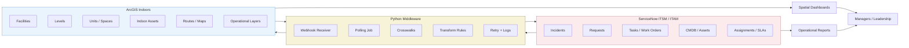

```{image} /_images/symbol-target.png
:alt: Business Capability Map
:width: 64px
:class: page-symbol
```

# Business Capability Map

Capability map

Python

Diagram


```mermaid
flowchart LR
    subgraph ITSM["ServiceNow ITSM / ITAM"]
        A["Incidents"]
        B["Requests"]
        C["Tasks / Work Orders"]
        D["CMDB / Assets"]
        E["Assignments / SLAs"]
    end

    subgraph Bridge["Python Middleware"]
        F["Webhook Receiver"]
        G["Polling Job"]
        H["Crosswalks"]
        I["Transform Rules"]
        J["Retry + Logs"]
    end

    subgraph Indoor["ArcGIS Indoors"]
        K["Facilities"]
        L["Levels"]
        M["Units / Spaces"]
        N["Indoor Assets"]
        O["Routes / Maps"]
        P["Operational Layers"]
    end

    ITSM --> Bridge
    Bridge --> Indoor
    Indoor --> Bridge
    Bridge --> ITSM
    Indoor --> Q["Spatial Dashboards"]
    ITSM --> R["Operational Reports"]
    Q --> S["Managers / Leadership"]
    R --> S

    style ITSM fill:#fbebed,stroke:#B3717A
    style Bridge fill:#f7f3d8,stroke:#908849
    style Indoor fill:#eaf4fd,stroke:#669DD5
```
