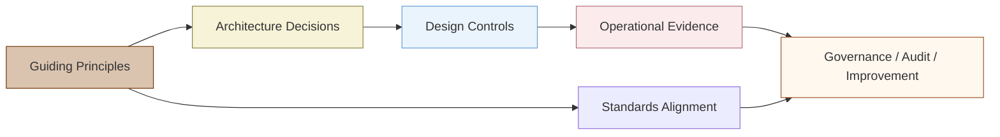

```{image} /_images/symbol-checkmark2.png
:alt: Guiding Principles, Tenets, and Standards
:width: 64px
:class: page-symbol
```

# Guiding Principles, Tenets, and Standards

This section establishes the governance spine of the Capybara Framework. The source text is incorporated source-authored from the attached document, then expanded into architecture-specific implications for ServiceNow, ArcGIS Indoors, and Python middleware implementation.

Source section

### Guiding Principles, Tenets, and Alignment with Standards

### Guiding Principles

The Capybara Framework is guided by a set of principles intended to ensure that spatially enabled IT operations deliver measurable value while remaining practical, scalable, and sustainable. At its core, the framework emphasizes integration over replacement, leveraging existing ITSM, ITAM, and GIS investments rather than introducing new systems of record. Capybara also prioritizes clarity, repeatability, and adaptability, recognizing that counties vary widely in size, maturity, and organizational structure.

A second guiding principle is the use of spatial context as a decision-support enhancement, not a novelty. Location intelligence is applied where it improves understanding, coordination, and outcomes—such as incident response, asset lifecycle planning, and workload balancing—without adding unnecessary complexity. The framework encourages incremental adoption, data quality discipline, and role-based access, ensuring that spatial insights remain trusted and actionable over time.

### Tenets

- Integration Over Replacement  
  Capybara enhances existing ITSM, ITAM, and GIS platforms rather than introducing new systems of record or duplicating functionality.

- Standards-Aligned by Design  
  The framework is grounded in ITIL 4 and ISO-based service and asset management standards to ensure governance, consistency, and auditability.

- Spatial Context Adds Operational Value  
  Location intelligence is applied where it meaningfully improves analytics, reporting, and decision-making—not as a standalone visualization exercise.

- Incremental and Phased Adoption  
  Capybara supports gradual implementation, allowing organizations to deliver value early while managing risk and complexity.

- Data Quality as a Foundation  
  Accurate, complete, and well-governed data is treated as a prerequisite for effective spatial enablement and downstream analytics.

- Role-Based Visibility and Access  
  Information is presented according to user roles, ensuring relevance, security, and usability for executives, managers, and technicians.

- Operational Practicality  
  The framework prioritizes workflows that reflect real-world constraints and day-to-day operational needs.

- Scalability Across Organizations  
  Capybara is designed to work for counties of varying size, maturity, and technical capacity.

- Transparency and Traceability  
  Asset locations, service activities, and decisions are traceable and defensible, supporting reporting, compliance, and oversight.

- Continuous Improvement Orientation  
  Performance metrics, feedback loops, and maturity assessments are used to guide ongoing refinement and evolution.

### Standards

### ITIL® 4

Capybara aligns with ITIL 4 by reinforcing a service value–oriented approach to IT operations, emphasizing visibility, collaboration, and continual improvement. By adding spatial context to assets, incidents, and personnel, Capybara enhances several ITIL practices, including Incident Management, Service Request Management, Asset Management, and Monitoring and Event Management. The framework supports ITIL 4’s guiding principles—such as focus on value, optimize and automate, and collaborate and promote visibility—by enabling data-driven decisions grounded in real-world location awareness rather than siloed system views.

### ISO/IEC 20000-1:2018 (IT Service Management Systems)

Capybara supports ISO/IEC 20000-1:2018 by strengthening the consistency, traceability, and measurability of IT service delivery processes. Spatially enabling ITSM data improves the organization’s ability to define, operate, monitor, and improve service management practices across facilities and departments. The framework enhances evidence-based management by linking service activities to physical locations and assets, supporting audit readiness, service reporting, and continual service improvement without altering the core ITSM system of record.

### ISO/IEC 19770 (IT Asset Management)

Capybara directly reinforces ISO/IEC 19770 principles by improving the accuracy, completeness, and usability of IT asset information throughout the asset lifecycle. By associating assets with precise indoor locations and service histories, the framework supports better asset identification, control, and lifecycle decision-making. This spatial enrichment helps organizations reduce asset loss, improve utilization, and better understand total cost of ownership, while remaining fully compatible with existing ITAM tools and processes.

### ISO 55000 (Asset Management)

Capybara aligns with ISO 55000 by treating IT assets as part of a broader, organization-wide asset management system focused on value, risk, and performance. The framework supports ISO 55000’s emphasis on governance, lifecycle thinking, and alignment between assets and organizational objectives. By providing location-aware insights into asset condition, service demand, and operational impact, Capybara helps organizations balance cost, risk, and performance across their IT asset portfolios in a transparent and defensible manner.

### Value of Standards Alignment

Aligning the Capybara Framework with established IT governance and service management standards ensures that innovation is grounded in proven operational practices. By adhering to methodologies such as ITIL 4 and ISO-based management systems, Capybara helps organizations introduce spatial capabilities in a way that supports accountability, auditability, and continual improvement. This alignment reduces risk, eases stakeholder acceptance, and strengthens confidence among leadership and oversight bodies.

Standards-based alignment also enhances the long-term sustainability of Capybara implementations. It ensures that spatially enabled workflows remain compatible with evolving organizational policies, regulatory requirements, and technology platforms. By embedding indoor GIS into recognized governance and service management frameworks, Capybara enables counties to modernize IT operations while maintaining consistency, control, and strategic coherence.

## Architecture Expansion: Turning Principles into Design Controls

| Principle / Tenet | Design Control | Example in Capybara |
| --- | --- | --- |
| Integration Over Replacement | Keep ServiceNow and ArcGIS Indoors authoritative in their own domains. | Use Python crosswalks and map URLs rather than recreating tickets or GIS geometry in the wrong platform. |
| Standards-Aligned by Design | Map each workflow to recognizable ITSM, ITAM, asset-management, and audit practices. | Associate mapped incident trends with Incident Management, Asset Management, Monitoring and Event Management, and continual improvement practices. |
| Spatial Context Adds Operational Value | Only spatially enable data where location materially improves decisions or work execution. | Map assets, rooms, floors, hotspots, technician routing, shared printers, network closets, and deployment waves. |
| Incremental and Phased Adoption | Implement one building, asset class, and ticket category before scaling. | Start with shared printers or workstation refresh before mapping every IT asset. |
| Data Quality as a Foundation | Require authoritative keys, readiness checks, and reconciliation before operational reliance. | Use location and asset match-status fields: Matched, Needs Review, Ambiguous, Not Found, Retired, or Suppressed. |
| Role-Based Visibility and Access | Separate technician, manager, leadership, and auditor views. | Technicians see work details; leadership sees summaries; auditors see traceability and controls. |
| Transparency and Traceability | Log event receipt, API calls, record changes, layer edits, and write-back outcomes. | Every integration update carries an event ID, source sys\_id, correlation ID, timestamp, and status. |

## Standards Alignment Matrix

| Standard / Framework | Capybara Contribution | Evidence Produced by the Architecture |
| --- | --- | --- |
| ITIL 4 | Improves visibility, collaboration, optimization, and automation across Incident, Service Request, Asset, and Monitoring practices. | Spatial incident dashboards, service-request location context, automation logs, and improvement metrics. |
| ISO/IEC 20000-1:2018 | Strengthens measurable, repeatable, and auditable service-management processes. | Cross-system service reports by facility, ticket-to-location traceability, reconciliation outputs, and SLA geography. |
| ISO/IEC 19770 | Improves asset identification, lifecycle context, completeness, and control. | Asset-to-unit mapping, asset service history by space, lifecycle-state overlays, and exception reports. |
| ISO 55000 | Connects IT assets to value, risk, cost, performance, lifecycle, and organizational objectives. | Facility-level asset health dashboards, risk-weighted refresh planning, and service-demand heat maps. |

Principles-to-architecture traceability

Code / configuration

Diagram


