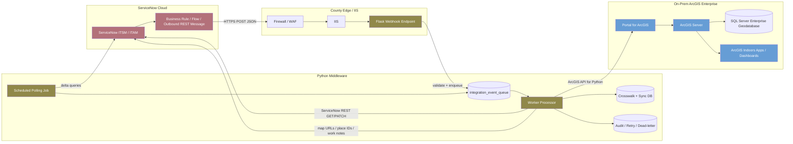

```{image} /_images/symbol-heavylift.png
:alt: Pattern 1 — Mostly On-Prem ArcGIS Enterprise + IIS/Flask
:width: 64px
:class: page-symbol
```

```{image} /_images/logo-servicenow.png
:alt: Pattern 1 — Mostly On-Prem ArcGIS Enterprise + IIS/Flask
:width: 150px
:class: page-logo
```

# Pattern 1 — Mostly On-Prem ArcGIS Enterprise + IIS/Flask

Pattern 1 is the default Capybara architecture for local governments that already host ArcGIS Enterprise and SQL Server internally. ServiceNow is cloud-hosted, but it only sends outbound HTTPS events. The county controls the middleware, ArcGIS Enterprise, data, network boundaries, and logs.

Pattern 1 — Mostly on-prem with outbound ServiceNow REST

Python

Diagram



#### Pattern 1 technical steps

1. ServiceNow business rule, flow, or outbound REST message identifies a relevant record event.
2. ServiceNow sends a small signed JSON payload to the Flask endpoint.
3. IIS/WAF enforces TLS, host headers, request size, and routing.
4. Flask validates authentication, timestamp, replay window, event schema, and allowed table/event type.
5. Flask stores the event and returns `202 Accepted`.
6. A worker claims the event, fetches authoritative records from ServiceNow, and resolves references.
7. The matcher resolves locations/assets to Indoors units/assets.
8. The ArcGIS client queries and edits feature layers.
9. The writer patches ServiceNow with map context and status.
10. Logs and reconciliation reports preserve traceability.
