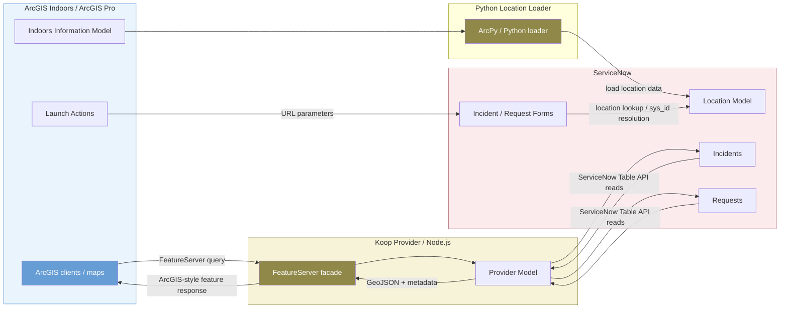

```{image} /_images/symbol-api.png
:alt: Koop Pattern Overview and Provider Mechanics
:width: 64px
:class: page-symbol
```

```{image} /_images/logo-servicenow.png
:alt: Koop Pattern Overview and Provider Mechanics
:width: 150px
:class: page-logo
```

# Koop Pattern Overview and Provider Mechanics

## Source-Derived Summary of the Koop-Based Repository

The Esri `indoors-servicenow-feature-service` repository describes itself as a complete ArcGIS Indoors and ServiceNow integration solution. Its README says it provides tools to populate the ServiceNow location model and expose ServiceNow incident and request data to the ArcGIS platform through a REST feature service. It identifies three feature areas: a `python-loader` that loads ArcGIS Indoors location data into the ServiceNow location model, a `koop-provider` that provides ServiceNow incidents and requests through a feature service, and launch-action configuration that opens ServiceNow incident or request forms from ArcGIS Indoors with prepopulated location values.

| Repository element | What it does | Architectural role | Capybara interpretation |
| --- | --- | --- | --- |
| `python-loader` | Loads ArcGIS Indoors location information into the ServiceNow location model. | One-way spatial reference seeding from ArcGIS Indoors to ServiceNow. | Comparable to a Capybara bootstrap/import routine for `cmn_location` crosswalk readiness. |
| `koop-provider` | Exposes ServiceNow incidents and requests as an ArcGIS-consumable feature service. | Read-through service façade over ServiceNow data. | Comparable to a live feature-service view of ServiceNow without necessarily copying ticket records into ArcGIS storage. |
| `launch-actions` | Configures ArcGIS Indoors action buttons to open ServiceNow forms and pass values through URLs. | Cross-application workflow initiation. | Comparable to Capybara's “map link / place ID / launch URL” user-experience layer. |

## How the Koop Pattern Works

Koop is a Node.js/JavaScript integration pattern that exposes non-ArcGIS data sources through ArcGIS-style service endpoints. In the ServiceNow/Indoors repository, the pattern can be read as a three-part flow:

1. **Load location reference data:** ArcGIS Indoors location data is loaded into ServiceNow's location model so that ServiceNow records can refer to known indoor locations.
2. **Expose ServiceNow operational records:** A Koop provider uses a ServiceNow account with read access to incidents and requests, queries ServiceNow, translates results into GeoJSON, and serves them through a feature-service façade.
3. **Launch ServiceNow from Indoors:** ArcGIS Indoors launch actions open a ServiceNow incident or request form and pass selected feature attributes into ServiceNow URL parameters.

Koop-based Indoors-ServiceNow feature-service pattern

Python

Diagram



## Koop Provider Mechanics

Koop providers implement a model that fetches data from a remote API or database and returns GeoJSON to Koop for output processing. The Koop documentation describes the provider model's required `getData(request, callback)` method as responsible for fetching remote data, converting it to GeoJSON, optionally adding metadata, and passing that GeoJSON to Koop's callback. This matters because the ServiceNow provider must translate ServiceNow incident/request records into GeoJSON features with coordinates and attributes that ArcGIS clients can understand.

### Full-fetch versus pass-through provider behavior

The distinction between full-fetch and pass-through behavior is operationally important. A full-fetch provider retrieves a broad dataset and lets Koop perform filtering. A pass-through provider translates ArcGIS GeoServices query parameters into remote API query parameters so the remote system does more filtering. For ServiceNow, a pass-through approach is usually safer for production because incident/request datasets may be large, sensitive, and subject to API limits. However, partial pass-through support must be implemented carefully because prematurely applying record limits in ServiceNow before geometry or attribute filters are applied can return incomplete results.

| Provider behavior | How it applies to ServiceNow | Benefit | Risk |
| --- | --- | --- | --- |
| Full fetch | Query many or all incident/request records, then let Koop filter. | Simpler implementation; useful for tiny pilot datasets. | High API load, memory load, latency, overexposure of sensitive records, and poor scalability. |
| Pass-through | Translate ArcGIS `where`time, paging, and possibly bounding-box logic into ServiceNow API parameters. | Smaller payloads, better performance, less unnecessary data movement. | Incomplete or incorrect results if not all filters are translated consistently. |
| Hybrid cache | Cache ServiceNow records in the Koop layer for short periods. | Reduces ServiceNow API pressure and improves map responsiveness. | Introduces freshness questions and requires cache invalidation policy. |

### FeatureServer façade

Koop's FeatureServer output can produce ArcGIS-style service, layer, query, renderer, and related-record responses from GeoJSON plus metadata. That is the key architectural trick: ArcGIS clients can treat the provider's output like a feature service even though the source records live in ServiceNow. The pattern is powerful because it lets ServiceNow appear as a map layer without first publishing a conventional hosted feature layer.

Code / configuration

Code / configuration

```
// Illustrative only: conceptual ServiceNow-to-Koop provider flow
async function getData(req, callback) { try { const serviceNowQuery = translateGeoServicesQuery(req.query); const records = await serviceNowClient.query('incident', serviceNowQuery); const geojson = { type: 'FeatureCollection', metadata: { name: 'ServiceNow Incidents', geometryType: 'Point', idField: 'OBJECTID', displayField: 'number', maxRecordCount: 2000 }, features: records.map(recordToGeoJSONFeature) }; callback(null, geojson); } catch (err) { callback(err); }
}
```
