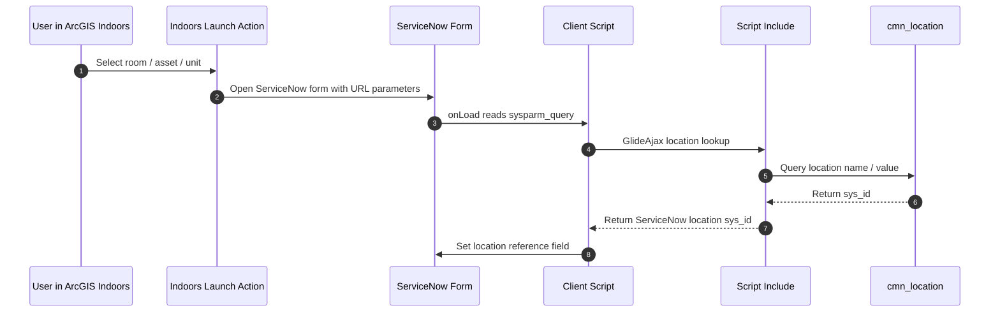

```{image} /_images/symbol-pythonlogo2.png
:alt: Python Location Loader and Launch Actions
:width: 64px
:class: page-symbol
```

```{image} /_images/logo-servicenow.png
:alt: Python Location Loader and Launch Actions
:width: 150px
:class: page-logo
```

# Python Location Loader and Launch Actions

## Python Location Loader Mechanics

The repository's location-loader requirements include the ArcGIS Indoors Information Model, Python 3.5 or later, ArcPy or ArcGIS Pro 2.4, and a ServiceNow account with read/write access to the ServiceNow location model. Architecturally, this means ServiceNow receives a location vocabulary derived from Indoors. ServiceNow can then hold location references that correspond to buildings, floors, rooms, spaces, or other Indoors entities, enabling downstream launch actions and record matching.

Location loader cautionLoading Indoors locations into ServiceNow is not just a technical import. It creates an operational dependency between the GIS-maintained indoor place model and ServiceNow's location table. Counties should define ownership, update cadence, deletion rules, duplicate handling, naming conventions, and rollback behavior before treating the import as authoritative.

## Launch Action Mechanics

The launch-action documentation describes configuring an ArcGIS Indoors action button to open ServiceNow incident or request forms. The action URL passes selected attributes, such as a unit name, facility value, or coordinates, into ServiceNow form fields through URL parameters. Additional ServiceNow configuration may be needed because ServiceNow stores locations by internal `sys_id`; the documentation describes client scripts and a server-side Script Include that can translate a passed location name into a ServiceNow-recognized location identifier.

Launch action from ArcGIS Indoors to ServiceNow

Code / configuration

Diagram


