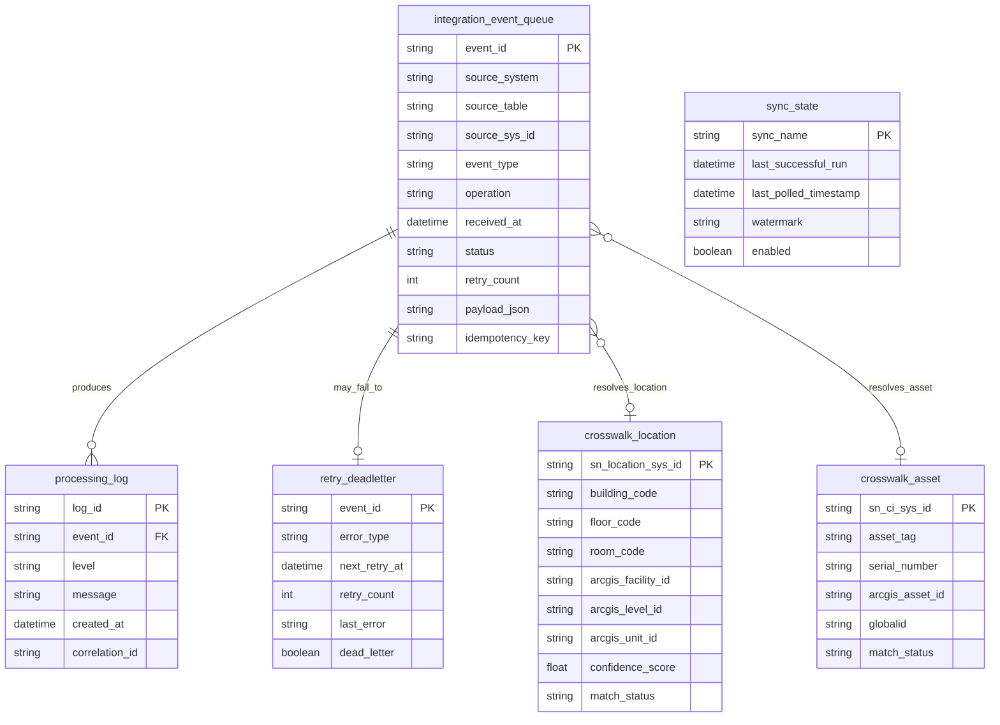

```{image} /_images/symbol-pythonlogo2.png
:alt: Middleware Responsibilities and Internal Data Model
:width: 64px
:class: page-symbol
```

# Middleware Responsibilities and Internal Data Model

## Middleware responsibilities

| Component | Responsibility | Failure mode | Control |
| --- | --- | --- | --- |
| Flask receiver | Accept and validate inbound ServiceNow events. | Forged, duplicated, or malformed event. | Signature validation, schema validation, idempotency. |
| Queue | Separate event receipt from long processing. | Queue backlog or lost event. | Durable storage, claimed/leased rows, status transitions. |
| Worker | Fetch full records, call APIs, apply rules, update layers. | Partial update or timeout. | Transactions where possible, retry/backoff, compensation logic. |
| Crosswalk engine | Resolve ServiceNow IDs to ArcGIS IDs. | Bad or stale mapping. | Confidence score, review queue, reconciliation. |
| ArcGIS client | Query and edit Portal/feature layers. | Layer schema drift, permission error, edit failure. | Schema validation, service health checks, edit result inspection. |
| ServiceNow client | GET/PATCH records and add work notes. | Auth failure, rate limiting, unexpected schema. | Scoped account, pagination, rate controls, schema tests. |

## Middleware internal data model

Middleware storage ERD

Code / configuration

Diagram


