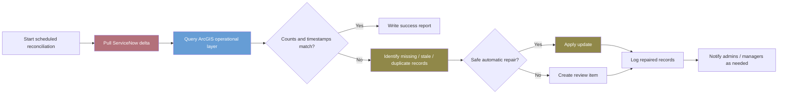

```{image} /_images/symbol-checkmark2.png
:alt: Reconciliation Workflow
:width: 64px
:class: page-symbol
```

# Reconciliation Workflow

Reconciliation process

Code / configuration

Diagram


```mermaid
flowchart LR
    A["Start scheduled reconciliation"] --> B["Pull ServiceNow delta"]
    B --> C["Query ArcGIS operational layer"]
    C --> D{"Counts and timestamps match?"}
    D -->|"Yes"| E["Write success report"]
    D -->|"No"| F["Identify missing / stale / duplicate records"]
    F --> G{"Safe automatic repair?"}
    G -->|"Yes"| H["Apply update"]
    G -->|"No"| I["Create review item"]
    H --> J["Log repaired records"]
    I --> J
    J --> K["Notify admins / managers as needed"]

    style B fill:#B3717A,color:#fff
    style C fill:#669DD5,color:#fff
    style F fill:#908849,color:#fff
    style H fill:#908849,color:#fff
```
